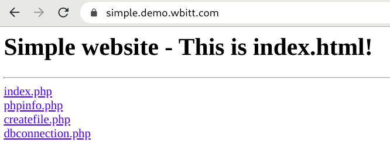
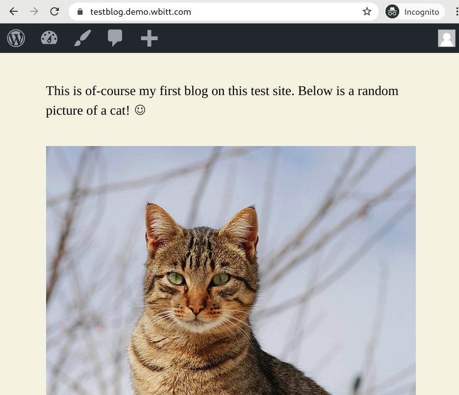
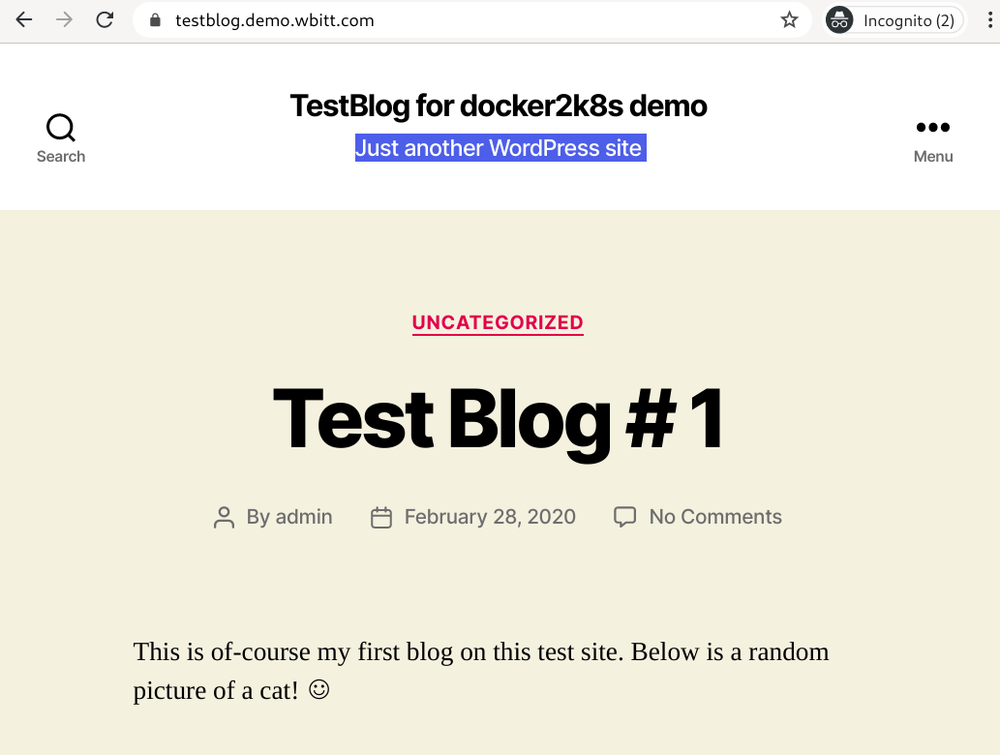
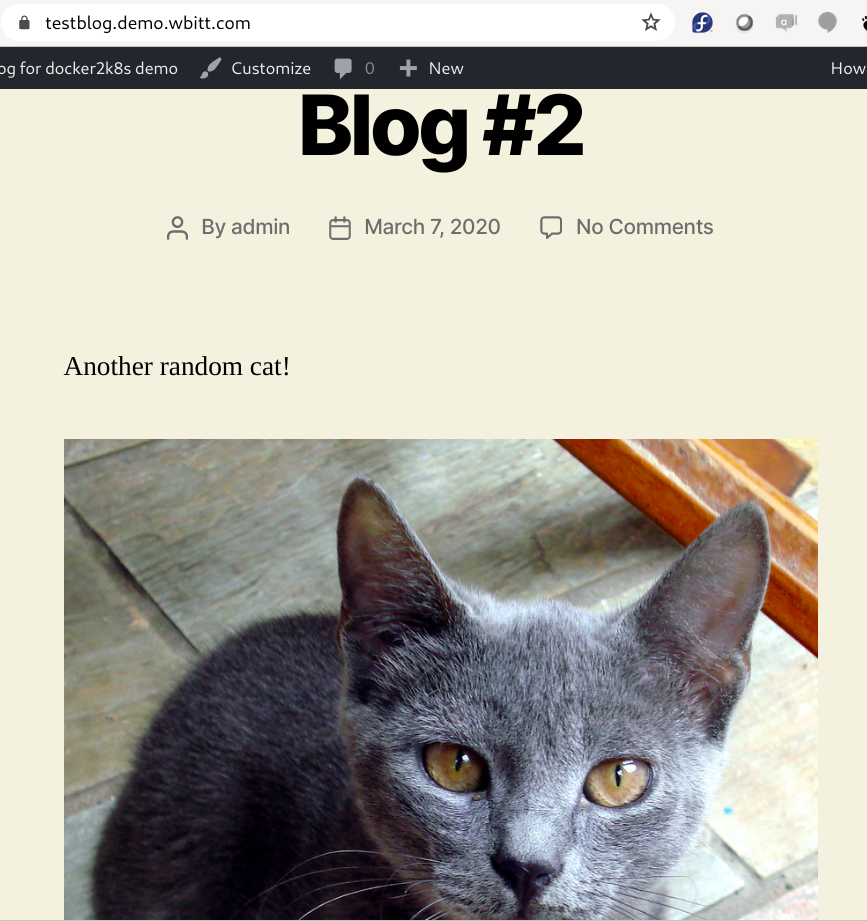

**Warning:** This document/article is work-in-progress!

# Docker-Compose to Kubernetes

This article talks about the ways to move your applications running on docker-compose to a Kubernetes cluster on GCP. It also shows how to achieve "continuous delivery" to get this done. The audience of this article are both the system admins and the developers. The article guides the system/cluster admins on how to migrate the various infrastructure services from docker-compose to the kubernetes cluster. It also guides the developers on how to migrate their applications from docker-compose to Kubernetes, and most importantly how to "continuously" deploy their applications on a Kubernetes cluster using a CD tool.

Moving your applications to Kubernetes is not straight-forward. (Developing your apps for Kubernetes is not straight-forward either). State is hard. Kubernetes has a lot of moving parts. Many of the concepts are new. In short, there are many potential pitfalls. You really need to have a clear understanding of how your current application works. You also need to understand how Kubernetes works. It is going to be bit painful, feel complex; but it will reward you in spades.

There are two very important things to remember before we start on this journey:
1. **Kubernetes != Docker/Compose**
2. **Kubernetes is not a magic wand**


This article will show all the steps performed on an actual production setup, running applications on docker-compose. So this is a real deal!

## Existing setup:
I am helping a friend of mine to manage his current setup on AWS, who wants to move to Kubernetes. The setup consists of three servers:
* A single database server running MySQL, Postgres and MongoDB instances
* Two servers running docker-compose on Fedora Linux. One of these servers is hosting some wordpress websites, running on docker-compose. The other server is running some applications being built in-house using various technologies (Node.js, C#, etc), on docker-compose.
* The domain I will use in this article for the demo purpose is `demo.wbitt.com` . The main infrastructure and various services run under the domain name `witpass.co.uk`
* The services talk to each other on the internal domain named `aws.witpass.co.uk`.
* There is a separate Traefik reverse proxy instance running on each application server.

|  |
| ----------------------------------------------------- |
| Current Setup |


**Important note:**
I am aware this is not an optimal setup, and there are few single points of failure. This was actually a "proof-of-concept" move to the cloud, which suddenly became "production". We wanted to keep the cost to lowest possible, without sacrificing any functionality, thus the small/minimal amount of servers.

### Problems in existing setup:
* Of course there is no resilience, no fault tolerance.
* The DB server can go down any moment. If it goes down (crashes), we have to rebuild it from backups.
* The capacity on the current application servers is a constant problem.
* Applications on one server cannot talk to the applications on the other server, because all applications run on an internal docker network on each server.
* Setting up resource limits on docker-compose is not possible, unless one is using docker-swarm, which we don't.
* We cannot move one application to another server without manual/admin intervention. 
* The applications are being deployed manually, not through any CI/CD pipeline.
* The state of various applications is being maintained on local file-system of the servers.
* In case any of the application server fails (crashes), we would need to rebuild it from backups.

## Advantages in moving to Kubernetes:
* A lot of resilience, because Kubernetes promises resilience on top of everything else.
* Pods can relocate to surviving nodes without admin intervention.
* Cluster capacity can be increased (or decreased) at will by adding (or removing) worker nodes.
* There is one large pod network, and all pods/containers talk to each other - except when prohibited by network policies, not discussed in this article.
* Setting up CPU and resource limits for applications/pods/containers are very easy.
* Most of the application deployment can be automated by CI/CD.
* Disk based state is maintained on persistent volumes provided by GCP, which are central to the entire cluster.
* Our applications simply move to a surviving worker node if a worker node crashes, eliminating the need to rebuild servers, or worker nodes. When worker nodes crash, then they are simply removed and new ones are added. Building new worker nodes is a task handled by GCP. 


## Why move to GCP/GKE? Why not AWS/EKS? or any other?
First, we don't want to be managing the kubernetes cluster ourselves. So the only choices were: GKE, GKE or GKE :)

I have experience of setting up and using Kubernetes cluster on different cloud providers, and found GKE to be the best. We know that AWS being the first cloud provider, has a very large number of customers. That is true. But, when Kubernetes came out, AWS made a mistake of sticking to their guns (ECS). When Kubernetes got enough traction, they also decided to join the party, but were late. Their "Kubernetes as a Service" - EKS - is just plain horrible. It is a mess. Although we are currently running our setup on AWS, we are not married to it, and we don't have children with it (like using AWS's other services), so we can definitely move away to a more solid platform. GCP/GKE is the gold standard anyway, so our choice is GKE.


## Two sample applications running on my servers:
I have two simple applications running on my current server(s), which I will use to explain various concepts.

* A simple static/HTML/PHP website [https://github.com/KamranAzeem/simple.demo.wbitt.com](https://github.com/KamranAzeem/simple.demo.wbitt.com)
* A simple WordPress website [https://github.com/KamranAzeem/testblog.demo.wbitt.com](https://github.com/KamranAzeem/testblog.demo.wbitt.com)


### A simple HTML+PHP website:
The simple static/HTML/PHP website has the following properties:

* Site name: `simple.demo.wbitt.com` , which points to the IP address of `web.witpass.co.uk` where all our wordpress based websites are running as docker containers.
* This website has static HTML content and builds a nginx based docker image at the time of start-up.
* This website also has some PHP files representing a simple dynamic (yet stateless) application. This would need to run through some PHP parser.
* One (imaginary) requirement is that the resulting docker image should be a private image. So this will need to be stored inside a private container repository. On GCP this is easily achievable. 
* This site/application needs some MySQL credentials to talk to a MySQL database. This information will be passed as environment variables.
* This site does not need to store any state on file-system
* This site uses a configuration file for it's internal use, and expects it at a location `/config/site.conf` on the file system of the running container.

**Note:** I know this is a simple/static/HTML file, and it does not need a config file. This (config file thing) is completely made-up, because I want to demonstrate something important around this, when we move this to Kubernetes. So there is no harm in assuming that there is a config file.

|  |
| ----------------------------------------------- |


### A simple Wordpress website:

Here is the `docker-compose.server.yml` file for my (test) blog website:

```
$ cat docker-compose.server.yml 

version: "3"
services:
  testblog.demo.wbitt.com:
    image:  wordpress:latest
    labels:
      - traefik.enable=true
      - traefik.port=80
      - traefik.frontend.rule=Host:testblog.demo.wbitt.com

    env_file:
      - testblog.env

    volumes:
      - /home/containers-data/testblog.demo.wbitt.com:/var/www/html

    networks:
      - services-network

networks:
  services-network:
    external: true
```

Here are the secrets I am passing to this container:
```
$ cat testblog.env

WORDPRESS_DB_HOST=db.aws.witpass.co.uk
WORDPRESS_DB_NAME=db_testblog_demo_wbitt_com
WORDPRESS_DB_USER=user_testblog_demo_wbitt_com
WORDPRESS_DB_PASSWORD=+GmNr+EYYT3LdHb/lYO5/w==
WORDPRESS_TABLE_PREFIX=wp_
APACHE_RUN_USER=#1001
APACHE_RUN_GROUP=#1001
```


Based on the information we see in the docker-compose file above, the WordPress website has the following properties:

* Site name: `testblog.demo.wbitt.com` , which points to the IP address of `web.witpass.co.uk` where all our wordpress based websites are running as docker containers.
* This website used an existing/official Wordpress docker image: `wordpress:latest`
* The `testblog.env` file is used to provide secrets (DB access details) to the WordPress image at run time.
* Site's **DB state** is saved in a database created manually in the database server: `db.aws.witpass.co.uk`
* Site's **File/disk state** is saved under a directory: `/home/containers-data/testblog.demo.wbitt.com/`. This is where all the wordpress software, uploads, and plugins, etc, are saved.

**Note:** I personally dislike the idea of storing "entire" wordpress installation as a **state**, and that is why I created a custom wordpress image, which only saves the state of `uploads`, and nothing else. This is a separate topic. The improved version of the wordpress image I just mentioned is here: [https://github.com/WITPASS/witpass-wordpress-docker-image](https://github.com/WITPASS/witpass-wordpress-docker-image)

|  |
| ------------------------------------------- |


## Kubernetes setup:

To move our applications to Kubernetes, we would need to ensure that the individual needs of these applications are met. Certain things need to be in place. These are discussed next.

### The database service:
In current setup we have a single database server running three different database software, i.e. MySQL Postgres, MongoDB. Currently all applications connect to this database server on desired ports. We can have a similar setup in a slightly different way on Kubernetes. We can have three individual database services running as three separate "StatefulSet". This helps the database software to save it's state in a disk volume acquired using a "PersistentVolumeClaimTemplate". So MySQL , Postgres and MongoDB can have their individual StatefulSets. 

Lets talk about MySQL only. In Kubernetes terms, the MySQL instance needs:

* to be a StatefulSet object instead of Deployment. Read [this](https://github.com/KamranAzeem/kubernetes-katas/blob/master/08-storage-basic-dynamic-provisioning.md) to understand the "why".
* a publicly accessible docker container image. This will be `mysql:5.7` in our case.
* a disk volume to save it's data files. This will be a PVC of size 1 GB - for now.
* a secret (`MYSQL_ROOT_PASSWORD`), which will be used by the MySQL image to setup the MySQL instance correctly at first boot. 
* an internal/cluster service, so MySQL is accessible to all the services wishing to connect to it, within the same namespace.
* a way to be accessible / used by the admin from the internet, to be able to create databases and users for various applications / websites. For this, we would setup a very small and secure web interface for mysql, named `Adminer`. This Adminer software will have a "Deployment", a "Service" and an "Ingress", so we can access it from the internet. See note below.

**Note:** The database service will be setup by the main cluster administrator, and will be a one time activity. Though the process of creation of this service can be defined / saved as a github repository , in the form of `yaml` files. This does not need to be part of a CI/CD pipeline.

**Note:** Personally, I dislike the idea of providing global access to my database instance through any web interface. Refer to `The best way to access your database instance in Kubernetes` in this article.

### The ingress controller:
Since the Adminer interface needs to be accessed over the internet, we already defined an ingress object for it. But for Ingress object to work, we need an **"Ingress Controller"**. This ingress controller will be a service defined as `type: LoadBalancer`. In the docker-compose setup, we have Traefik running as the ingress controller - sort of. In our Kubernetes setup, we will continue to use Traefik as Ingress controller. 

**Note:** The setup of Ingress Controller will also be a one time activity by the administrator.

### The individual applications:
Now we discuss the Kubernetes related needs of our applications. This is where developers will have the main interest, and they will have the main responsibility for deploying their applications on the cluster.

#### The WordPress application , and it's needs:
* It needs to be a "Deployment" , so we can scale up (and down) the number of replicas, depending on the load, which still able to serve the files on the (shared) disk from all the instances. This is only possible when you use a Deployment object, and not StatefulSet object.
* The Deployment will need an image. In this case, it uses a publicly available docker container image, so that is not a problem.
* The Deployment will need to know the location of MySQL database server, the DB for this wordpress installation , the DB username and passwords to connect to that database. This information cannot be part of the repository, so it is provided manually on the docker servers as `wordpress.env` file (as an example). On Kubernetes this information needs to be provided as environment variables. The question is, how? There are two ways. One, we create the secret manually from command line. The other way way is to setup the secrets as environment variables in the CI server. We will be using CircleCI for our CI/CD needs. We will see both methods to get this done. 
* The Deployment will also need a persistent storage for storing various files this wordpress software will create. The same location will also hold any content uploaded by the user, for example pictures, etc. This will be a PVC, and will be created separately. It's definition of creation will not be part of the same file as the `deployment.yaml` . This is to prevent any accidents of old PVCs being deleted and new ones being created automatically resulting in data loss. This problem has been explain in another article of mine: [https://github.com/KamranAzeem/kubernetes-katas/blob/master/08-storage-basic-dynamic-provisioning.md](https://github.com/KamranAzeem/kubernetes-katas/blob/master/08-storage-basic-dynamic-provisioning.md) . Anyhow, the developer will be required to create the necessary PV/PVC once, and then make sure to **never delete the PVC**. Till the time the PVC is there, the data will be safe. 

**Note:** This example uses with wordpress, which is quite "stateful". What we want, from the developers is: applications as stateless as possible. i.e. There should be no involvement of saving any state, eliminating a need to acquire and maintain PVCs and PVs. **This is very important in application design.** 

#### The simple static/HTML site has the following Kubernetes related needs:
* It needs to be a "Deployment" , so we can scale up (and down) the number of replicas, depending on the load, which still able to serve the files on the (shared) disk from all the instances. This is only possible when you use a Deployment object, and not StatefulSet object.
* The Deployment will need to (sort of) "build" a private image, which is impossible. Kubernetes objects cannot build container images. (Recall: Kubernetes != Docker). So, for this to work, the image needs to be built outside/before the deployment process is carried out. If the image needs to be a private image, then GCP's [gcr.io](gcr.io) is ideal, as it can create private container images without requiring any extra steps at our end. 
* The Deployment will also need a (imaginary) configuration file mounted at `/config/site.conf` . One can argue that a configuration file (or files) can be baked into the image itself. For the sake of this example, we will create a config map every time before creating the main deployment. This can be done manually, or through the CI server. In case of CI server, the entire configuration file will need to be stored an an environment variable in the CI server and then be used inside the deployment pipeline. We will show you that too.


## Kubernetes setup:

I have setup a Kubernetes cluster on GCP/GKE. I have also ensured that I can access it using kubectl on my local work computer:

```
[kamran@kworkhorse mysql]$ kubectl get cs
NAME                 STATUS    MESSAGE              ERROR
etcd-1               Healthy   {"health": "true"}   
scheduler            Healthy   ok                   
controller-manager   Healthy   ok                   
etcd-0               Healthy   {"health": "true"}   
[kamran@kworkhorse mysql]$ kubectl get nodes
NAME                                           STATUS   ROLES    AGE     VERSION
gke-docker-to-k8s-default-pool-b0b5bbac-dx7z   Ready    <none>   6m25s   v1.14.10-gke.17
[kamran@kworkhorse mysql]$ 
```

We will first deploy the wordpress based application to Kubernetes. To be able to deploy that, we would need to perform the following steps, in order:

* Deploy Traefik Ingress Controller, and create it's related service as `type:LoadBalancer` and obtain the public IP. Traefik will be deployed in the very basic form without HTTPS , because this is just a demo, and HTTPS is simply beyond the scope. If you are interested, please consult: [https://github.com/KamranAzeem/kubernetes-katas/tree/master/ingress-traefik/https-letsencrypt-HTTP-Challenge](https://github.com/KamranAzeem/kubernetes-katas/tree/master/ingress-traefik/https-letsencrypt-HTTP-Challenge)
* Modify our DNS zone for the domain `demo.wbitt.com` and add an entry for `traefik.demo.wbitt.com` and point it to this public IP obtained in the previous step
* Deploy MySQL as StatefulSet, and create related service
* [OPTIONAL] Deploy [Adminer](https://www.adminer.org/) as Deployment, and create its related service and ingress. 
* [OPTIONAL] Add another CNAME entry in the same DNS zone for `adminer.demo.wbitt.com` pointing to `traefik.demo.wbitt.com` . **Note:** During my testing, I found problems setting up `adminer` as `adminer.demo.wbitt.com`, so I change the name to `dbadmin`instead. The only place I used the word "adminer", was the name of "adminer" docker image.
* [OPTIONAL] Verify that Adminer can connect to the backend MySQL server by using the user root, and the password set as ENV variable for mysql
* Create a database, user and password in the MySQL instance, for the wordpress application/site (to be setup next)- through command line (forwarded port), or through Adminer.
* Create a PV and PVC for the wordpress deployment.
* Create the secrets for connecting the wordpress Deployment to the MySQL instance, and make sure that the wordpress deployment is configured to uses those secrets.
* Stop the related wordpress docker-compose application on the docker server. This will ensure that when you change it's IP address in next steps, Traefik will not panic in trying to arrange SSL certificates for it.
* In the DNS server, point `testblog.demo.wbitt.com` (as CNAME) to `traefik.demo.wbitt.com`
* Deploy the wordpress deployment, service and ingress. 


As soon as wordpress pods are started, you can access it from the URL `testblog.demo.wbitt.com`. Though you will notice DB connection errors, empty pages, incorrectly rendered web pages, etc. This is because you have not yet migrated the database and the web content directory of the existing website to Kubernetes. You will need to do few extra steps. (This is a migration after all!)

* Perform a database dump of the existing MySQL database of this wordpress website from the old server, and copy the file to your local work computer.
* Load the database dump in the new database through adminer; or, through mysql command line. (Refer to `The best way to access your database instance in Kubernetes` in this article). `mysqldump db_testblog_demo_wbitt_com > db_testblog.demo.wbitt.com.dump
; gzip -9 db_testblog.demo.wbitt.com.dump`
* Make a tarball/zip/etc of the web content of this wordpress website, and copy it to your local work computer. Then, use `kubectl cp ...` command to copy the tarfile inside the wordpress container in `/tmp/`, and untar the files. Copy all the files from this location in `/tmp/<oldWPcontents>` to `/var/www/html/` over-writing everything. 
* Make sure you change ownership of all files to a user which the Apache web-server in that pod run as, i.e. UID 33, GID 33, using `chown -R 33:33 /var/www/html/` 
* Since you have overwritten the config file which was adjusted by the docker entrypoint, you will need to restart wordpress pod by simply killing it. 
* Since both the database and other web-content files are already there, this wordpress instance should start without any problem, showing the correct blog page and showing the media/pictures attached with this blog post.

**Note:** If the wordpress application was running as `https://` on the old server, then you will need to ensure that your new installation also runs on `https://` , by correctly setup Traefik in the beginning. If you don't do this, and run new installation on plain HTTP, then your wordpress website will not render correctly. It happens because wordpress stores full URLs to various objects in the database, and tries to use those URLs as it is , when it needs to show some picture, etc. When the URLs mismatch, the picture file is not read from the file-system, and nothing is shown. This problem is very difficult to troubleshoot, because the wordpress pods's logs do not show this problem.

#### The best way to access your database instance in Kubernetes:

Setting up a web-UI in front of your database instance, with global access/reach-ability, is a horrible idea. Anyone with enough time and resources will continue to brute-force their way into the database server, through the web-UI.

The best/secure way is to port-forward database's service port to your local computer, using kubectl,  and then connecting to it through the localhost. This approach is very effective, but it expects that you have access to the kubernetes cluster, using kubectl. If that is not the case, then you do need some web interface to access your database instance. You may further secure it by setting up some firewall rules to allow access to the database instance only from selected IP addresses/ranges.

Another way could be to setup a **"jumpbox"** or **bastion host**, which has access to the cluster using kubectl, and forwards certain ports from the database service all the way to the jumpbbox. Then, setup SSH accounts on the jumpbox, for anyone wishing to connect to these database (forwarded) ports. These people will not actually connect directly to the database service on the jumpbox. Instead, they will connect to the jumpbox, and forward the related port to their local computer, and **then** use/connect-to the database service through that local port.

Above may seem a lot of work, but that is the secure (and recommended) way to access your database from outside the cluster.


### Setup Traefik:

The first step is to setup Traefik with HTTPS enabled, using HTTP challenge. To achieve this, we use some extra files, i.e. `traefik.toml` and `dashboard-users.htpasswd`.

Remember to fix the email address in `traefik.toml` file.

```
[kamran@kworkhorse kubernetes]$ pwd
/home/kamran/Projects/Personal/github/docker-to-kubernetes/traefik/kubernetes


[kamran@kworkhorse kubernetes]$ htpasswd -c -b dashboard-users.htpasswd admin secretpassword

[kamran@kworkhorse kubernetes]$ kubectl  --namespace=kube-system  create configmap configmap-traefik-toml --from-file=traefik.toml
configmap/configmap-traefik-toml created

[kamran@kworkhorse kubernetes]$ kubectl  --namespace=kube-system  create secret generic secret-traefik-dashboard-users --from-file=dashboard-users.htpasswd
secret/secret-traefik-dashboard-users created

[kamran@kworkhorse kubernetes]$ kubectl apply -f traefik-deployment.yaml
serviceaccount/traefik-ingress-controller created
persistentvolumeclaim/pvc-traefik-acme-json created
deployment.extensions/traefik-ingress-controller created
service/traefik-ingress-service created
[kamran@kworkhorse kubernetes]$ 
```

Verify:
```
[kamran@kworkhorse kubernetes]$ kubectl --namespace=kube-system get pods
NAME                                                       READY   STATUS    RESTARTS   AGE
. . . 
traefik-ingress-controller-d76466dfc-zd59d                 1/1     Running   0          72s
```

```
[kamran@kworkhorse kubernetes]$ kubectl --namespace=kube-system get svc
NAME                      TYPE           CLUSTER-IP    EXTERNAL-IP    PORT(S)                                     AGE
default-http-backend      NodePort       10.0.15.173   <none>         80:31416/TCP                                21m
heapster                  ClusterIP      10.0.0.16     <none>         80/TCP                                      21m
kube-dns                  ClusterIP      10.0.0.10     <none>         53/UDP,53/TCP                               22m
metrics-server            ClusterIP      10.0.9.117    <none>         443/TCP                                     21m
traefik-ingress-service   LoadBalancer   10.0.14.84    35.228.250.6   80:30307/TCP,443:30999/TCP,8080:31041/TCP   111s
```


#### Deploy Traefik UI:

Find the IP of Traefik LB `35.228.250.6`, and adjust the DNS domain, so everything points to the traefik lb . Make sure that DNS has propagated:

```
[kamran@kworkhorse kubernetes]$ dig traefik-ui.demo.wbitt.com

;; QUESTION SECTION:
;traefik-ui.demo.wbitt.com.	IN	A

;; ANSWER SECTION:
traefik-ui.demo.wbitt.com. 299	IN	CNAME	traefik.demo.wbitt.com.
traefik.demo.wbitt.com.	299	IN	A	35.228.250.6

. . . 
[kamran@kworkhorse kubernetes]$ 
```

Create Traefik-web-UI deployment:

```
[kamran@kworkhorse kubernetes]$ kubectl apply -f traefik-webui-ingress.yaml 
service/traefik-web-ui created
ingress.extensions/traefik-web-ui created
[kamran@kworkhorse kubernetes]$ 

```

Verify by looking at Traefik web interface.


|  |
| --------------------------------------------------------------------- |


### Setup MySQL:

The MySQL setup runs a MySQL:5.7 docker container image. This image is capable of creating an additional database (and username and password) if certain environment variables are passed to it . We can very easily use this feature to create a database and related user for our WordPress website, but, we would be moving in more databases from our current/old DB server to this instance. For that reason, creating this addition database (and related user) is not very useful. It is best to setup this database instance using only the `MYSQL_ROOT_PASSWORD`. Later, when we need to create various databases and their related users, we can connect to this instance as the root user, and get all these tasks done. So this would be just like any other regular/normal database instance.

**Note:** In this repository, there is another file named `mysql-statefulset-for-wordpress.yaml` . Use that if all you want to do is run a database instance for a single wordpress website. 

#### Create secret for MySQL:
There is a file in this repository, named `mysql.env`. Update the value for `MYSQL_ROOT_PASSWORD`. Then, use the `create-mysql-credentials.sh` file to create `MYSQL_ROOT_PASSWORD` as a **secret**  in your kubernetes cluster. For the sake of example, everything will be deployed in the `default` namespace.

```
[kamran@kworkhorse mysql]$ ./create-mysql-credentials.sh 
First delete the old secret: mysql-credentials
Error from server (NotFound): secrets "mysql-credentials" not found
Found mysql.env file, creating kubernetes secret: mysql-credentials
secret/mysql-credentials created
[kamran@kworkhorse mysql]$ 
```


#### Create Statefulset for MySQL:

Adjust cpu/memory limits, and the size of PVC in `mysql-statefulset.yaml`, then create the Statefulset for MySQL.

```
[kamran@kworkhorse mysql]$ kubectl apply -f mysql-statefulset.yaml
statefulset.apps/mysql created
service/mysql created
[kamran@kworkhorse mysql]$
```

Verify:

```
[kamran@kworkhorse mysql]$ kubectl get statefulset
NAME    READY   AGE
mysql   1/1     86s


[kamran@kworkhorse mysql]$ kubectl get pods
NAME      READY   STATUS    RESTARTS   AGE
mysql-0   1/1     Running   0          80s

[kamran@kworkhorse kubernetes]$ kubectl get pvc
NAME                               STATUS   VOLUME                                     CAPACITY   ACCESS MODES   STORAGECLASS   AGE
mysql-persistent-storage-mysql-0   Bound    pvc-b03e5db9-60b8-11ea-9327-42010aa600a1   1Gi        RWO            standard       90s
[kamran@kworkhorse kubernetes]$ 
```


```
[kamran@kworkhorse mysql]$ kubectl exec -it mysql-0 bash

root@mysql-0:/# mysql -u root -p
Enter password: 
Welcome to the MySQL monitor.  Commands end with ; or \g.
Your MySQL connection id is 3
Server version: 5.7.29 MySQL Community Server (GPL)

Copyright (c) 2000, 2020, Oracle and/or its affiliates. All rights reserved.

Oracle is a registered trademark of Oracle Corporation and/or its
affiliates. Other names may be trademarks of their respective
owners.

Type 'help;' or '\h' for help. Type '\c' to clear the current input statement.

mysql> show databases;
+--------------------+
| Database           |
+--------------------+
| information_schema |
| mysql              |
| performance_schema |
| sys                |
+--------------------+
4 rows in set (0.04 sec)

mysql> 

```

MySQL running properly. No more to be done about MySQL.


### Setup adminer [OPTIONAL]

This step is completely un-necessary for most setups. I strongly discourage exposing your database instance to the entire world through a web interface such as `adminer` or `phpmyadmin`, etc.

Still, if some setup requires it, then the steps to set it up are provided below:

(TBD)


## Migrate the existing WordPress application to Kubernetes:

### Shutdown/stop the wordpress website on old server:

```
$ ssh root@web.witpass.co.uk 

[root@web testblog.demo.wbitt.com]# cd /home/containers-runtime/testblog.demo.wbitt.com/

[root@web testblog.demo.wbitt.com]# docker-compose -f docker-compose.server.yml down
Stopping testblogdemowbittcom_testblog.demo.wbitt.com_1 ... done
Removing testblogdemowbittcom_testblog.demo.wbitt.com_1 ... done
Network services-network is external, skipping
```


### Backup existing database:
Back up existing database related to this wordpress website, on the old DB server:


```
[root@db ~]# mysqldump db_testblog_demo_wbitt_com > db_testblog.demo.wbitt.com.dump

[root@db ~]# gzip -9 db_testblog.demo.wbitt.com.dump
```

Copy the dump-file from DB server to your local computer:
```
[kamran@kworkhorse ~]$ cd tmp/docker-to-kubernetes-data/
[kamran@kworkhorse docker-to-kubernetes-data]$ rsync root@db.witpass.co.uk:/root/db_testblog*.gz  .
```


### Restore the database to MySQL instance in Kubernetes:

Restoring the database using a web UI, such as `adminer` is straight forward. However, if you are not using a DB web UI, then the following steps need to be performed:

Forward the MySQL port from the Kubernetes cluster to your local computer, using kubectl. Do this in a separate shell/terminal. Before doing that, ensure that you are not running a local MySQL instance, because we need port 3306 on local computer to be available. 

```
[kamran@kworkhorse mysql]$ kubectl get services
NAME         TYPE        CLUSTER-IP   EXTERNAL-IP   PORT(S)    AGE
kubernetes   ClusterIP   10.0.0.1     <none>        443/TCP    3h22m
mysql        ClusterIP   None         <none>        3306/TCP   11m
```

Run the following command in a separate terminal window and leave it running.
```
[kamran@kworkhorse mysql]$ kubectl port-forward svc/mysql 3306:3306 
Forwarding from 127.0.0.1:3306 -> 3306
Forwarding from [::1]:3306 -> 3306

(waits forever)
```

Open a new terminal. Make sure you are in the same directory where you copied the dump file from the old DB server. Unzip the dump file.

```
[kamran@kworkhorse docker-to-kubernetes-data]$ pwd
/home/kamran/tmp/docker-to-kubernetes-data

[kamran@kworkhorse docker-to-kubernetes-data]$ ls -l
total 12504
-rw-r--r-- 1 kamran kamran   160570 Mar  7 19:20 db_testblog.demo.wbitt.com.dump.gz
-rw-r--r-- 1 kamran kamran 12637119 Feb 28 13:54 testblog.demo.wbitt.com.tar.gz

[kamran@kworkhorse docker-to-kubernetes-data]$ gzip -d db_testblog.demo.wbitt.com.dump.gz 

[kamran@kworkhorse docker-to-kubernetes-data]$ ls -l
total 12900
-rw-r--r-- 1 kamran kamran   569038 Mar  7 19:20 db_testblog.demo.wbitt.com.dump
-rw-r--r-- 1 kamran kamran 12637119 Feb 28 13:54 testblog.demo.wbitt.com.tar.gz
[kamran@kworkhorse docker-to-kubernetes-data]$ 
```

Connect to this port (3306) on local computer, using `mysql` command, and create a MySQL database for your database, a user and a password for this user. 

```
[kamran@kworkhorse docker-to-kubernetes-data]$ mysql -h 127.0.0.1 -u root -p
Enter password: 
Welcome to the MariaDB monitor.  Commands end with ; or \g.
Your MySQL connection id is 6
Server version: 5.7.29 MySQL Community Server (GPL)

Copyright (c) 2000, 2018, Oracle, MariaDB Corporation Ab and others.

Type 'help;' or '\h' for help. Type '\c' to clear the current input statement.

MySQL [(none)]> create database testblog_demo_wbitt_com ;
Query OK, 1 row affected (0.061 sec)

MySQL [(none)]> grant all on testblog_demo_wbitt_com.* to 'testblog_demo_wbitt_com'@'%' identified by 'Pi+hd8cqfGc0oWOeZOCM8w==';
Query OK, 0 rows affected, 1 warning (0.025 sec)

MySQL [(none)]> flush privileges;
Query OK, 0 rows affected (0.028 sec)


MySQL [(none)]> select user,host,authentication_string from mysql.user;
+-------------------------+-----------+-------------------------------------------+
| user                    | host      | authentication_string                     |
+-------------------------+-----------+-------------------------------------------+
| root                    | localhost | *E5A99A335AAC5AAA1C688AD99906AF4C054C7283 |
| mysql.session           | localhost | *THISISNOTAVALIDPASSWORDTHATCANBEUSEDHERE |
| mysql.sys               | localhost | *THISISNOTAVALIDPASSWORDTHATCANBEUSEDHERE |
| root                    | %         | *E5A99A335AAC5AAA1C688AD99906AF4C054C7283 |
| testblog_demo_wbitt_com | %         | *681B6FC9E9359096E16EDED829F86C9D6C86E3BC |
+-------------------------+-----------+-------------------------------------------+
5 rows in set (0.098 sec)

MySQL [(none)]> 

```

Now exit the mysql session, and reconnect using these new credentials, to make sure that it works:

```
[kamran@kworkhorse docker-to-kubernetes-data]$ mysql -h 127.0.0.1 -u testblog_demo_wbitt_com -D testblog_demo_wbitt_com -p
Enter password: 
Welcome to the MariaDB monitor.  Commands end with ; or \g.
Your MySQL connection id is 8
Server version: 5.7.29 MySQL Community Server (GPL)

Copyright (c) 2000, 2018, Oracle, MariaDB Corporation Ab and others.

Type 'help;' or '\h' for help. Type '\c' to clear the current input statement.

MySQL [testblog_demo_wbitt_com]> show tables;
Empty set (0.028 sec)

MySQL [testblog_demo_wbitt_com]> exit
Bye
[kamran@kworkhorse docker-to-kubernetes-data]$ 

```

Very good. Now load the DB dump you obtained from the old DB server, into this database:

```
[kamran@kworkhorse docker-to-kubernetes-data]$ ls -l
total 12900
-rw-r--r-- 1 kamran kamran   569038 Mar  7 19:20 db_testblog.demo.wbitt.com.dump
-rw-r--r-- 1 kamran kamran 12637119 Feb 28 13:54 testblog.demo.wbitt.com.tar.gz

[kamran@kworkhorse docker-to-kubernetes-data]$ mysql -h 127.0.0.1 -u testblog_demo_wbitt_com -D testblog_demo_wbitt_com -p < db_testblog.demo.wbitt.com.dump 
Enter password: 
[kamran@kworkhorse docker-to-kubernetes-data]$ 
```

Reconnect and verify that the database has been restored successfully:

```
[kamran@kworkhorse docker-to-kubernetes-data]$ mysql -h 127.0.0.1 -u testblog_demo_wbitt_com -D testblog_demo_wbitt_com -p
Enter password: 
Reading table information for completion of table and column names
You can turn off this feature to get a quicker startup with -A

Welcome to the MariaDB monitor.  Commands end with ; or \g.
Your MySQL connection id is 11
Server version: 5.7.29 MySQL Community Server (GPL)

Copyright (c) 2000, 2018, Oracle, MariaDB Corporation Ab and others.

Type 'help;' or '\h' for help. Type '\c' to clear the current input statement.

MySQL [testblog_demo_wbitt_com]> show tables;
+-----------------------------------+
| Tables_in_testblog_demo_wbitt_com |
+-----------------------------------+
| wp_commentmeta                    |
| wp_comments                       |
| wp_links                          |
| wp_options                        |
| wp_postmeta                       |
| wp_posts                          |
| wp_term_relationships             |
| wp_term_taxonomy                  |
| wp_termmeta                       |
| wp_terms                          |
| wp_usermeta                       |
| wp_users                          |
+-----------------------------------+
12 rows in set (0.030 sec)

MySQL [testblog_demo_wbitt_com]> 
```

Database is restored on the new DB instance in Kubernetes. You can terminate the kubectl session running in the other terminal, being used to forward port 3306 to local computer.


### Setup WordPress Deployment:

Now we setup the Wordpress Deployment. Remember that the database related to this wordpress website is restored in Kubernetes, and we have the web content as a tarball on our local computer. 

First, we create the PVC required for this deployment.

```
[kamran@kworkhorse kubernetes]$ kubectl apply -f wordpress-pvc.yaml 
persistentvolumeclaim/pvc-testblog created

[kamran@kworkhorse kubernetes]$ kubectl get pvc
NAME                               STATUS   VOLUME                                     CAPACITY   ACCESS MODES   STORAGECLASS   AGE
mysql-persistent-storage-mysql-0   Bound    pvc-b03e5db9-60b8-11ea-9327-42010aa600a1   1Gi        RWO            standard       50m
pvc-testblog                       Bound    pvc-c3b2d847-60bf-11ea-9327-42010aa600a1   1Gi        RWO            standard       18s
[kamran@kworkhorse kubernetes]$ 
```

Now, the PVC exists, but we cannot copy any files directly inside it. It has to be mounted inside a pod/container. We will use the wordpress deployment to mount this PVC at it's designated mount point, and copy the web-content inside it. For that we need the deployment; and the deployment needs secrets. So we have to perform the following steps.


#### Create secrets for WordPress Deployment:

```
[kamran@kworkhorse kubernetes]$ pwd
/home/kamran/Projects/Personal/github/docker-to-kubernetes/wordpress/kubernetes


[kamran@kworkhorse kubernetes]$ cat wordpress.env 
WORDPRESS_DB_HOST=mysql
WORDPRESS_DB_NAME=testblog_demo_wbitt_com
WORDPRESS_DB_USER=testblog_demo_wbitt_com
WORDPRESS_DB_PASSWORD=Pi+hd8cqfGc0oWOeZOCM8w==
[kamran@kworkhorse kubernetes]$ 
```

```
[kamran@kworkhorse kubernetes]$ ./create-wordpress-credentials.sh 
First, deleting the old secret: wordpress-credentials
Error from server (NotFound): secrets "wordpress-credentials" not found
Found wordpress.env file, creating kubernetes secret: wordpress-credentials
secret/wordpress-credentials created
[kamran@kworkhorse kubernetes]$ 
```

In the `wordpress-deployment.yaml` file, ensure that the ingress has correct host name set for the wordpress website. i.e `testblog.demo.wbitt.com` . Then create the deployment:

```
[kamran@kworkhorse kubernetes]$ kubectl apply -f wordpress-deployment.yaml 
deployment.apps/testblog created
service/testblog created
ingress.extensions/testblog created
[kamran@kworkhorse kubernetes]$ 
```

```
[kamran@kworkhorse kubernetes]$ kubectl get pods
NAME                        READY   STATUS    RESTARTS   AGE
mysql-0                     1/1     Running   0          67m
testblog-54f855f697-n6bz2   1/1     Running   0          10s
[kamran@kworkhorse kubernetes]$ 
```

As soon as the deployment is created, this wordpress application will start. It will try to connect to the database, and then it will see that the document root (`/var/www/html`) in the pod/container is empty, (because it mounts the PVC we created just now), it will be populated by the fresh wordpress installation files, but the installation will not proceed without our confirmation. If you access `testblog.demo.wbitt.com` at this moment, you will (should) see your website - without any pictures/media, or plugins. Possibly showing some errors about missing plugins. In the screenshot below, I can't see the picture of cat I placed in my blog post when this site was running through docker-compose.

|  |
| --------------------------------------------------------------------------- |


Don't worry. Wordpress does not have the file content yet. Just be sure that at this point, you **do not perform any actions on the web interface**. Instead, use `kubectl cp ...` command to copy the tarball  of web content inside this container, and unzip/untar it.

So lets move into the directory on local computer, which has the file content from previous server and copy the web-content tarball to this container.

```
[kamran@kworkhorse docker-to-kubernetes-data]$ pwd
/home/kamran/tmp/docker-to-kubernetes-data

[kamran@kworkhorse docker-to-kubernetes-data]$ ls -l
total 12900
-rw-r--r-- 1 kamran kamran   569038 Mar  7 19:20 db_testblog.demo.wbitt.com.dump
-rw-r--r-- 1 kamran kamran 12637119 Feb 28 13:54 testblog.demo.wbitt.com.tar.gz

[kamran@kworkhorse docker-to-kubernetes-data]$ kubectl cp testblog.demo.wbitt.com.tar.gz testblog-54f855f697-n6bz2:/tmp/ 
```

Now, login interactively to the pod/container on the OS level , using kubectl. Do some basic info collection steps:

```
root@testblog-54f855f697-n6bz2:/var/www/html# ls -ln
total 228
-rw-r--r--  1 33 33   420 Nov 30  2017 index.php
-rw-r--r--  1 33 33 19935 Jan  1  2019 license.txt
drwx------  2  0  0 16384 Mar  7 22:20 lost+found
-rw-r--r--  1 33 33  7368 Sep  2  2019 readme.html
-rw-r--r--  1 33 33  6939 Sep  3  2019 wp-activate.php
drwxr-xr-x  9 33 33  4096 Dec 18 22:16 wp-admin
-rw-r--r--  1 33 33   369 Nov 30  2017 wp-blog-header.php
-rw-r--r--  1 33 33  2283 Jan 21  2019 wp-comments-post.php
-rw-r--r--  1 33 33  2808 Mar  7 22:21 wp-config-sample.php
-rw-r--r--  1 33 33  3225 Mar  7 22:21 wp-config.php
drwxr-xr-x  5 33 33  4096 Mar  7 22:22 wp-content
-rw-r--r--  1 33 33  3955 Oct 10 22:52 wp-cron.php
drwxr-xr-x 20 33 33 12288 Dec 18 22:16 wp-includes
-rw-r--r--  1 33 33  2504 Sep  3  2019 wp-links-opml.php
-rw-r--r--  1 33 33  3326 Sep  3  2019 wp-load.php
-rw-r--r--  1 33 33 47597 Dec  9 13:30 wp-login.php
-rw-r--r--  1 33 33  8483 Sep  3  2019 wp-mail.php
-rw-r--r--  1 33 33 19120 Oct 15 15:37 wp-settings.php
-rw-r--r--  1 33 33 31112 Sep  3  2019 wp-signup.php
-rw-r--r--  1 33 33  4764 Nov 30  2017 wp-trackback.php
-rw-r--r--  1 33 33  3150 Jul  1  2019 xmlrpc.php
root@testblog-54f855f697-n6bz2:/var/www/html# 
```

Now, untar this tarball  inside /var/www/html/ .

```
root@testblog-54f855f697-n6bz2:/var/www/html# tar xzf /tmp/testblog.demo.wbitt.com.tar.gz 

root@testblog-54f855f697-n6bz2:/var/www/html# ls -l
total 228
-rw-r--r--  1 1001 1001   420 Nov 30  2017 index.php
-rw-r--r--  1 1001 1001 19935 Jan  1  2019 license.txt
drwx------  2 root root 16384 Mar  7 22:20 lost+found
-rw-r--r--  1 1001 1001  7368 Sep  2  2019 readme.html
-rw-r--r--  1 1001 1001  6939 Sep  3  2019 wp-activate.php
drwxr-xr-x  9 1001 1001  4096 Dec 18 22:16 wp-admin
-rw-r--r--  1 1001 1001   369 Nov 30  2017 wp-blog-header.php
-rw-r--r--  1 1001 1001  2283 Jan 21  2019 wp-comments-post.php
-rw-r--r--  1 1001 1001  2808 Feb 28 01:25 wp-config-sample.php
-rw-r--r--  1 1001 1001  3248 Feb 28 01:25 wp-config.php
drwxr-xr-x  5 1001 1001  4096 Feb 28 01:35 wp-content
-rw-r--r--  1 1001 1001  3955 Oct 10 22:52 wp-cron.php
drwxr-xr-x 20 1001 1001 12288 Dec 18 22:16 wp-includes
-rw-r--r--  1 1001 1001  2504 Sep  3  2019 wp-links-opml.php
-rw-r--r--  1 1001 1001  3326 Sep  3  2019 wp-load.php
-rw-r--r--  1 1001 1001 47597 Dec  9 13:30 wp-login.php
-rw-r--r--  1 1001 1001  8483 Sep  3  2019 wp-mail.php
-rw-r--r--  1 1001 1001 19120 Oct 15 15:37 wp-settings.php
-rw-r--r--  1 1001 1001 31112 Sep  3  2019 wp-signup.php
-rw-r--r--  1 1001 1001  4764 Nov 30  2017 wp-trackback.php
-rw-r--r--  1 1001 1001  3150 Jul  1  2019 xmlrpc.php
root@testblog-54f855f697-n6bz2:/var/www/html# 
```

Fix file ownership, which is **VERY IMPORTANT**:

```
root@testblog-54f855f697-n6bz2:/var/www/html# chown -R 33:33 .  

root@testblog-54f855f697-n6bz2:/var/www/html# ls -ln
total 228
-rw-r--r--  1 33 33   420 Nov 30  2017 index.php
-rw-r--r--  1 33 33 19935 Jan  1  2019 license.txt
drwx------  2 33 33 16384 Mar  7 22:20 lost+found
-rw-r--r--  1 33 33  7368 Sep  2  2019 readme.html
-rw-r--r--  1 33 33  6939 Sep  3  2019 wp-activate.php
drwxr-xr-x  9 33 33  4096 Dec 18 22:16 wp-admin
-rw-r--r--  1 33 33   369 Nov 30  2017 wp-blog-header.php
-rw-r--r--  1 33 33  2283 Jan 21  2019 wp-comments-post.php
-rw-r--r--  1 33 33  2808 Feb 28 01:25 wp-config-sample.php
-rw-r--r--  1 33 33  3248 Feb 28 01:25 wp-config.php
drwxr-xr-x  5 33 33  4096 Feb 28 01:35 wp-content
-rw-r--r--  1 33 33  3955 Oct 10 22:52 wp-cron.php
drwxr-xr-x 20 33 33 12288 Dec 18 22:16 wp-includes
-rw-r--r--  1 33 33  2504 Sep  3  2019 wp-links-opml.php
-rw-r--r--  1 33 33  3326 Sep  3  2019 wp-load.php
-rw-r--r--  1 33 33 47597 Dec  9 13:30 wp-login.php
-rw-r--r--  1 33 33  8483 Sep  3  2019 wp-mail.php
-rw-r--r--  1 33 33 19120 Oct 15 15:37 wp-settings.php
-rw-r--r--  1 33 33 31112 Sep  3  2019 wp-signup.php
-rw-r--r--  1 33 33  4764 Nov 30  2017 wp-trackback.php
-rw-r--r--  1 33 33  3150 Jul  1  2019 xmlrpc.php
root@testblog-54f855f697-n6bz2:/var/www/html# 
```

Check if images of my cat are there!
```
root@testblog-54f855f697-n6bz2:/var/www/html# ls -l wp-content/uploads/2020/02/767px-Cat_November_2010-1a*
-rw-r--r-- 1 www-data www-data   6239 Feb 28 01:35 wp-content/uploads/2020/02/767px-Cat_November_2010-1a-150x150.jpg
-rw-r--r-- 1 www-data www-data  15943 Feb 28 01:35 wp-content/uploads/2020/02/767px-Cat_November_2010-1a-225x300.jpg
-rw-r--r-- 1 www-data www-data 211437 Feb 28 01:35 wp-content/uploads/2020/02/767px-Cat_November_2010-1a.jpg
root@testblog-54f855f697-n6bz2:/var/www/html# exit
exit
[kamran@kworkhorse docker-to-kubernetes-data]$ 
```

Very good. Now exit the pod/container, and simply kill it , so it can restart. 

```
[kamran@kworkhorse docker-to-kubernetes-data]$ kubectl delete pod testblog-54f855f697-n6bz2
pod "testblog-54f855f697-n6bz2" deleted


[kamran@kworkhorse docker-to-kubernetes-data]$ kubectl get pods
NAME                        READY   STATUS    RESTARTS   AGE
mysql-0                     1/1     Running   0          82m
testblog-54f855f697-pzhd5   1/1     Running   0          10s
[kamran@kworkhorse docker-to-kubernetes-data]$ 
```

Check logs of the new pod to see if there are any problems:

```
[kamran@kworkhorse docker-to-kubernetes-data]$ kubectl logs -f testblog-54f855f697-pzhd5
AH00558: apache2: Could not reliably determine the server's fully qualified domain name, using 10.32.0.16. Set the 'ServerName' directive globally to suppress this message
AH00558: apache2: Could not reliably determine the server's fully qualified domain name, using 10.32.0.16. Set the 'ServerName' directive globally to suppress this message
[Sat Mar 07 22:37:26.711030 2020] [mpm_prefork:notice] [pid 1] AH00163: Apache/2.4.38 (Debian) PHP/7.3.15 configured -- resuming normal operations
[Sat Mar 07 22:37:26.711430 2020] [core:notice] [pid 1] AH00094: Command line: 'apache2 -D FOREGROUND'
```

I don't see any problems, so lets check the web page:

|  |
| ----------------------------------------------------------------------------------------------------------- |

I see my cat! Hurray! It works!


Add another post, just to be sure! 

|  |
| --------------------------------------- |

It works!


# Additional Notes:
* To generate random passwords, I use: `openssl rand -base64 16`. I have set it up as an alias in my `~/.bashrc` as: `alias generate_random_16='openssl rand -base64 16'`
