In the [previous article](Migration-Part-2.md), we migrated a Wordpress website to Kubernetes. In this article , I will show the process of not only migrating a PHP application to Kubernetes, but also to setup a CI/CD pipeline, so any changes made to the application code is deployed continuously.

# Deploy applications on Kubernetes continuously using CircleCI:

I will use a simple web HTML/PHP application as an example, which does not maintain state on the disk, but it builds it's container image every time. This example is suitable to explain the concepts of Continuous Delivery. 

**Note:** This document does not cover the CI (Continuous Integration) aspect of application development. That is a topic for later.

The CI/CD server of our choice is [CircleCI](https://circleci.com). 

The repository used is:
* https://github.com/KamranAzeem/simpleapp.demo.wbitt.com

## Prerequisites:
The following need to be installed and setup correctly on your computer, before we continue.
* gcloud
* kubectl

## Analysis of existing application:
This simple web application is currently running as a docker-compose application on a production server. 

Here is the `docker-compose.server.yml` file for this application:
```
version: "3"
services:
  simpleapp.demo.wbitt.com:

    build: .

    labels:
      - traefik.enable=true
      - traefik.port=80
      - traefik.frontend.rule=Host:simpleapp.demo.wbitt.com

    volumes:
      - ${PWD}/simpleapp.conf:/config/simpleapp.conf

    env_file:
    - simpleapp.env

    networks:
      - services-network

networks:
  services-network:
    external: true
```

Here is the `Dockerfile` which is used to build the image:

```
[kamran@kworkhorse simpleapp.demo.wbitt.com]$ cat Dockerfile 
FROM php:7-apache
RUN docker-php-ext-install mysqli
COPY htdocs/ /var/www/html/
[kamran@kworkhorse simpleapp.demo.wbitt.com]$ 
```

Here are the secrets:
```
[kamran@kworkhorse simpleapp.demo.wbitt.com]$ cat simpleapp.env 
MYSQL_HOST=db.aws.witpass.co.uk
MYSQL_DATABASE=simpleapp_demo_wbitt_com
MYSQL_USER=simpleapp_demo_wbitt_com
MYSQL_PASSWORD=zxSVgF9OC7O3bCOqsLOe4Q==
[kamran@kworkhorse simpleapp.demo.wbitt.com]$ 
```

#### The simple PHP application and it's needs:
From the docker-compose file, we have gathered the following facts:

* The application runs as `simpleapp.demo.wbitt.com`. This can be handled by defining an **Ingress** object in Kubernetes.
* **The application uses environment variables in DB connection.** This is very important. There are no usernames and passwords stored with the code. If your application does that, use this example to convert it to use environment variables instead. It is very easy!
* This application "builds" its image every time it runs. i.e. It does not use a pre-built image. This is going to be a problem when we move this to Kubernetes. Kubernetes does not allow building an image on-the-fly. Instead, Kubernetes expects the container image to exist before it is used in the pod/container. We will handle this by always **creating a docker image through a CircleCI**, on each commit to the repository, and **push that image to Google's container registry `gcr.io`**. This way, before we run the application as a deployment, the container image will be available.
* It mounts a (bogus) configuration file under `/config/simpleapp.conf` . This can be handled by creating a **configmap** of this configuration file. 
* Certain files in this application uses a database connection to MySQL server. To get this to work in Kubernetes, we need to pass some ENV variables as **secret**. 
* It connects to an external network. This network is actually the network on which Traefik is configured to serve. This is not needed in Kubernetes.


Below is an `index.html` file from the `htdocs` directory. This file will experience constant changes during this exercise, resulting in a need to re-create the related docker image on each commit. I will simply append a new line of bogus text in this file to represent change in the repository , or "change in application", so to speak.

```
[kamran@kworkhorse simpleapp.demo.wbitt.com]$ cat htdocs/index.html 
<h1>Simple website - This is index.html!</h1>
<hr>
<a href=index.php>index.php</a><br>
<a href=phpinfo.php>phpinfo.php</a><br>
<a href=createfile.php>createfile.php</a><br>
<a href=dbconnection.php>dbconnection.php</a><br>
<hr>
``` 


The biggest hurdle in such applications is to create the image - automatically. The problem is that even if the image is a public image, we would not know what is the tag/version number of the latest image. The work around is to (a) always use `latest` , or (b) create/assign version numbers yourself and assign them as tags to the image. Doing any of (a) or (b) is **not** recommended - as it is manual work. We need to automate this somehow, which in-turn means we need to use a CI/CD tool. 

## Migration plan:
To be able to deploy our simple PHP  application to kubernetes, we would need to perform the following steps, in order:

**Note:** It is VERY important that you set TTL for the DNS zone of the related domain to a low value, say "5 minutes". This will ensure that when you change DNS records, the change is propagated quickly across DNS servers around the world.


* Stop the related simple PHP docker-compose application on the docker server. 
* Open DNS zone file in a separate browser tab, and set `simpleapp.demo.wbitt.com` as CNAME for `traefik.demo.wbitt.com`. This will help propagate DNS changes, while we work on the actual migration.
* Perform a database dump of the existing MySQL database of this PHP application from the old server.
* Copy the dump file from old db server to your local work computer.
* Create a database, user and password in the MySQL instance (running inside kubernetes cluster) for the simple-PHP application - through command line (using forwarded port).
* Load the database dump in the new database through mysql command line. 
* Create the secrets for connecting the simple-PHP Deployment to the MySQL instance, and make sure that the PHP application deployment is configured to uses those secrets.
* Deploy the PHP application as kubernetes deployment, service and ingress. 
* Since the database is already setup, this PHP application instance should start without any problem, showing the correct web-content.


## Prepare to deploy on Kubernetes - manually:

To test things first, I will show you the manual way of creating this deployment. For this I will create a public docker container image in docker hub. 

### Shutdown the PHP application on the old serer:

```
[kamran@kworkhorse ~]$ ssh witpass@web.witpass.co.uk 

[witpass@web simple.demo.wbitt.com]$ docker-compose -f docker-compose.server.yml stop
Stopping simpledemowbittcom_simpleapp.demo.wbitt.com_1 ... done


[witpass@web simple.demo.wbitt.com]$ docker-compose -f docker-compose.server.yml rm -f
Going to remove simpledemowbittcom_simpleapp.demo.wbitt.com_1
Removing simpledemowbittcom_simpleapp.demo.wbitt.com_1 ... done
[witpass@web simple.demo.wbitt.com]$
```

### Update DNS setting in DNS zone:
Update DNS setting in DNS zone file for the `demo.wbitt.com` zone, and verify with the following command:

```
[kamran@kworkhorse ~]$ dig simpleapp.demo.wbitt.com

;; QUESTION SECTION:
;simpleapp.demo.wbitt.com.		IN	A

;; ANSWER SECTION:
simpleapp.demo.wbitt.com.	299	IN	CNAME	traefik.demo.wbitt.com.
traefik.demo.wbitt.com.	299	IN	A	35.228.250.6

[kamran@kworkhorse ~]$
```

### Backup existing database:
Back up existing database related to this PHP website, on the old DB server:

```
[kamran@kworkhorse tmp]$ ssh root@db.witpass.co.uk

[root@db ~]# mysqldump simpleapp_demo_wbitt_com > /tmp/db_simpleapp_demo_wbitt_com.dump 
```

Copy the dump-file from DB server to your local computer:

```
[kamran@kworkhorse tmp]$ pwd
/tmp
[kamran@kworkhorse tmp]$ scp root@db.witpass.co.uk:/tmp/db_simpleapp_demo_wbitt_com.dump  .
db_simpleapp_demo_wbitt_com.dump                                                                      100% 1943    60.4KB/s   00:00    
[kamran@kworkhorse tmp]$
```
### Restore the database to MySQL instance in Kubernetes:

Forward the MySQL port from the Kubernetes cluster to your local computer, using kubectl. Do this in a separate shell/terminal. Before doing that, ensure that you are not running a local MySQL instance, because we need port 3306 on local computer to be available. 

```
[kamran@kworkhorse mysql]$ kubectl get services
NAME         TYPE        CLUSTER-IP   EXTERNAL-IP   PORT(S)    AGE
kubernetes   ClusterIP   10.0.0.1     <none>        443/TCP    3h22m
mysql        ClusterIP   None         <none>        3306/TCP   11m
```

Run the following command in a separate terminal window and leave it running.
```
[kamran@kworkhorse mysql]$ kubectl port-forward svc/mysql 3306:3306 
Forwarding from 127.0.0.1:3306 -> 3306
Forwarding from [::1]:3306 -> 3306

(waits forever)
```

Open a new terminal. Make sure you are in the same directory where you copied the dump file from the old DB server. Unzip the dump file if necessary.

Connect to this port (3306) on local computer, using `mysql` command, and create a MySQL database for your database, a user and a password for this user. 

```
[kamran@kworkhorse tmp]$ mysql -h 127.0.0.1  -u root -p 

MySQL [(none)]> create database simpleapp_demo_wbitt_com;
Query OK, 1 row affected (0.029 sec)

MySQL [(none)]> grant all on simpleapp_demo_wbitt_com.* to 'simpleapp_demo_wbitt_com'@'%' identified by 'n0xkFhsIdb2aNrs/fP3y8jxa';
Query OK, 0 rows affected, 1 warning (0.030 sec)

MySQL [(none)]> flush privileges;
Query OK, 0 rows affected (0.042 sec)

MySQL [(none)]> quit
Bye
[kamran@kworkhorse tmp]$
```

Now exit the mysql session, and reconnect using these new credentials, to make sure that it works:

```
[kamran@kworkhorse tmp]$ mysql -h 127.0.0.1 -u simpleapp_demo_wbitt_com -p
Enter password: 

MySQL [(none)]> use simpleapp_demo_wbitt_com;
Database changed
MySQL [simpleapp_demo_wbitt_com]> show tables;
Empty set (0.027 sec)

MySQL [simpleapp_demo_wbitt_com]> exit
Bye
[kamran@kworkhorse tmp]$
```

Very good. Now load the DB dump you obtained from the old DB server, into this database:

```
[kamran@kworkhorse tmp]$ mysql -h 127.0.0.1 -u simpleapp_demo_wbitt_com -D simpleapp_demo_wbitt_com  -p < /tmp/db_simpleapp_demo_wbitt_com.dump 
Enter password: 
[kamran@kworkhorse tmp]$
```

Reconnect and verify that the database has been restored successfully:

```
[kamran@kworkhorse tmp]$ mysql -h 127.0.0.1 -u simpleapp_demo_wbitt_com -p
Enter password: 

MySQL [(none)]> use simpleapp_demo_wbitt_com;

Database changed
MySQL [simpleapp_demo_wbitt_com]> show tables;
+------------------------------------+
| Tables_in_simpleapp_demo_wbitt_com |
+------------------------------------+
| students                           |
+------------------------------------+
1 row in set (0.123 sec)

MySQL [simpleapp_demo_wbitt_com]> exit
Bye
[kamran@kworkhorse tmp]$
```
Database is restored on the new DB instance in Kubernetes. You can terminate the kubectl session running in the other terminal, being used to forward port 3306 to local computer.

### Create docker image for SimpleApp:
Create a docker image and save it as a public image on docker hub. 

Build the image:
```
[kamran@kworkhorse simpleapp.demo.wbitt.com]$ docker build  -t kamranazeem/simpleapp:php-7-apache-2.4 .
Sending build context to Docker daemon  161.3kB
Step 1/3 : FROM php:7-apache
 ---> d753d5b380a1
Step 2/3 : RUN docker-php-ext-install mysqli
 ---> Using cache
 ---> 929cda30c0e6
Step 3/3 : COPY htdocs/ /var/www/html/
 ---> 21b4117f3682
Successfully built 21b4117f3682
Successfully tagged kamranazeem/simpleapp:php-7-apache-2.4

[kamran@kworkhorse simpleapp.demo.wbitt.com]$ 
```

Push to docker hub:
```
[kamran@kworkhorse simpleapp.demo.wbitt.com]$ docker push kamranazeem/simpleapp:php-7-apache-2.4
The push refers to repository [docker.io/kamranazeem/simpleapp]
f0f442497cc4: Pushed 
a616f8ab5356: Mounted from kamranazeem/php 
079d43545924: Mounted from kamranazeem/php 
d97484483f49: Mounted from kamranazeem/php 
b242745ebda2: Mounted from kamranazeem/php 
d0d3b2f87351: Mounted from kamranazeem/php 
be73e3c8f219: Mounted from kamranazeem/php 
0fc284fc9cf5: Mounted from kamranazeem/php 
732057c800a3: Mounted from kamranazeem/php 
4cc11613548d: Mounted from kamranazeem/php 
df6c050501b6: Mounted from kamranazeem/php 
b4bfb20b5f05: Mounted from kamranazeem/php 
2e8cc9f5313f: Mounted from kamranazeem/php 
f2cb0ecef392: Mounted from kamranazeem/php 
php-7-apache-2.4: digest: sha256:a5cdf1339c75106d5d1cf9d98d56230d382fac81e3241c245fceae156b77f826 size: 3243
[kamran@kworkhorse simpleapp.demo.wbitt.com]$ 
```

Alright, just so you know , (for now) our image is: `kamranazeem/simpleapp:php-7-apache-2.4` . The naming is not very practical, but I will come to that later. 


### Create configmap:

```
[kamran@kworkhorse simpleapp.demo.wbitt.com]$ cat simpleapp.conf 
dir=/home
user=someone
demo=true
[kamran@kworkhorse simpleapp.demo.wbitt.com]$ 
```

```
[kamran@kworkhorse simpleapp.demo.wbitt.com]$ ./create-simpleapp-configmap.sh 
First, deleting the old configmap: configmap-simpleapp-conf
Error from server (NotFound): configmaps "configmap-simpleapp-conf" not found

Creating the new configmap: configmap-simpleapp-conf
configmap/configmap-simpleapp-conf created
[kamran@kworkhorse simpleapp.demo.wbitt.com]$ 
```

### Create secret:
We know that the name of mysql service in our kubernetes cluster is `mysql`, so we need to adjust the `simpleapp.env` file before we create a secret for it:

```
[kamran@kworkhorse simpleapp.demo.wbitt.com]$ cat simpleapp.env 
MYSQL_HOST=mysql
MYSQL_DATABASE=simpleapp_demo_wbitt_com
MYSQL_USER=simpleapp_demo_wbitt_com
MYSQL_PASSWORD=zxSVgF9OC7O3bCOqsLOe4Q==
[kamran@kworkhorse simpleapp.demo.wbitt.com]$ 
```

Create the secret:
```
[kamran@kworkhorse simpleapp.demo.wbitt.com]$ ./create-simpleapp-credentials.sh 
First, deleting the old secret: simpleapp-credentials
Error from server (NotFound): secrets "simpleapp-credentials" not found
Found simpleapp.env file, creating kubernetes secret: simpleapp-credentials
secret/simpleapp-credentials created
[kamran@kworkhorse simpleapp.demo.wbitt.com]$ 
```

Verify:
```
[kamran@kworkhorse simpleapp.demo.wbitt.com]$ kubectl get configmap
NAME                       DATA   AGE
configmap-simpleapp-conf   1      94s


[kamran@kworkhorse simpleapp.demo.wbitt.com]$ kubectl get secret
NAME                    TYPE                                  DATA   AGE
default-token-5hdzn     kubernetes.io/service-account-token   3      29h
mysql-credentials       Opaque                                1      26h
simpleapp-credentials   Opaque                                4      41s
simpleapp-credentials   Opaque                                4      24h
[kamran@kworkhorse simpleapp.demo.wbitt.com]$ 
```

### Setup the PHP application's deployment:

Here is the `deployment.yaml` file for the same simpleapp, now in Kubernetes format - with some additional features.

```
[kamran@kworkhorse simpleapp.demo.wbitt.com]$ cat deployment.yaml
apiVersion: apps/v1
kind: Deployment
metadata:
  name: simpleapp
  labels:
    app: simpleapp
spec:
  selector:
    matchLabels:
      app: simpleapp
      tier: frontend
  template:
    metadata:
      labels:
        app: simpleapp
        tier: frontend
    spec:
      containers:
      - name: simpleapp
        image: kamranazeem/simpleapp:php-7-apache-2.4
        env:
        - name: MYSQL_HOST
          valueFrom:
            secretKeyRef:
              name: simpleapp-credentials
              key: MYSQL_HOST
        - name: MYSQL_DATABASE
          valueFrom:
            secretKeyRef:
              name: simpleapp-credentials
              key: MYSQL_DATABASE
        - name: MYSQL_USER
          valueFrom:
            secretKeyRef:
              name: simpleapp-credentials
              key: MYSQL_USER
        - name: MYSQL_PASSWORD
          valueFrom:
            secretKeyRef:
              name: simpleapp-credentials
              key: MYSQL_PASSWORD

        ports:
        - containerPort: 80

        resources:
          limits:
            cpu: 10m
            memory: 20Mi
          requests:
            cpu: 5m
            memory: 10Mi

        volumeMounts:
        - mountPath: "/config/"
          name: vol-simpleapp-conf

      volumes:
      - name: vol-simpleapp-conf
        configMap:
          name: configmap-simpleapp-conf

[kamran@kworkhorse simpleapp.demo.wbitt.com]$ 
```

We also need a service and ingress for this deployment. This is a separate file, as we don't expect service and ingress definition to change constantly. Though this can be part of the main `deployment.yaml` file without any harm.

```
[kamran@kworkhorse docker-to-kubernetes]$ cat simpleapp-service-ingress.yaml 

apiVersion: v1
kind: Service
metadata:
  name: simpleapp
  labels:
    app: simpleapp
spec:
  ports:
    - port: 80
  selector:
    app: simpleapp
    tier: frontend
  type: ClusterIP

---

apiVersion: extensions/v1beta1
kind: Ingress
metadata:
  name: simpleapp
spec:
  rules:
  - host: simpleapp.demo.wbitt.com
    http:
      paths:
      - path: /
        backend:
          serviceName: simpleapp
          servicePort: 80

[kamran@kworkhorse docker-to-kubernetes]$ 
```


#### Deploy the application:

```
[kamran@kworkhorse simpleapp.demo.wbitt.com]$ kubectl apply -f deployment.yaml
deployment.apps/simpleapp-deployment created


[kamran@kworkhorse simpleapp.demo.wbitt.com]$ kubectl get pods
NAME                                    READY   STATUS    RESTARTS   AGE
mysql-0                                 1/1     Running   0          26h
simpleapp-deployment-5d7dc79f7c-ctqx8   1/1     Running   0          71s
testblog-54f855f697-5qdmz               1/1     Running   0          24h
[kamran@kworkhorse simpleapp.demo.wbitt.com]$ 
```

#### Setup service and ingress:
```
[kamran@kworkhorse simpleapp.demo.wbitt.com]$ kubectl apply -f service-ingress.yaml 
service/simpleapp created
ingress.extensions/simpleapp created
[kamran@kworkhorse simpleapp.demo.wbitt.com]$ 
```


Verify:
```
[kamran@kworkhorse simpleapp.demo.wbitt.com]$ kubectl get deployments
NAME        READY   UP-TO-DATE   AVAILABLE   AGE
simpleapp   1/1     1            1           81s
testblog    1/1     1            1           25h


[kamran@kworkhorse simpleapp.demo.wbitt.com]$ kubectl get services
NAME         TYPE        CLUSTER-IP    EXTERNAL-IP   PORT(S)    AGE
kubernetes   ClusterIP   10.0.0.1      <none>        443/TCP    29h
mysql        ClusterIP   None          <none>        3306/TCP   26h
simpleapp    ClusterIP   10.0.14.240   <none>        80/TCP     58s
testblog     ClusterIP   10.0.14.118   <none>        80/TCP     25h


[kamran@kworkhorse simpleapp.demo.wbitt.com]$ kubectl get endpoints
NAME         ENDPOINTS           AGE
kubernetes   35.228.53.139:443   29h
mysql        10.32.0.14:3306     26h
simpleapp    10.32.0.20:80       66s
testblog     10.32.0.17:80       25h


[kamran@kworkhorse simpleapp.demo.wbitt.com]$ kubectl get ingress
NAME        HOSTS                      ADDRESS   PORTS   AGE
simpleapp   simpleapp.demo.wbitt.com             80      70s
testblog    testblog.demo.wbitt.com              80      25h
[kamran@kworkhorse simpleapp.demo.wbitt.com]$ 
```

Here are some screenshots:

| 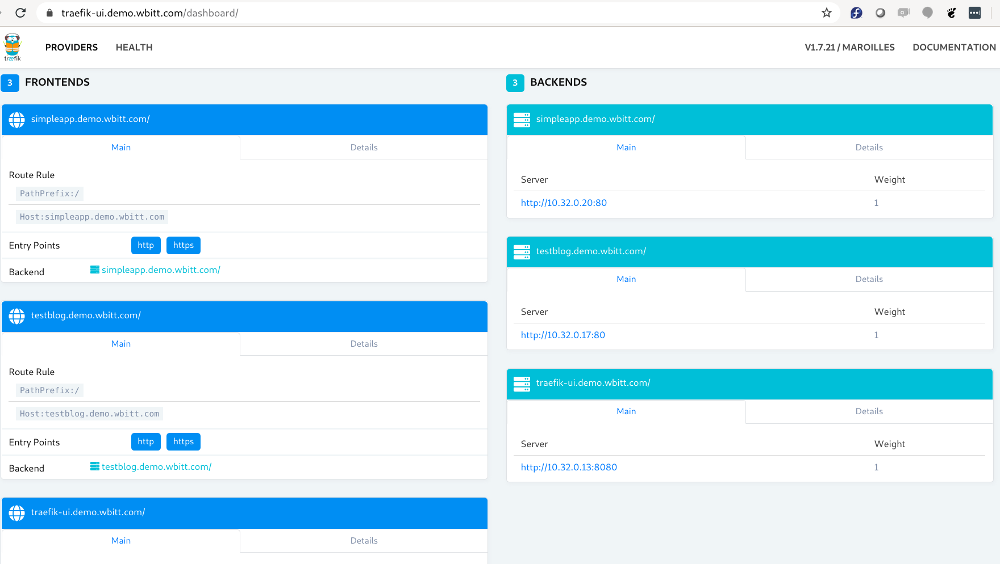 |
| --------------------------------------------------------- |


| 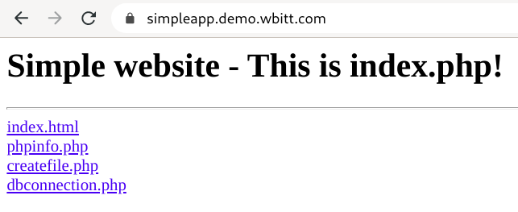 |
| ----------------------------------------------------------------- |


| 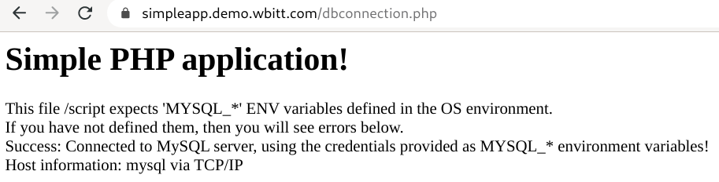 |
| ------------------------------------------------------------------------------- |


**It works!**

------


## Prepare to deploy on Kubernetes - through CircleCI:

### Add service account under IAM & Admin - for GCR and GKE access:

Create a new service account named "circleci-access" under "IAM & Admin"

Give some access Roles to this newly created service account. For example's sake we will use a bit relaxed permissions:
* Storage/Storage Admin
* Kubernetes Engine/Kubernetes Engine Developer


After setting permissions, create a key for this service account, by using "Create Key" button on next screen. Use type JSON. The key will download immediately to your computer, only once. Make a note of it's location. Keep it safe.


| 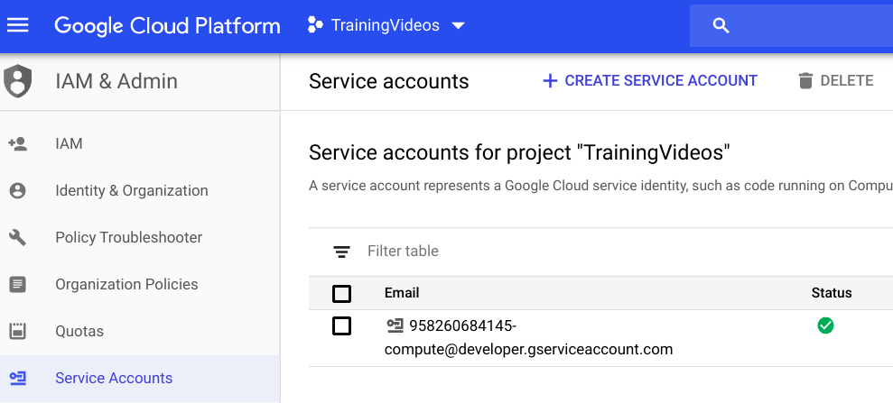 |
| ----------------------------------- |

| 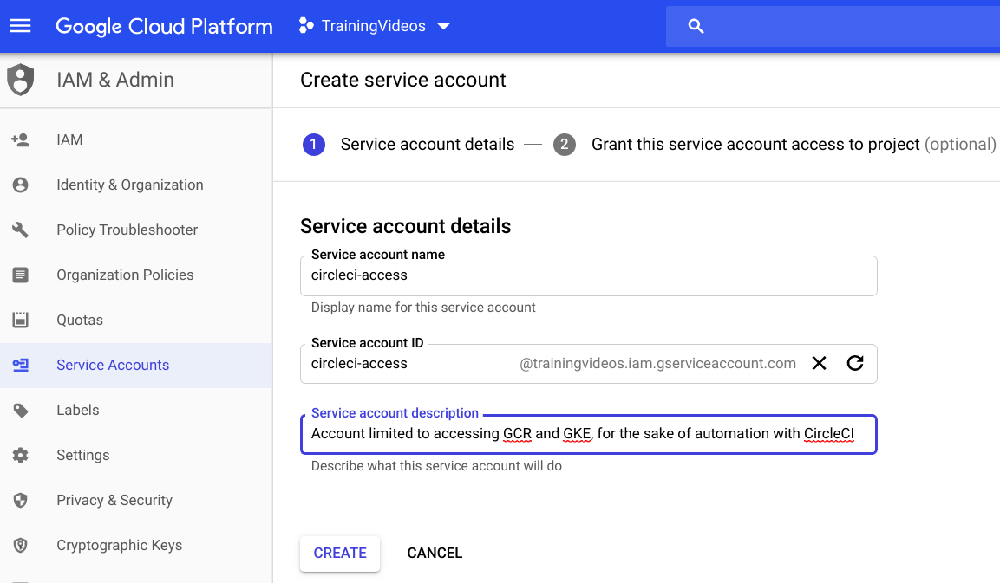 |
| ----------------------------------- |

| 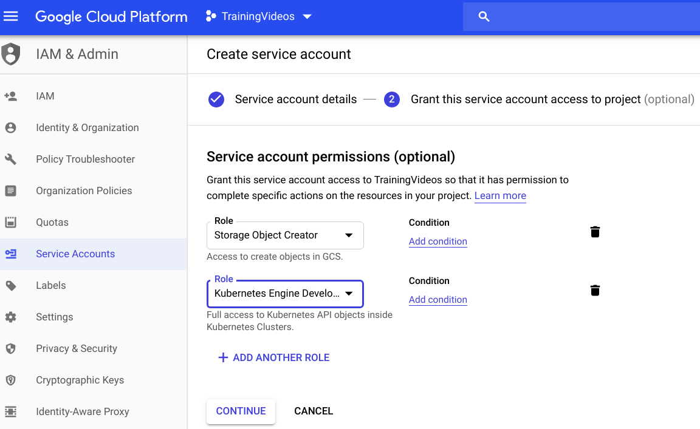 |
| ----------------------------------- |

| 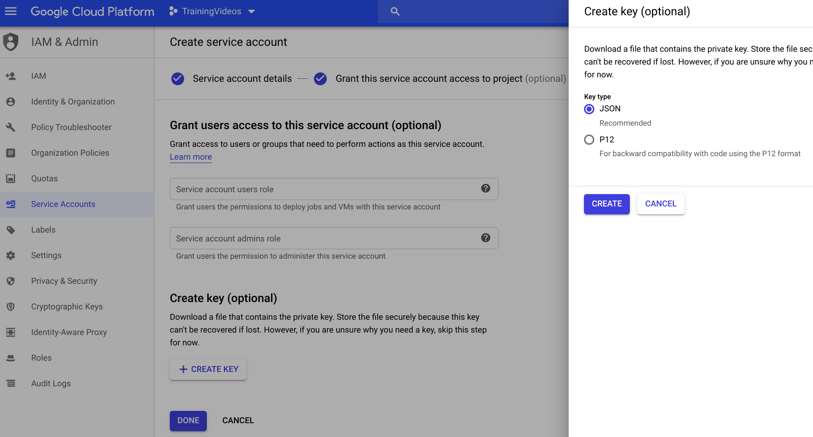 |
| ----------------------------------- |

| 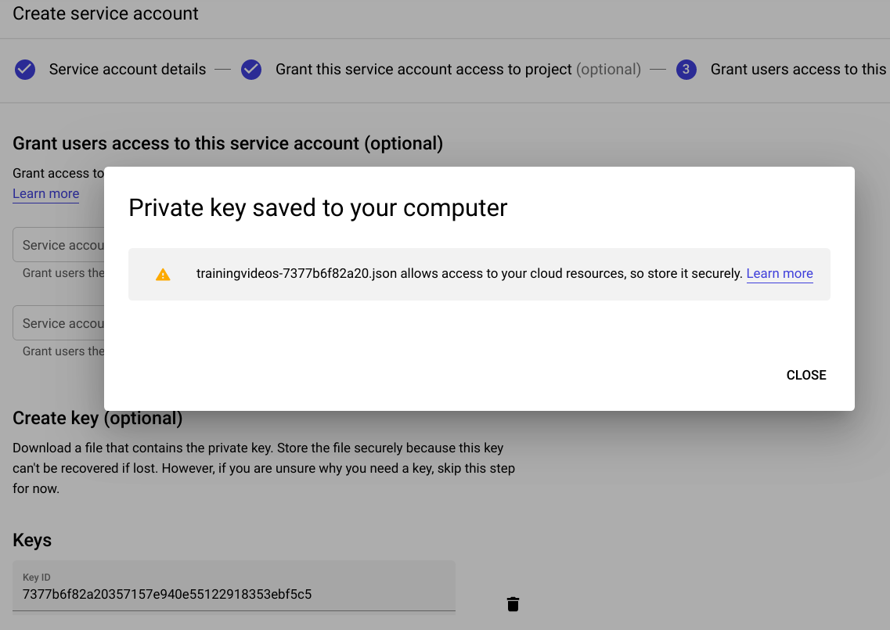 |
| ----------------------------------- |

| 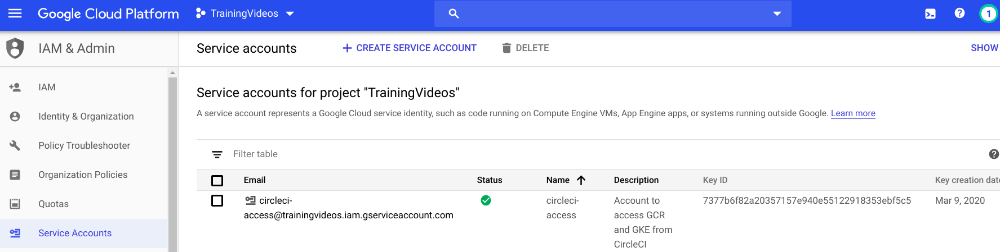 |
| ----------------------------------- |


Find the JSON file, and `cat` it on the terminal. Leave this here as it is, until we setup CircleCI.

| 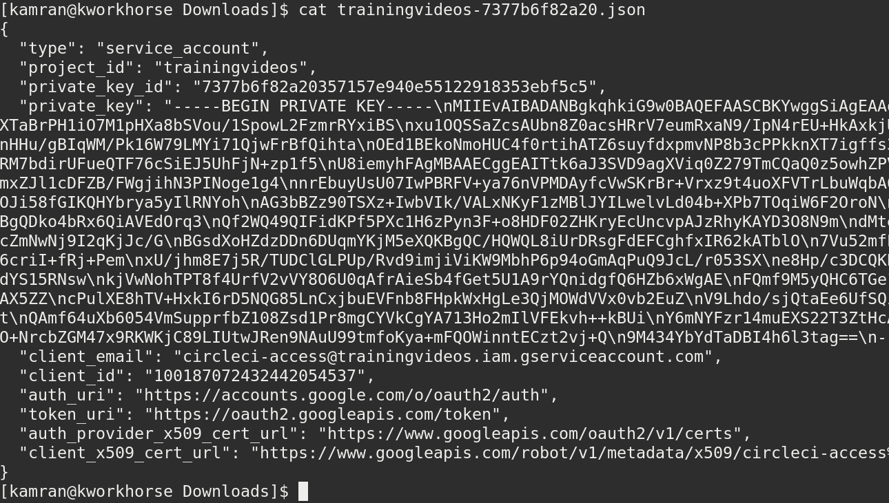 |
| ----------------------------------- |

You also need to know ID of the current GKE project, which you can obtain by simply visiting the Home section of the current project. The Project ID is listed over there. For my project, the id is: `trainingvideos` .


### Add new CircleCI project:
We start by setting up a new CircleCI project in CircleCI web interface. Click "Add Project" on left pane, and connect this repository to that project.


Select "Start Building". Select "Add Manually" on next screen. Click "Start Building" again on yet another screen. No need to download the `.circleci/config.yml`, because we are going to create it manually. Note that the first build **"will fail"**. That is ok.

| 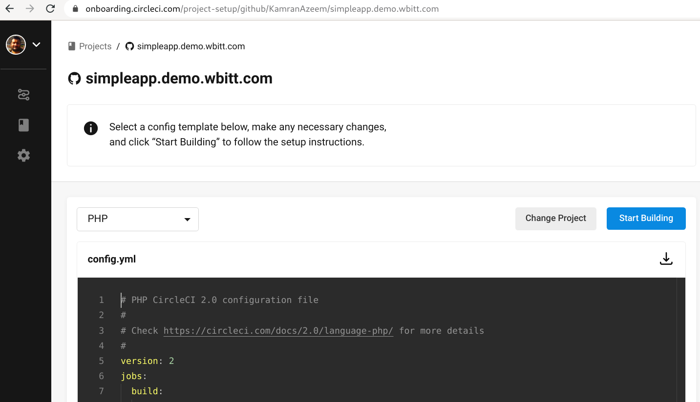 |
| ----------------------------------------------------------- |


| 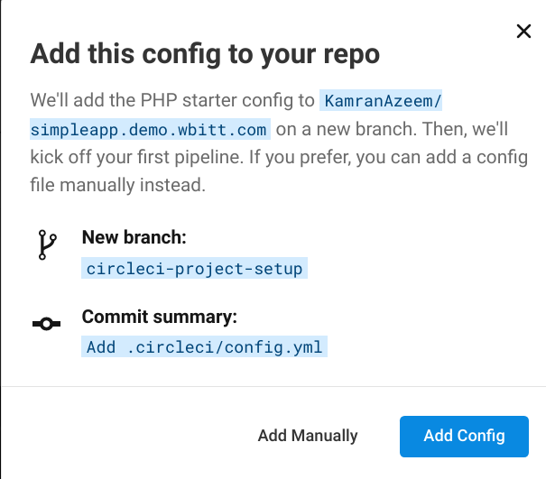 |
| ----------------------------------------------------------- |


|  |
| ----------------------------------------------------------- |


| 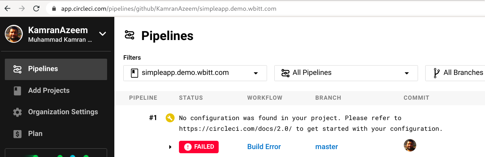 |
| ----------------------------------------------------------- |


We setup `GCLOUD_CREDENTIALS` as environment variable . In the Project settings of this project, go to Environment variables, and add an environment variable called `GCLOUD_CREDENTIALS`. Copy the text of the `JSON` file from the text terminal and paste it in as a value for this variable.

|  |
| ----------------------------------- |

| 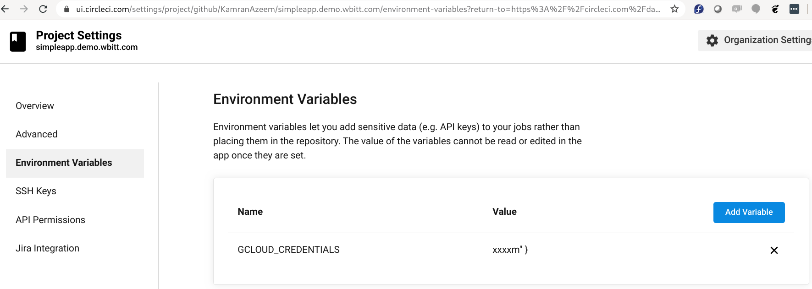 |
| ----------------------------------- |


We need to configure `.circleci/config.yml` to do the following steps:
* create and push a container image to GCR
* create necessary configmap
* create necessary secret
* deploy our application as a deployment
* create related service and ingress objects 


The `deployment.yaml` file expects an image name and tag. But remember, we can never know the tag/hash of the image in advance. The image will always be created by circleCI as part of a pipeline-job, and therefore we can't have a fixed image tag/hash in the `deployment.yaml` file. We must use some sort of "template" file, which will have only a "place-holder" for the image tag/hash. We will replace the placeholder with the actual value of the image tag/hash while processing it through CircleCI.

To be able to deploy any objects in Kubernetes cluster, you will need to connect to it through CircleCI. So we need a connection string - so to speak, which will create a `.kube/config` inside the CircleCI environment. We obtain that by choosing to connect to the cluster, which shows us the correct command.

| 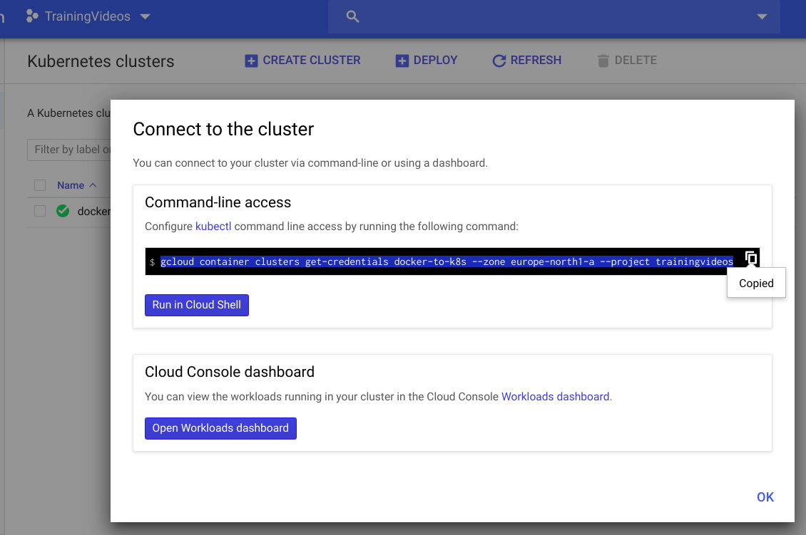 |
| ----------------------------------- |


Create CircleCI environment variables for our fictional configuration file and the `MYSQL_*` environment variables.


| 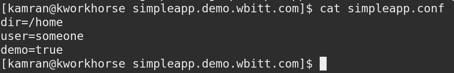 |
| ----------------------------------- |

| 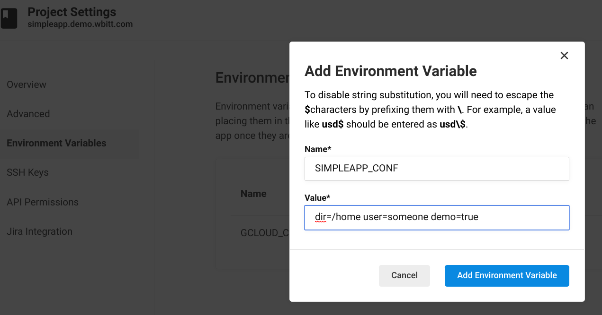 |
| ----------------------------------- |

| 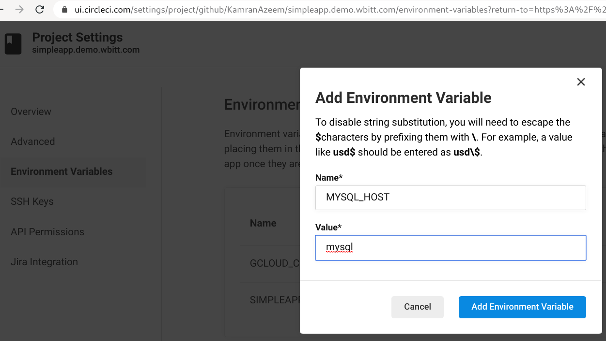 |
| ----------------------------------- |

| 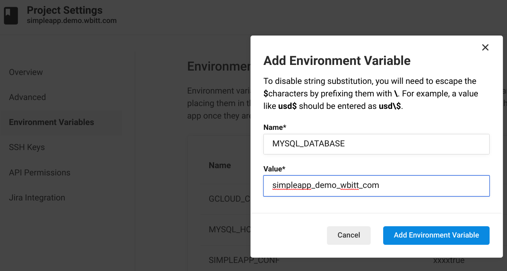 |
| ----------------------------------- |

| 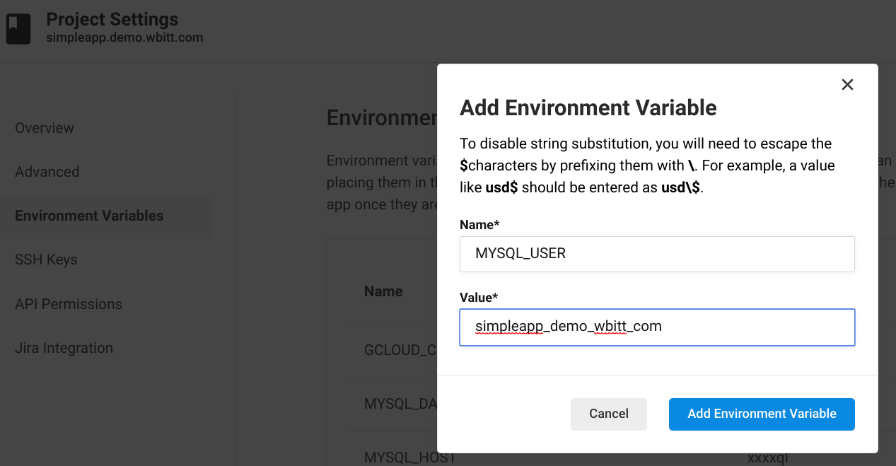 |
| ----------------------------------- |

|  |
| ----------------------------------- |

| 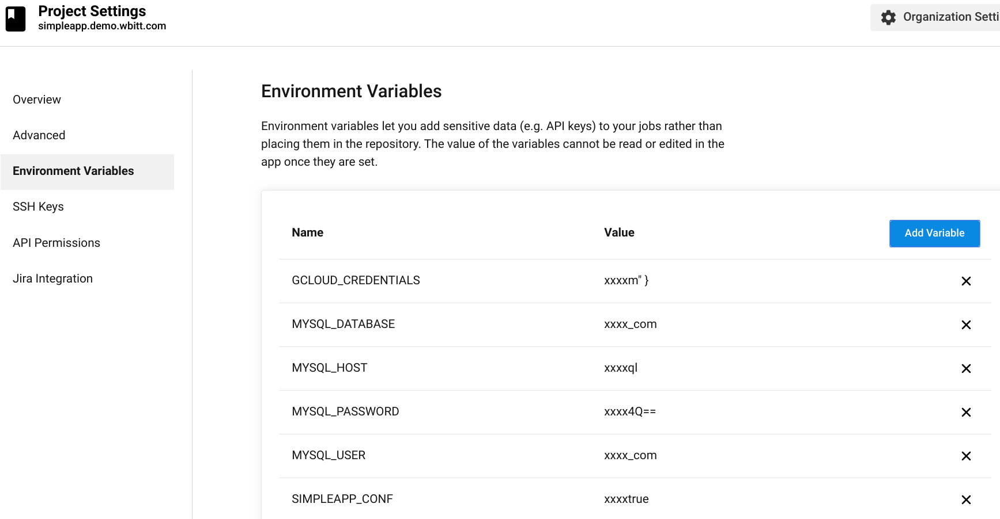 |
| ----------------------------------- |


Update the `.circleci/config.yml` file to use these environment variables as needed. Then, push this updated `.circleci/config.yml` to the repository. CircleCI will see the change and will start processing it. You will notice a "workflow" showing up in CircleCI web interface.


At this point, CircleCI will perform all the steps configured in it's `config.yml` file. Configmap will be (re)created, Secret will be (re)created, application will be deployed as a Deployment, and related Service and Ingress objects will be created.

| 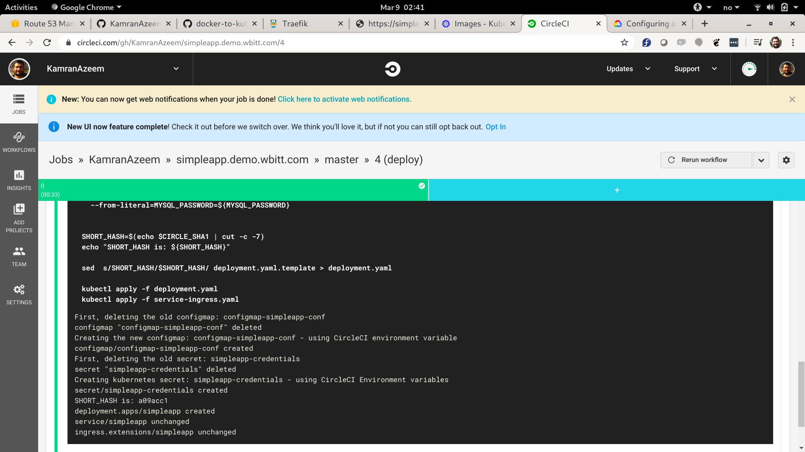 |
| ------------------------------------- |

| 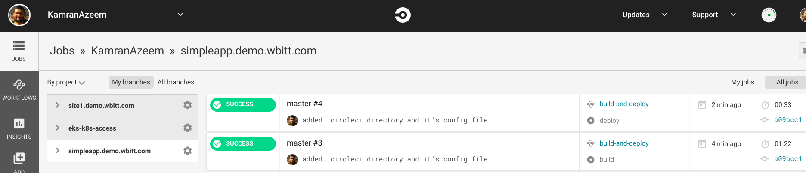 |
| ------------------------------------- |


Here is the complete `.circleci/config.yml` file:

```
[kamran@kworkhorse simpleapp.demo.wbitt.com]$ cat .circleci/config.yml | grep -v ^$
version: 2
jobs:
  build:
    docker:
      - image: google/cloud-sdk
    steps: 
      - run: 
          name: authenticate with gcloud
          command: |
            echo $GCLOUD_CREDENTIALS > ${HOME}/gcloud-service-key.json
            gcloud auth activate-service-account --key-file=${HOME}/gcloud-service-key.json
      - checkout             
      - setup_remote_docker
      - run: |
          gcloud auth configure-docker --quiet
          SHORT_HASH=$(echo $CIRCLE_SHA1 | cut -c -7)      
          docker build -t eu.gcr.io/trainingvideos/simpleapp:${SHORT_HASH} .
          docker push eu.gcr.io/trainingvideos/simpleapp:${SHORT_HASH}
  deploy:
    docker:
      - image: google/cloud-sdk  
    steps: 
      - run: 
          name: authenticate with gcloud
          command: |
            echo $GCLOUD_CREDENTIALS > ${HOME}/gcloud-service-key.json
            gcloud auth activate-service-account --key-file=${HOME}/gcloud-service-key.json
            gcloud container clusters get-credentials docker-to-k8s --zone europe-north1-a --project trainingvideos
      - checkout             
      - run: |
          echo ${SIMPLEAPP_CONF} > simpleapp.conf
          echo "First, deleting the old configmap: configmap-simpleapp-conf"
          kubectl delete configmap configmap-simpleapp-conf || true
          echo "Creating the new configmap: configmap-simpleapp-conf - using CircleCI environment variable"
          kubectl create  configmap configmap-simpleapp-conf --from-file=simpleapp.conf
          echo "First, deleting the old secret: simpleapp-credentials"
          kubectl delete secret simpleapp-credentials || true
          echo "Creating kubernetes secret: simpleapp-credentials - using CircleCI Environment variables"
          kubectl create secret generic simpleapp-credentials \
            --from-literal=MYSQL_HOST=${MYSQL_HOST} \
            --from-literal=MYSQL_DATABASE=${MYSQL_DATABASE} \
            --from-literal=MYSQL_USER=${MYSQL_USER} \
            --from-literal=MYSQL_PASSWORD=${MYSQL_PASSWORD}
          SHORT_HASH=$(echo $CIRCLE_SHA1 | cut -c -7)      
          echo "SHORT_HASH is: ${SHORT_HASH}"
          sed  s/SHORT_HASH/$SHORT_HASH/ deployment.yaml.template > deployment.yaml
          kubectl apply -f deployment.yaml 
          kubectl apply -f service-ingress.yaml
workflows:
  version: 2
  build-and-deploy:
    jobs: 
      - build:
          filters:
            branches: 
              only: master
      - deploy:
          requires:
            - build
          filters:
            branches: 
              only: master
[kamran@kworkhorse simpleapp.demo.wbitt.com]$ 
```

After successful run you see the objects in Kubernetes:

```
[kamran@kworkhorse simpleapp.demo.wbitt.com]$ kubectl get deployments
NAME        READY   UP-TO-DATE   AVAILABLE   AGE
simpleapp   1/1     1            1           60s
testblog    1/1     1            1           27h


[kamran@kworkhorse simpleapp.demo.wbitt.com]$ kubectl get pods
NAME                         READY   STATUS    RESTARTS   AGE
mysql-0                      1/1     Running   0          28h
simpleapp-5656d7cd44-g49zf   1/1     Running   0          68s
testblog-54f855f697-5qdmz    1/1     Running   0          26h
[kamran@kworkhorse simpleapp.demo.wbitt.com]$ 
```


| 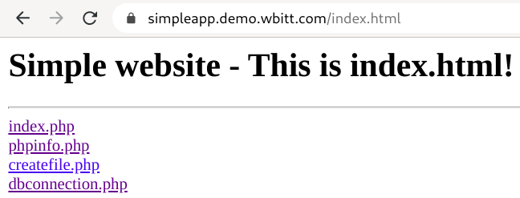 |
| ------------------------------------- |


| 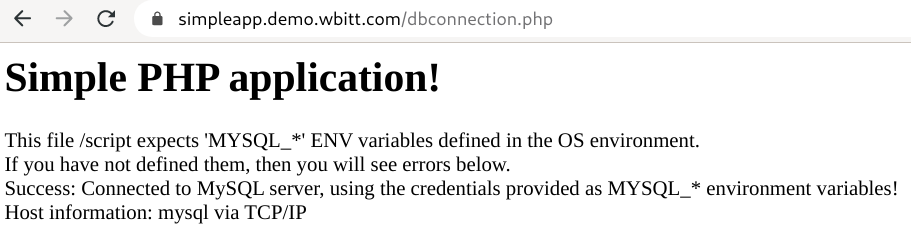 |
| ------------------------------------- |


As an experiment, add one line to `index.html` file indicating a new version of the application - so to speak. You will see new job kicks in:

```
[kamran@kworkhorse simpleapp.demo.wbitt.com]$ vi htdocs/index.html 

[kamran@kworkhorse simpleapp.demo.wbitt.com]$ git add htdocs/index.html 

[kamran@kworkhorse simpleapp.demo.wbitt.com]$ git commit -m "added first extra line in index.html"
[master 52cfc76] added first extra line in index.html
 1 file changed, 2 insertions(+)

[kamran@kworkhorse simpleapp.demo.wbitt.com]$ git push
Enumerating objects: 7, done.
. . . 
a09acc1..52cfc76  master -> master
[kamran@kworkhorse simpleapp.demo.wbitt.com]$
```

| 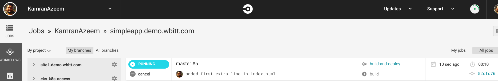 |
| ------------------------------------- |

| 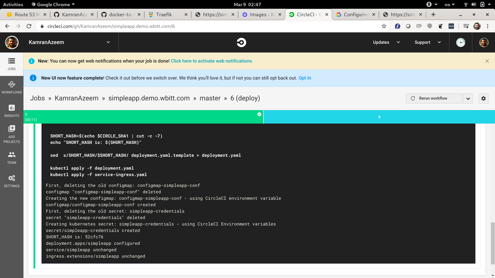 |
| ------------------------------------- |

| 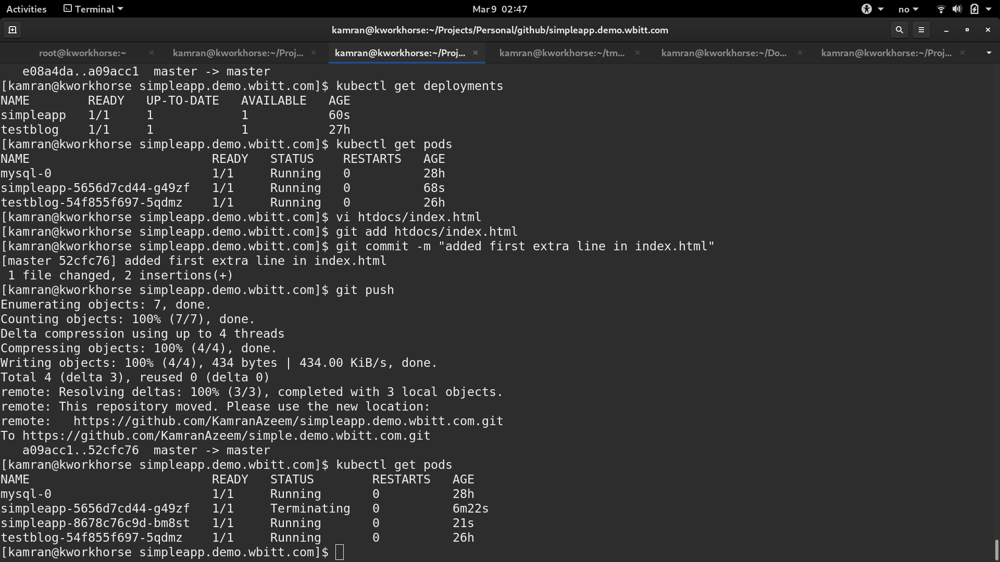 |
| ------------------------------------- |

|  |
| ------------------------------------- |


Since the image has changed, the new deployment will cause the previous pod to terminate and start a new one. 
```
[kamran@kworkhorse simpleapp.demo.wbitt.com]$ kubectl get pods
NAME                         READY   STATUS        RESTARTS   AGE
mysql-0                      1/1     Running       0          28h
simpleapp-5656d7cd44-g49zf   1/1     Terminating   0          6m22s
simpleapp-8678c76c9d-bm8st   1/1     Running       0          21s
testblog-54f855f697-5qdmz    1/1     Running       0          26h
[kamran@kworkhorse simpleapp.demo.wbitt.com]$ 
```

Notice that the change we introduced in our `index.html` is now visible on the web!

|  |
| ------------------------------------- |

So, **It works!**

There you have it, your application being deployed continuously using CircleCI.

(End of Part 3.)

