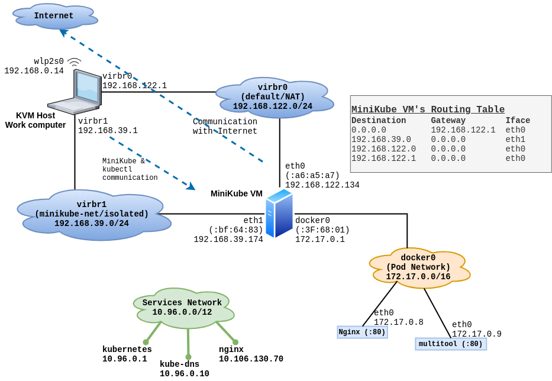
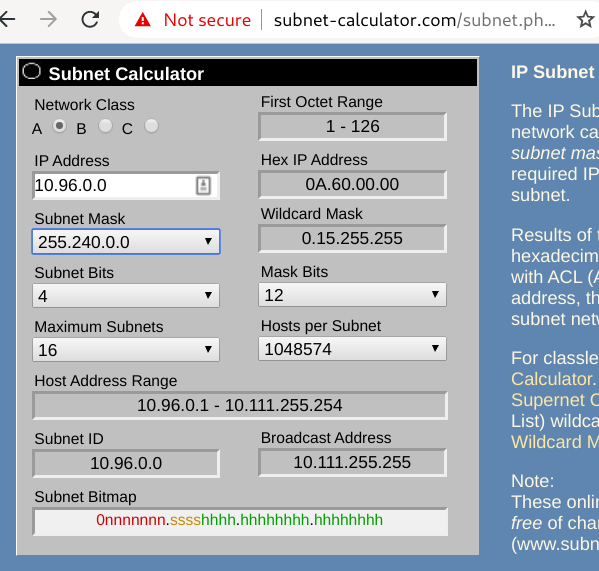

# Minikube Internals - Advanced topic

First, if you installed minikube **on Linux** *and* **used KVM for Virtualization**, then congratulations, you made the best choice! :) The reason is, Linux and KVM setup is very simple and straight-forward. There is nothing hidden, complicated, fearful or frustrating - as it is the case with Windows and VirtualBox/HyperV. (I will discuss this at a later time.)

This article discusses a minikube VM, running in KVM, on Fedora Linux.

## KVM virtual networks:
By default, KVM (libvirt) sets up a virtual network on your Linux host, and calls it `virbr0` (or, Virtual Bridge - Zero). This is a **NAT** type network,(Network Address Translation), which NATs any traffic coming in from inside this virtual network, trying to reach the internet, via any of the physical devices on your host. i.e either your wireless adapter, or network/ethernet port, or modem. So, this way, not only you can access the VMs you create (on this network), the VMs (on this network) can easily reach the internet also. 

When you install `minikube` , it creates an additional **isolated** virtual network inside KVM, and connects the minikube VM to both of these networks. i.e. it attaches itself to the NAT network as well as the isolated network. Like so:

|  |
| ----------------------------------------------------------- |


# Why minikube uses two different networks on the host?
Basically, I found no documentation on this topic so far. Minikube's documentation is completely silent about it. It is not discussed in any discussion forums, or GitHub issues, etc. Some people have asked somewhat similar questions, but either the discussion went into another direction, or the issue/thread simply died.

Below is my understanding so far. 

I think that minikube simply wants to deliver a development environment **completely local** to your work-computer. It does not want the kubernetes cluster (running inside the minikube VM) to be reached from the any other network. It also does not want to step on anyone else's toes in terms of IP addresses or networking in general - on this computer. That is why it simply sets up a new **"isolated"** virtual network, and sets up the VM to run on this network. Since the minikube VM needs to pull necessary software from the internet, such as `boot2docker.iso` and `minikube-v.x.y.z.iso`, and other things, it also connects the VM to a **NAT** network, which is normally the **default** network on any Hypervisor.

The minikube bootstrap process talks to the Hypervisor - KVM in our case - and dictates how the VM will be setup, such as:
* number of CPU cores
* amount of RAM
* size of disk
* network cards, and which network card connects to which network

When you pass the `--driver=kvm2` - or whatever Hypervisor you have on your computer - on the `minikube start` command, minikube configures itself to talk to that particular Hypervisor and get things done. That handles the "talking to the Hypervisor" part. When the VM is being created, the DHCP service attached to the virtual network assigns an IP address to it. This IP address can be queried/obtained directly from the hypervisor. e.g.

```
[root@kworkhorse ~]# virsh net-list
 Name              State    Autostart   Persistent
----------------------------------------------------
 default           active   yes         yes
 k8s-kubeadm-net   active   yes         yes
 minikube-net      active   yes         yes


[root@kworkhorse ~]# virsh net-dhcp-leases minikube-net
 Expiry Time           MAC address         Protocol   IP address          Hostname   Client ID or DUID
-----------------------------------------------------------------------------------------------------------
 2020-04-21 00:05:03   30:e0:ec:bf:64:8e   ipv4       192.168.39.174/24   minikube   01:30:e0:ec:bf:64:8e

[root@kworkhorse ~]# 
```

The minikube IP address discussed everywhere in this document is `192.168.39.174` .

During the bootstrap process minikube uses this IP address to configure various aspects of kubernetes components, and also places certain SSH keys inside the VM. It then does a ssh fingerprint scan against that IP address and keeps that in your local user's local config files specific to minikue, inside `~/.minikube` directory. It also configures a context for this newly created single-node kubernetes cluster, and places that inside your `~/.kube/config` file - using the same IP. Inside the VM, minikube configures kubernetes API server to only bind to the IP address from the isolated network. 

All of above happens when you use `minikube start --driver=kvm2` command. (The driver can be a different one depending on your hypervisor). Minikube perform all these checks every time you `start` the VM from the stopped state. If, for some reason, the IP changes, minikube bootstrap process updates all necessary file. 

This is the reason that `minikube ip` command **never** returns you the IP of the VM when the minikube VM is in stopped state. It does not just read the IP from config file and shows it to you. It actually queries the hypervisor each time `minikube ip` command is issued and depending on the VM's state, either shows the IP currently assigned to the VM by KVM's DHCP service, or refuses to show it to you if the VM is found in the stopped state. Below are examples of both cases:

```
[kamran@kworkhorse ~]$ minikube ip
🤷  The control plane node must be running for this command
👉  To fix this, run: "minikube start"
[kamran@kworkhorse ~]$
```

```
[kamran@kworkhorse ~]$ minikube ip
192.168.39.174
[kamran@kworkhorse ~]$
```

By the way, networking perspective, the minikube VM is accessible from the host, over both isolated and NAT networks. It is just that the kubectl commands will expect to connect to the IP of the API server listed in `.kube/config` file. This IP will always be from the isolated network. 

Below I have shown that this VM is accessible using standard network tools over both networks it is connected to. First, I find the IP addresses assigned to this VM by each virtual network's DHCP service.

```
[root@kworkhorse ~]# virsh net-dhcp-leases minikube-net
 Expiry Time           MAC address         Protocol   IP address          Hostname   Client ID or DUID
-----------------------------------------------------------------------------------------------------------
 2020-04-21 00:05:03   30:e0:ec:bf:64:8e   ipv4       192.168.39.174/24   minikube   01:30:e0:ec:bf:64:8e

[root@kworkhorse ~]# 
```


```
[root@kworkhorse ~]# virsh net-dhcp-leases default
 Expiry Time           MAC address         Protocol   IP address           Hostname   Client ID or DUID
------------------------------------------------------------------------------------------------------------
 2020-04-21 00:32:39   e8:94:3e:a6:a5:a7   ipv4       192.168.122.134/24   minikube   01:e8:94:3e:a6:a5:a7

[root@kworkhorse ~]# 
```

Now I can ping both IP addresses from my computer:

```
[root@kworkhorse ~]# ping -c 2 192.168.39.174
PING 192.168.39.174 (192.168.39.174) 56(84) bytes of data.
64 bytes from 192.168.39.174: icmp_seq=1 ttl=64 time=0.188 ms
64 bytes from 192.168.39.174: icmp_seq=2 ttl=64 time=0.276 ms

--- 192.168.39.174 ping statistics ---
2 packets transmitted, 2 received, 0% packet loss, time 1031ms
rtt min/avg/max/mdev = 0.188/0.232/0.276/0.044 ms
[root@kworkhorse ~]# 
```

```
[root@kworkhorse ~]# ping -c 2 192.168.122.134
PING 192.168.122.134 (192.168.122.134) 56(84) bytes of data.
64 bytes from 192.168.122.134: icmp_seq=1 ttl=64 time=0.160 ms
64 bytes from 192.168.122.134: icmp_seq=2 ttl=64 time=0.121 ms

--- 192.168.122.134 ping statistics ---
2 packets transmitted, 2 received, 0% packet loss, time 1042ms
rtt min/avg/max/mdev = 0.121/0.140/0.160/0.019 ms
[root@kworkhorse ~]# 
```

Minikube creates a RSA keypair in `.minikube/machines/minikube/`, which I can use to login to the VM as user `docker`. Actually the `minikube ssh` command also logs you in this VM using the user `docker`.

```
[kamran@kworkhorse ~]$ ssh -i .minikube/machines/minikube/id_rsa docker@192.168.39.174
                         _             _            
            _         _ ( )           ( )           
  ___ ___  (_)  ___  (_)| |/')  _   _ | |_      __  
/' _ ` _ `\| |/' _ `\| || , <  ( ) ( )| '_`\  /'__`\
| ( ) ( ) || || ( ) || || |\`\ | (_) || |_) )(  ___/
(_) (_) (_)(_)(_) (_)(_)(_) (_)`\___/'(_,__/'`\____)

$ 
```


I can also log in to the same VM using the other IP address:

```
[kamran@kworkhorse ~]$ ssh -i .minikube/machines/minikube/id_rsa docker@192.168.122.134
The authenticity of host '192.168.122.134 (192.168.122.134)' can't be established.
ECDSA key fingerprint is SHA256:5Fy2a0TdCmA4+UbR7zDYF0cMOsOjcU10hdrYFeYo4pQ.
Are you sure you want to continue connecting (yes/no/[fingerprint])? yes
Warning: Permanently added '192.168.122.134' (ECDSA) to the list of known hosts.
                         _             _            
            _         _ ( )           ( )           
  ___ ___  (_)  ___  (_)| |/')  _   _ | |_      __  
/' _ ` _ `\| |/' _ `\| || , <  ( ) ( )| '_`\  /'__`\
| ( ) ( ) || || ( ) || || |\`\ | (_) || |_) )(  ___/
(_) (_) (_)(_)(_) (_)(_)(_) (_)`\___/'(_,__/'`\____)

$ 
```


## The minikube pod network:

Minikube uses the default `docker0` software bridge (on the minikube VM) as it's pod network. When you run your pods on minikube, they get IP addresses from the `docker0` network `172.17.0.0/16` . 

```
[kamran@kworkhorse ~]$ kubectl get pods -o wide
NAME                         READY   STATUS    RESTARTS   AGE    IP           NODE       NOMINATED NODE   READINESS GATES
multitool-7f647bbbd7-756n7   1/1     Running   0          104m   172.17.0.9   minikube   <none>           <none>
nginx-745b4df97d-wjrtr       1/1     Running   0          24h    172.17.0.8   minikube   <none>           <none>
[kamran@kworkhorse ~]$ 
```


Below is list of all the pods running in all namespaces:

```
[kamran@kworkhorse ~]$ kubectl get pods --all-namespaces=true -o wide
NAMESPACE              NAME                                         READY   STATUS    RESTARTS   AGE     IP               NODE       NOMINATED NODE   READINESS GATES
default                multitool-7f647bbbd7-756n7                   1/1     Running   0          111m    172.17.0.9       minikube   <none>           <none>
default                nginx-745b4df97d-wjrtr                       1/1     Running   0          24h     172.17.0.8       minikube   <none>           <none>
kube-system            coredns-66bff467f8-dww5p                     1/1     Running   3          4d23h   172.17.0.2       minikube   <none>           <none>
kube-system            coredns-66bff467f8-hnbxp                     1/1     Running   3          4d23h   172.17.0.4       minikube   <none>           <none>
kube-system            etcd-minikube                                1/1     Running   2          4d23h   192.168.39.174   minikube   <none>           <none>
kube-system            kube-apiserver-minikube                      1/1     Running   2          4d23h   192.168.39.174   minikube   <none>           <none>
kube-system            kube-controller-manager-minikube             1/1     Running   2          4d23h   192.168.39.174   minikube   <none>           <none>
kube-system            kube-proxy-hdc9r                             1/1     Running   2          4d23h   192.168.39.174   minikube   <none>           <none>
kube-system            kube-scheduler-minikube                      1/1     Running   2          4d23h   192.168.39.174   minikube   <none>           <none>
kube-system            metrics-server-7bc6d75975-kp4kp              1/1     Running   3          4d23h   172.17.0.6       minikube   <none>           <none>
kube-system            storage-provisioner                          1/1     Running   4          4d23h   192.168.39.174   minikube   <none>           <none>
kube-system            tiller-deploy-58bf6f4995-nvwc6               1/1     Running   2          4d23h   172.17.0.7       minikube   <none>           <none>
kubernetes-dashboard   dashboard-metrics-scraper-84bfdf55ff-jtp2z   1/1     Running   3          4d23h   172.17.0.5       minikube   <none>           <none>
kubernetes-dashboard   kubernetes-dashboard-bc446cc64-wccx9         1/1     Running   4          4d23h   172.17.0.3       minikube   <none>           <none>
[kamran@kworkhorse ~]$
```

For each pod, there is a matching `vethX` interface on the minikube VM. You will notice that there are total of eight pods in the list of pods above, which belong to `172.17.0.0/16` network. Those eight pods have eight corresponding veth interfaces on the minikube VM.

```
[kamran@kworkhorse ~]$ minikube ssh
                         _             _            
            _         _ ( )           ( )           
  ___ ___  (_)  ___  (_)| |/')  _   _ | |_      __  
/' _ ` _ `\| |/' _ `\| || , <  ( ) ( )| '_`\  /'__`\
| ( ) ( ) || || ( ) || || |\`\ | (_) || |_) )(  ___/
(_) (_) (_)(_)(_) (_)(_)(_) (_)`\___/'(_,__/'`\____)

$ ifconfig
docker0   Link encap:Ethernet  HWaddr 02:42:18:3F:68:01  
          inet addr:172.17.0.1  Bcast:172.17.255.255  Mask:255.255.0.0
          UP BROADCAST RUNNING MULTICAST  MTU:1500  Metric:1
          RX packets:237369 errors:0 dropped:0 overruns:0 frame:0
          TX packets:261018 errors:0 dropped:0 overruns:0 carrier:0
          collisions:0 txqueuelen:0 
          RX bytes:26199466 (24.9 MiB)  TX bytes:86701864 (82.6 MiB)

eth0      Link encap:Ethernet  HWaddr E8:94:3E:A6:A5:A7  
          inet addr:192.168.122.134  Bcast:192.168.122.255  Mask:255.255.255.0
          UP BROADCAST RUNNING MULTICAST  MTU:1500  Metric:1
          RX packets:34317 errors:0 dropped:4 overruns:0 frame:0
          TX packets:8861 errors:0 dropped:0 overruns:0 carrier:0
          collisions:0 txqueuelen:1000 
          RX bytes:75742418 (72.2 MiB)  TX bytes:569894 (556.5 KiB)

eth1      Link encap:Ethernet  HWaddr 30:E0:EC:BF:64:8E  
          inet addr:192.168.39.174  Bcast:192.168.39.255  Mask:255.255.255.0
          UP BROADCAST RUNNING MULTICAST  MTU:1500  Metric:1
          RX packets:21801 errors:0 dropped:4 overruns:0 frame:0
          TX packets:4233 errors:0 dropped:0 overruns:0 carrier:0
          collisions:0 txqueuelen:1000 
          RX bytes:1666237 (1.5 MiB)  TX bytes:2275476 (2.1 MiB)

lo        Link encap:Local Loopback  
          inet addr:127.0.0.1  Mask:255.0.0.0
          UP LOOPBACK RUNNING  MTU:65536  Metric:1
          RX packets:4467438 errors:0 dropped:0 overruns:0 frame:0
          TX packets:4467438 errors:0 dropped:0 overruns:0 carrier:0
          collisions:0 txqueuelen:1000 
          RX bytes:923712869 (880.9 MiB)  TX bytes:923712869 (880.9 MiB)

veth24e6f1c Link encap:Ethernet  HWaddr 12:DF:6B:2E:70:1D  
          UP BROADCAST RUNNING MULTICAST  MTU:1500  Metric:1
          RX packets:61790 errors:0 dropped:0 overruns:0 frame:0
          TX packets:68648 errors:0 dropped:0 overruns:0 carrier:0
          collisions:0 txqueuelen:0 
          RX bytes:5168870 (4.9 MiB)  TX bytes:24400766 (23.2 MiB)

veth4a92c04 Link encap:Ethernet  HWaddr 2A:7E:59:B6:D3:3F  
          UP BROADCAST RUNNING MULTICAST  MTU:1500  Metric:1
          RX packets:28820 errors:0 dropped:0 overruns:0 frame:0
          TX packets:33862 errors:0 dropped:0 overruns:0 carrier:0
          collisions:0 txqueuelen:0 
          RX bytes:2538372 (2.4 MiB)  TX bytes:3042459 (2.9 MiB)

veth5873179 Link encap:Ethernet  HWaddr 66:03:01:A4:6C:F9  
          UP BROADCAST RUNNING MULTICAST  MTU:1500  Metric:1
          RX packets:17650 errors:0 dropped:0 overruns:0 frame:0
          TX packets:19288 errors:0 dropped:0 overruns:0 carrier:0
          collisions:0 txqueuelen:0 
          RX bytes:4384335 (4.1 MiB)  TX bytes:2108358 (2.0 MiB)

vethbc5fa46 Link encap:Ethernet  HWaddr 32:7B:8F:D8:84:65  
          UP BROADCAST RUNNING MULTICAST  MTU:1500  Metric:1
          RX packets:18996 errors:0 dropped:0 overruns:0 frame:0
          TX packets:22951 errors:0 dropped:0 overruns:0 carrier:0
          collisions:0 txqueuelen:0 
          RX bytes:1923616 (1.8 MiB)  TX bytes:4943649 (4.7 MiB)

vethbef0bfa Link encap:Ethernet  HWaddr 6E:52:39:0A:A2:6E  
          UP BROADCAST RUNNING MULTICAST  MTU:1500  Metric:1
          RX packets:48404 errors:0 dropped:0 overruns:0 frame:0
          TX packets:47498 errors:0 dropped:0 overruns:0 carrier:0
          collisions:0 txqueuelen:0 
          RX bytes:10339373 (9.8 MiB)  TX bytes:27796021 (26.5 MiB)

vethee5118c Link encap:Ethernet  HWaddr FE:24:BF:DD:C3:FB  
          UP BROADCAST RUNNING MULTICAST  MTU:1500  Metric:1
          RX packets:28 errors:0 dropped:0 overruns:0 frame:0
          TX packets:45 errors:0 dropped:0 overruns:0 carrier:0
          collisions:0 txqueuelen:0 
          RX bytes:5092 (4.9 KiB)  TX bytes:3075 (3.0 KiB)

vethf55e120 Link encap:Ethernet  HWaddr 76:C5:6F:ED:13:26  
          UP BROADCAST RUNNING MULTICAST  MTU:1500  Metric:1
          RX packets:61660 errors:0 dropped:0 overruns:0 frame:0
          TX packets:68801 errors:0 dropped:0 overruns:0 carrier:0
          collisions:0 txqueuelen:0 
          RX bytes:5160476 (4.9 MiB)  TX bytes:24411304 (23.2 MiB)

vethfb87fab Link encap:Ethernet  HWaddr 06:E3:43:C1:FA:8D  
          UP BROADCAST RUNNING MULTICAST  MTU:1500  Metric:1
          RX packets:35 errors:0 dropped:0 overruns:0 frame:0
          TX packets:47 errors:0 dropped:0 overruns:0 carrier:0
          collisions:0 txqueuelen:0 
          RX bytes:4152 (4.0 KiB)  TX bytes:3492 (3.4 KiB)

$ 
```

## The service network (ClusterIPs):
Minikube uses `10.96.0.0/12` address range for the services it creates. It allows XXXX amount of host IPAddresses, essentially meaning that it supports XXXX amount of cluster services (ClusterIPs). The usable IP address range for this network is: `10.96.0.1 - 10.111.255.254`. That is why you see all these funny looking ClusterIP addresses like `10.106.130.70`), which - visually - do not resemble `10.96.x.y`! But they are from the same network IP range!

```
[kamran@kworkhorse ~]$ kubectl --all-namespaces=true get svc
NAMESPACE              NAME                        TYPE           CLUSTER-IP       EXTERNAL-IP   PORT(S)                  AGE
default                kubernetes                  ClusterIP      10.96.0.1        <none>        443/TCP                  5d
default                multitool                   LoadBalancer   10.111.126.81    <pending>     80:31019/TCP             134m
default                nginx                       LoadBalancer   10.106.130.70    <pending>     80:32185/TCP             137m
kube-system            kube-dns                    ClusterIP      10.96.0.10       <none>        53/UDP,53/TCP,9153/TCP   5d
kube-system            metrics-server              ClusterIP      10.107.10.22     <none>        443/TCP                  4d23h
kube-system            tiller-deploy               ClusterIP      10.106.118.240   <none>        44134/TCP                4d23h
kubernetes-dashboard   dashboard-metrics-scraper   ClusterIP      10.108.205.16    <none>        8000/TCP                 4d23h
kubernetes-dashboard   kubernetes-dashboard        ClusterIP      10.100.220.107   <none>        80/TCP                   4d23h
[kamran@kworkhorse ~]$ 
```

Below is a screenshot from a popular online subnet calculator.

|  |
| ------------------------------------------------------------- |


## The minikube LoadBalancer:

Iptables rules setup by `minikube tunnel`. It needs sudo, because it needs to add iptables rules for traffic redirection.


The two files, where some of this information is written are:
* ~/.minikube/profiles/minikube/config.json
* ~/.minikube/machines/minikube/config.json
 

```
[kamran@kworkhorse ~]$ cat ~/.minikube/profiles/minikube/config.json
{
	"Name": "minikube",
	"KeepContext": false,
	"EmbedCerts": false,
	"MinikubeISO": "https://storage.googleapis.com/minikube/iso/minikube-v1.9.0.iso",
	"Memory": 3900,
	"CPUs": 2,
	"DiskSize": 20000,
	"Driver": "kvm2",
. . . 
. . . 
	},
	"Nodes": [
		{
			"Name": "m01",
			"IP": "192.168.39.174",
			"Port": 8443,
			"KubernetesVersion": "v1.18.0",
			"ControlPlane": true,
			"Worker": true
		}
	],
	"Addons": {
		"dashboard": true,
		"default-storageclass": true,
		"helm-tiller": true,
		"metrics-server": true,
		"storage-provisioner": true
	},
	"VerifyComponents": {
		"apiserver": true,
		"system_pods": true
	}
}
[kamran@kworkhorse ~]$ 
```


```
[kamran@kworkhorse ~]$ cat .minikube/machines/minikube/config.json 
{
    "ConfigVersion": 3,
    "Driver": {
        "IPAddress": "192.168.39.174",
        "MachineName": "minikube",
        "SSHUser": "docker",
        "SSHPort": 22,
        "SSHKeyPath": "/home/kamran/.minikube/machines/minikube/id_rsa",
        "StorePath": "/home/kamran/.minikube",
        "SwarmMaster": false,
        "SwarmHost": "",
        "SwarmDiscovery": "",
        "Memory": 3900,
        "CPU": 2,
        "Network": "default",
        "PrivateNetwork": "minikube-net",
        "DiskSize": 20000,
        "DiskPath": "/home/kamran/.minikube/machines/minikube/minikube.rawdisk",
        "Boot2DockerURL": "file:///home/kamran/.minikube/cache/iso/minikube-v1.9.0.iso",
        "ISO": "/home/kamran/.minikube/machines/minikube/boot2docker.iso",
        "MAC": "e8:94:3e:a6:a5:a7",
        "PrivateMAC": "30:e0:ec:bf:64:8e",
        "GPU": false,
        "Hidden": false,
        "DevicesXML": "",
        "ConnectionURI": "qemu:///system"
    },
    "DriverName": "kvm2",
    "HostOptions": {
        "Driver": "",
        "Memory": 0,
        "Disk": 0,
        "EngineOptions": {
            "ArbitraryFlags": null,
            "Dns": null,
            "GraphDir": "",
            "Env": null,
            "Ipv6": false,
            "InsecureRegistry": [
                "10.96.0.0/12"
            ],
. . . 
        },
. . . 
        "AuthOptions": {
            "CertDir": "/home/kamran/.minikube",
            "CaCertPath": "/home/kamran/.minikube/certs/ca.pem",
            "CaPrivateKeyPath": "/home/kamran/.minikube/certs/ca-key.pem",
            "CaCertRemotePath": "",
            "ServerCertPath": "/home/kamran/.minikube/machines/server.pem",
            "ServerKeyPath": "/home/kamran/.minikube/machines/server-key.pem",
            "ClientKeyPath": "/home/kamran/.minikube/certs/key.pem",
            "ServerCertRemotePath": "",
            "ServerKeyRemotePath": "",
            "ClientCertPath": "/home/kamran/.minikube/certs/cert.pem",
            "ServerCertSANs": null,
            "StorePath": "/home/kamran/.minikube"
        }
    },
    "Name": "minikube"
}
[kamran@kworkhorse ~]$ 
```

