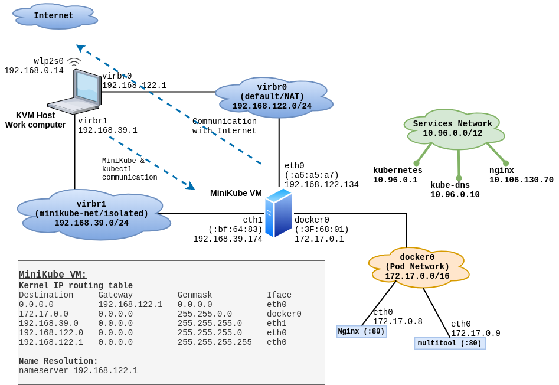
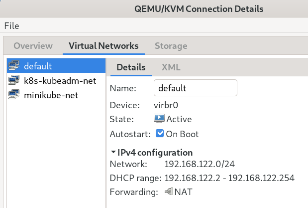
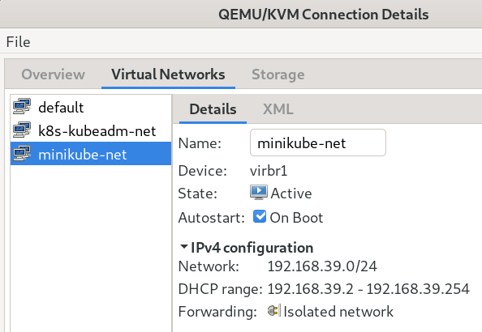
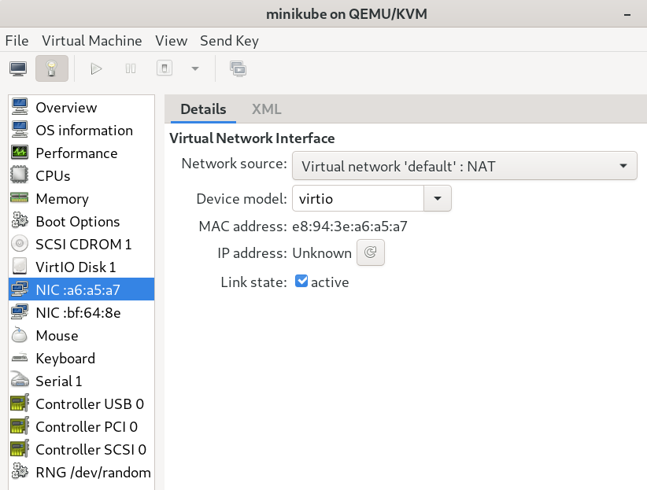
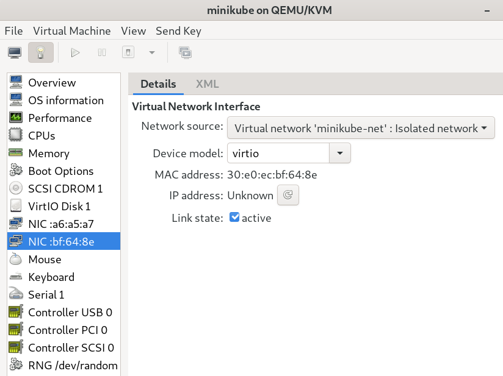

# Minikube Internals - Advanced topic

First, if you installed minikube **on Linux** *and* **used KVM for Virtualization**, then congratulations, you made the best choice! :) The reason is, Linux and KVM setup is very simple and straight-forward. There is nothing hidden, complicated, fearful or frustrating - as it is the case with Windows and VirtualBox/HyperV. (I will discuss this at a later time.)

This article discusses a minikube VM, running in KVM, on Fedora Linux.

## KVM virtual networks:
By default, KVM (libvirt) sets up a virtual network on your Linux host, and calls it `virbr0` (or, Virtual Bridge - Zero). This is a **NAT** type network,(Network Address Translation), which NATs any traffic coming in from inside this virtual network, trying to reach the internet, via any of the physical devices on your host. i.e either your wireless adapter, or network/ethernet port, or modem. So, this way, not only you can access the VMs you create (on this network), the VMs (on this network) can easily reach the internet also. 

When you install `minikube` , it creates an additional **isolated** virtual network inside KVM, and connects the minikube VM to both of these networks. i.e. it attaches itself to the NAT network as well as the isolated network. Like so:

|  |
| ------------------------------------------------------------------- |

# Why minikube uses two different networks on the host?
Basically, I found no documentation on this topic so far. Minikube's documentation is completely silent about it. It is not discussed in any discussion forums, or GitHub issues, etc. Some people have asked somewhat similar questions, but either the discussion went into another direction, or the issue/thread simply died. So, I eventually asked [the question](https://github.com/kubernetes/minikube/issues/7848).   

Below is my understanding so far. 

This is some silliness from `docker-machine`, which has crept into the KVM setup from the VirtualBox setup. Just so you know, minikube uses `docker-machine` internally to setup the VM on a given hypervisor. Now, VirtualBox has very weird networking; and when docker-machine is used to setup a docker environment on VirtualBox, it uses two networks, one to access the VM, and the other for the VM to access the Internet. When `minikube` needed this (docker) setup for KVM, someone from docker-machine team - not confirmed yet, but most probably - copied the same design and applied to KVM/libvirt, which was completely unnecessary, and just complicated things. KVM is very capable, simple and efficient hypervisor, and it does not need any *"workarounds"* . Treating KVM and VirtualBox in the same way is unfair with KVM. 

I later checked minikube on Windows-10/Hyper-V, and found out that minikube's setup *does not* create the additional *isolated network* on Hyper-V the way it did on Linux. Instead it simply uses Hyper-V's *default* network for accessing the minikube VM from the host, and for the minikube VM to access the Internet. Simple! 

I don't know why minikube and/or docker-machine team decided to go the *"two networks"* route for KVM.

## More networking details about the MiniKube VM:
The minikube bootstrap process talks to the Hypervisor - KVM in our case - and dictates how the VM will be setup, such as:
* number of CPU cores
* amount of RAM
* size of disk
* network cards, and the network to which each network card connects

When you pass the `--driver=kvm2` on the `minikube start` command, minikube configures itself to talk to KVM to get things done. That handles the *"talking to the Hypervisor"* part. When the VM is being created, the DHCP services serving/attached to each virtual network, assign an IP address to the corresponding network interface on the VM. This IP address can be queried/obtained directly from the hypervisor. e.g.

```
[root@kworkhorse ~]# virsh net-list
 Name              State    Autostart   Persistent
----------------------------------------------------
 default           active   yes         yes
 k8s-kubeadm-net   active   yes         yes
 minikube-net      active   yes         yes
```

```
[root@kworkhorse ~]# virsh net-dhcp-leases minikube-net
 Expiry Time           MAC address         Protocol   IP address          Hostname   Client ID or DUID
-----------------------------------------------------------------------------------------------------------
 2020-04-21 00:05:03   30:e0:ec:bf:64:8e   ipv4       192.168.39.174/24   minikube   01:30:e0:ec:bf:64:8e

[root@kworkhorse ~]# 
```


```
[root@kworkhorse ~]# virsh net-dhcp-leases default
 Expiry Time           MAC address         Protocol   IP address           Hostname   Client ID or DUID
------------------------------------------------------------------------------------------------------------
 2020-04-21 00:32:39   e8:94:3e:a6:a5:a7   ipv4       192.168.122.134/24   minikube   01:e8:94:3e:a6:a5:a7

[root@kworkhorse ~]# 
```

Here are the two networks showing up in Virtual Machine Manager's graphical interface.

|  |
| ----------------------------------------------------------------- |

|  |
| ------------------------------------------------------------------- |


The minikube VM has two (virtual) network cards, one connected to the default/NAT network, and the other connected to the isolated network.

|  |
| --------------------------------------------------------------------------------------------- |

|  |
| --------------------------------------------------------------------------------------------- |


**Note:** The minikube (main) IP address discussed everywhere in this document is `192.168.39.174` . Also, whenever it says "minikube IP", it is that the "minikube IP" from the *"isolated network"* is being discussed/referenced.

During the bootstrap process minikube uses this (main) IP address to configure various aspects of kubernetes components, and also uses it to place certain SSH keys inside the VM. It then does a ssh fingerprint scan against that IP address and keeps that in your local user's local configuration files specific to minikube, inside `~/.minikube` directory. It also configures a context for this newly created single-node kubernetes cluster, and places that inside your `~/.kube/config` file - using the same IP. Inside the VM, minikube configures kubernetes API server to only bind to the IP address from the isolated network. 

All of above happens when you use `minikube start --driver=kvm2` command. Minikube performs all these checks every time you `start` the VM from the *stopped* state. If, for some reason, the IP changes, minikube bootstrap process updates all necessary files. 

### Minikube IP:
`minikube ip` command **never** returns you the IP of the VM when the minikube VM is in stopped state. It does not just read the IP from config file and shows it to you. It actually queries the hypervisor each time `minikube ip` command is issued and depending on the VM's state, either shows the IP currently assigned to the VM by KVM's DHCP service (serving/connected to the isolated network), or refuses to show it to you if the VM is found in the stopped state. Below are examples of both cases:

```
[kamran@kworkhorse ~]$ minikube ip
🤷  The control plane node must be running for this command
👉  To fix this, run: "minikube start"
[kamran@kworkhorse ~]$
```

```
[kamran@kworkhorse ~]$ minikube ip
192.168.39.174
[kamran@kworkhorse ~]$
```

### Host-VM connectivity:
The minikube VM is accessible from the host, over *both* **isolated** and **NAT** networks. It is just that the kubectl commands will expect to connect to the IP of the API server listed in `.kube/config` file. This IP will **always** be from/belong-to the isolated network. 

Below I have shown that this VM is accessible using standard network tools over both the networks it is connected to. First, I find the IP addresses assigned to this VM by DHCP service on each virtual network.

```
[root@kworkhorse ~]# virsh net-dhcp-leases minikube-net
 Expiry Time           MAC address         Protocol   IP address          Hostname   Client ID or DUID
-----------------------------------------------------------------------------------------------------------
 2020-04-21 00:05:03   30:e0:ec:bf:64:8e   ipv4       192.168.39.174/24   minikube   01:30:e0:ec:bf:64:8e

[root@kworkhorse ~]# 
```

```
[root@kworkhorse ~]# virsh net-dhcp-leases default
 Expiry Time           MAC address         Protocol   IP address           Hostname   Client ID or DUID
------------------------------------------------------------------------------------------------------------
 2020-04-21 00:32:39   e8:94:3e:a6:a5:a7   ipv4       192.168.122.134/24   minikube   01:e8:94:3e:a6:a5:a7

[root@kworkhorse ~]# 
```

Now I can ping both IP addresses from my computer:

```
[root@kworkhorse ~]# ping -c 2 192.168.39.174
PING 192.168.39.174 (192.168.39.174) 56(84) bytes of data.
64 bytes from 192.168.39.174: icmp_seq=1 ttl=64 time=0.188 ms
64 bytes from 192.168.39.174: icmp_seq=2 ttl=64 time=0.276 ms

--- 192.168.39.174 ping statistics ---
2 packets transmitted, 2 received, 0% packet loss, time 1031ms
rtt min/avg/max/mdev = 0.188/0.232/0.276/0.044 ms
[root@kworkhorse ~]# 
```

```
[root@kworkhorse ~]# ping -c 2 192.168.122.134
PING 192.168.122.134 (192.168.122.134) 56(84) bytes of data.
64 bytes from 192.168.122.134: icmp_seq=1 ttl=64 time=0.160 ms
64 bytes from 192.168.122.134: icmp_seq=2 ttl=64 time=0.121 ms

--- 192.168.122.134 ping statistics ---
2 packets transmitted, 2 received, 0% packet loss, time 1042ms
rtt min/avg/max/mdev = 0.121/0.140/0.160/0.019 ms
[root@kworkhorse ~]# 
```

### DNS/Name resolution:
Minikube VM uses the IP address of the network interface on the host, connected to the *"default"* network.

```
[kamran@kworkhorse ~]$ minikube ssh

$ cat /etc/resolv.conf 

nameserver 192.168.122.1
```

Here is an example lookup from inside the minikube VM's host OS:
```
$ nslookup wbitt.com
Server:		192.168.122.1
Address:	192.168.122.1:53

Non-authoritative answer:

Non-authoritative answer:
Name:	wbitt.com
Address: 18.184.217.120
```

### SSH connectivity:
During the bootstrap process, minikube creates a RSA key-pair in `.minikube/machines/minikube/` on your host computer, and places the public key of that key-pair inside the VM, under user docker's home directory. You can use this key-pair to log on to the VM as user `docker`. Actually the `minikube ssh` command also logs you in this VM using the `docker` user.

**Note:** I noticed that minikube does not do a fingerprint scan of the minikube VM's (main) IP address, and just logs on the the VM if you execute `minikube ssh` command. It uses `-o "StrictHostKeyChecking no"` switch internally for the `minikube ssh` command. That is why, no `known_hosts` file is ever updated with a fingerprint when `minikube ssh` is executed.

```
[kamran@kworkhorse ~]$ minikube ssh
                         _             _            
            _         _ ( )           ( )           
  ___ ___  (_)  ___  (_)| |/')  _   _ | |_      __  
/' _ ` _ `\| |/' _ `\| || , <  ( ) ( )| '_`\  /'__`\
| ( ) ( ) || || ( ) || || |\`\ | (_) || |_) )(  ___/
(_) (_) (_)(_)(_) (_)(_)(_) (_)`\___/'(_,__/'`\____)

$ exit
logout
[kamran@kworkhorse ~]$ 
```
How `minikube ssh` is executed, is logged under `/tmp/minikube.INFO` file:

```
[kamran@kworkhorse ~]$ tail /tmp/minikube.INFO
. . . 

I0428 06:25:08.816623    7686 main.go:110] libmachine: /usr/bin/ssh -F /dev/null -o ConnectionAttempts=3 -o ConnectTimeout=10 -o ControlMaster=no -o ControlPath=none -o LogLevel=quiet -o PasswordAuthentication=no -o ServerAliveInterval=60 -o StrictHostKeyChecking=no -o UserKnownHostsFile=/dev/null docker@192.168.39.174 -o IdentitiesOnly=yes -i /home/kamran/.minikube/machines/minikube/id_rsa -p 22
```
You can see that the command is indeed executed with `-o StrictHostKeyChecking=no` along other switches.


Now I try to connect to the minikube VM over both networks, using standard `ssh` command:

```
[kamran@kworkhorse ~]$ ssh -i .minikube/machines/minikube/id_rsa docker@192.168.39.174
The authenticity of host '192.168.39.174 (192.168.39.174)' can't be established.
ECDSA key fingerprint is SHA256:qARHWuKImsg4qtAhOtZN6PXI2dBuNB9x+Z3kj8kPYeY.
Are you sure you want to continue connecting (yes/no/[fingerprint])? yes
Warning: Permanently added '192.168.39.174' (ECDSA) to the list of known hosts.

                         _             _            
            _         _ ( )           ( )           
  ___ ___  (_)  ___  (_)| |/')  _   _ | |_      __  
/' _ ` _ `\| |/' _ `\| || , <  ( ) ( )| '_`\  /'__`\
| ( ) ( ) || || ( ) || || |\`\ | (_) || |_) )(  ___/
(_) (_) (_)(_)(_) (_)(_)(_) (_)`\___/'(_,__/'`\____)

$ 
```


I can also log in to the same VM using the other IP address:

```
[kamran@kworkhorse ~]$ ssh -i .minikube/machines/minikube/id_rsa docker@192.168.122.134
The authenticity of host '192.168.122.134 (192.168.122.134)' can't be established.
ECDSA key fingerprint is SHA256:5Fy2a0TdCmA4+UbR7zDYF0cMOsOjcU10hdrYFeYo4pQ.
Are you sure you want to continue connecting (yes/no/[fingerprint])? yes
Warning: Permanently added '192.168.122.134' (ECDSA) to the list of known hosts.
                         _             _            
            _         _ ( )           ( )           
  ___ ___  (_)  ___  (_)| |/')  _   _ | |_      __  
/' _ ` _ `\| |/' _ `\| || , <  ( ) ( )| '_`\  /'__`\
| ( ) ( ) || || ( ) || || |\`\ | (_) || |_) )(  ___/
(_) (_) (_)(_)(_) (_)(_)(_) (_)`\___/'(_,__/'`\____)

$ 
```


## The minikube pod network:
Minikube does not use any of the [CNI](https://kubernetes.io/docs/concepts/cluster-administration/networking/) plugins for container networking. Instead, it simply uses the default `docker0` software bridge (local on the minikube VM) as it's pod network. When you run your pods on minikube, they get IP addresses from the `docker0` network `172.17.0.0/16` . 

```
[kamran@kworkhorse ~]$ kubectl get pods -o wide
NAME                         READY   STATUS    RESTARTS   AGE    IP           NODE       NOMINATED NODE   READINESS GATES
multitool-7f647bbbd7-756n7   1/1     Running   0          104m   172.17.0.9   minikube   <none>           <none>
nginx-745b4df97d-wjrtr       1/1     Running   0          24h    172.17.0.8   minikube   <none>           <none>
[kamran@kworkhorse ~]$ 
```


Below is list of all the pods running in all namespaces:

```
[kamran@kworkhorse ~]$ kubectl get pods --all-namespaces=true -o wide
NAMESPACE              NAME                                         READY   STATUS    RESTARTS   AGE     IP               NODE       NOMINATED NODE   READINESS GATES
default                multitool-7f647bbbd7-756n7                   1/1     Running   0          111m    172.17.0.9       minikube   <none>           <none>
default                nginx-745b4df97d-wjrtr                       1/1     Running   0          24h     172.17.0.8       minikube   <none>           <none>
kube-system            coredns-66bff467f8-dww5p                     1/1     Running   3          4d23h   172.17.0.2       minikube   <none>           <none>
kube-system            coredns-66bff467f8-hnbxp                     1/1     Running   3          4d23h   172.17.0.4       minikube   <none>           <none>
kube-system            etcd-minikube                                1/1     Running   2          4d23h   192.168.39.174   minikube   <none>           <none>
kube-system            kube-apiserver-minikube                      1/1     Running   2          4d23h   192.168.39.174   minikube   <none>           <none>
kube-system            kube-controller-manager-minikube             1/1     Running   2          4d23h   192.168.39.174   minikube   <none>           <none>
kube-system            kube-proxy-hdc9r                             1/1     Running   2          4d23h   192.168.39.174   minikube   <none>           <none>
kube-system            kube-scheduler-minikube                      1/1     Running   2          4d23h   192.168.39.174   minikube   <none>           <none>
kube-system            metrics-server-7bc6d75975-kp4kp              1/1     Running   3          4d23h   172.17.0.6       minikube   <none>           <none>
kube-system            storage-provisioner                          1/1     Running   4          4d23h   192.168.39.174   minikube   <none>           <none>
kube-system            tiller-deploy-58bf6f4995-nvwc6               1/1     Running   2          4d23h   172.17.0.7       minikube   <none>           <none>
kubernetes-dashboard   dashboard-metrics-scraper-84bfdf55ff-jtp2z   1/1     Running   3          4d23h   172.17.0.5       minikube   <none>           <none>
kubernetes-dashboard   kubernetes-dashboard-bc446cc64-wccx9         1/1     Running   4          4d23h   172.17.0.3       minikube   <none>           <none>
[kamran@kworkhorse ~]$
```

For each pod, there is a matching `vethX` interface on the minikube VM. You will notice that there are total of eight pods in the list of pods above, which belong to `172.17.0.0/16` network. Those eight pods have eight corresponding veth interfaces on the minikube VM.

```
[kamran@kworkhorse ~]$ minikube ssh
                         _             _            
            _         _ ( )           ( )           
  ___ ___  (_)  ___  (_)| |/')  _   _ | |_      __  
/' _ ` _ `\| |/' _ `\| || , <  ( ) ( )| '_`\  /'__`\
| ( ) ( ) || || ( ) || || |\`\ | (_) || |_) )(  ___/
(_) (_) (_)(_)(_) (_)(_)(_) (_)`\___/'(_,__/'`\____)

$ ifconfig
docker0   Link encap:Ethernet  HWaddr 02:42:18:3F:68:01  
          inet addr:172.17.0.1  Bcast:172.17.255.255  Mask:255.255.0.0
          UP BROADCAST RUNNING MULTICAST  MTU:1500  Metric:1
          RX packets:237369 errors:0 dropped:0 overruns:0 frame:0
          TX packets:261018 errors:0 dropped:0 overruns:0 carrier:0
          collisions:0 txqueuelen:0 
          RX bytes:26199466 (24.9 MiB)  TX bytes:86701864 (82.6 MiB)

eth0      Link encap:Ethernet  HWaddr E8:94:3E:A6:A5:A7  
          inet addr:192.168.122.134  Bcast:192.168.122.255  Mask:255.255.255.0
          UP BROADCAST RUNNING MULTICAST  MTU:1500  Metric:1
          RX packets:34317 errors:0 dropped:4 overruns:0 frame:0
          TX packets:8861 errors:0 dropped:0 overruns:0 carrier:0
          collisions:0 txqueuelen:1000 
          RX bytes:75742418 (72.2 MiB)  TX bytes:569894 (556.5 KiB)

eth1      Link encap:Ethernet  HWaddr 30:E0:EC:BF:64:8E  
          inet addr:192.168.39.174  Bcast:192.168.39.255  Mask:255.255.255.0
          UP BROADCAST RUNNING MULTICAST  MTU:1500  Metric:1
          RX packets:21801 errors:0 dropped:4 overruns:0 frame:0
          TX packets:4233 errors:0 dropped:0 overruns:0 carrier:0
          collisions:0 txqueuelen:1000 
          RX bytes:1666237 (1.5 MiB)  TX bytes:2275476 (2.1 MiB)

lo        Link encap:Local Loopback  
          inet addr:127.0.0.1  Mask:255.0.0.0
          UP LOOPBACK RUNNING  MTU:65536  Metric:1
          RX packets:4467438 errors:0 dropped:0 overruns:0 frame:0
          TX packets:4467438 errors:0 dropped:0 overruns:0 carrier:0
          collisions:0 txqueuelen:1000 
          RX bytes:923712869 (880.9 MiB)  TX bytes:923712869 (880.9 MiB)

veth24e6f1c Link encap:Ethernet  HWaddr 12:DF:6B:2E:70:1D  
          UP BROADCAST RUNNING MULTICAST  MTU:1500  Metric:1
          RX packets:61790 errors:0 dropped:0 overruns:0 frame:0
          TX packets:68648 errors:0 dropped:0 overruns:0 carrier:0
          collisions:0 txqueuelen:0 
          RX bytes:5168870 (4.9 MiB)  TX bytes:24400766 (23.2 MiB)

veth4a92c04 Link encap:Ethernet  HWaddr 2A:7E:59:B6:D3:3F  
          UP BROADCAST RUNNING MULTICAST  MTU:1500  Metric:1
          RX packets:28820 errors:0 dropped:0 overruns:0 frame:0
          TX packets:33862 errors:0 dropped:0 overruns:0 carrier:0
          collisions:0 txqueuelen:0 
          RX bytes:2538372 (2.4 MiB)  TX bytes:3042459 (2.9 MiB)

veth5873179 Link encap:Ethernet  HWaddr 66:03:01:A4:6C:F9  
          UP BROADCAST RUNNING MULTICAST  MTU:1500  Metric:1
          RX packets:17650 errors:0 dropped:0 overruns:0 frame:0
          TX packets:19288 errors:0 dropped:0 overruns:0 carrier:0
          collisions:0 txqueuelen:0 
          RX bytes:4384335 (4.1 MiB)  TX bytes:2108358 (2.0 MiB)

vethbc5fa46 Link encap:Ethernet  HWaddr 32:7B:8F:D8:84:65  
          UP BROADCAST RUNNING MULTICAST  MTU:1500  Metric:1
          RX packets:18996 errors:0 dropped:0 overruns:0 frame:0
          TX packets:22951 errors:0 dropped:0 overruns:0 carrier:0
          collisions:0 txqueuelen:0 
          RX bytes:1923616 (1.8 MiB)  TX bytes:4943649 (4.7 MiB)

vethbef0bfa Link encap:Ethernet  HWaddr 6E:52:39:0A:A2:6E  
          UP BROADCAST RUNNING MULTICAST  MTU:1500  Metric:1
          RX packets:48404 errors:0 dropped:0 overruns:0 frame:0
          TX packets:47498 errors:0 dropped:0 overruns:0 carrier:0
          collisions:0 txqueuelen:0 
          RX bytes:10339373 (9.8 MiB)  TX bytes:27796021 (26.5 MiB)

vethee5118c Link encap:Ethernet  HWaddr FE:24:BF:DD:C3:FB  
          UP BROADCAST RUNNING MULTICAST  MTU:1500  Metric:1
          RX packets:28 errors:0 dropped:0 overruns:0 frame:0
          TX packets:45 errors:0 dropped:0 overruns:0 carrier:0
          collisions:0 txqueuelen:0 
          RX bytes:5092 (4.9 KiB)  TX bytes:3075 (3.0 KiB)

vethf55e120 Link encap:Ethernet  HWaddr 76:C5:6F:ED:13:26  
          UP BROADCAST RUNNING MULTICAST  MTU:1500  Metric:1
          RX packets:61660 errors:0 dropped:0 overruns:0 frame:0
          TX packets:68801 errors:0 dropped:0 overruns:0 carrier:0
          collisions:0 txqueuelen:0 
          RX bytes:5160476 (4.9 MiB)  TX bytes:24411304 (23.2 MiB)

vethfb87fab Link encap:Ethernet  HWaddr 06:E3:43:C1:FA:8D  
          UP BROADCAST RUNNING MULTICAST  MTU:1500  Metric:1
          RX packets:35 errors:0 dropped:0 overruns:0 frame:0
          TX packets:47 errors:0 dropped:0 overruns:0 carrier:0
          collisions:0 txqueuelen:0 
          RX bytes:4152 (4.0 KiB)  TX bytes:3492 (3.4 KiB)

$ 
```

## The service network (ClusterIPs):
Minikube uses `10.96.0.0/12` address range for the services it creates. You can find it mentioned as `"ServiceCIDR": "10.96.0.0/12"` in the configuration file `~/.minikube/profiles/minikube/config.json` on the host computer. It allows 1,048,574 number of host IPAddresses (about one million), essentially meaning that it supports 1,048,574 amount of cluster services (ClusterIPs). The usable IP address range for this network is: `10.96.0.1 - 10.111.255.254`. That is why you see all these funny looking ClusterIP addresses like `10.106.130.70`), which - visually - do not resemble `10.96.x.y`! But they are from the same network IP range!

```
[kamran@kworkhorse ~]$ kubectl --all-namespaces=true get services
NAMESPACE              NAME                        TYPE           CLUSTER-IP       EXTERNAL-IP   PORT(S)                  AGE
default                kubernetes                  ClusterIP      10.96.0.1        <none>        443/TCP                  5d
default                multitool                   LoadBalancer   10.111.126.81    <pending>     80:31019/TCP             134m
default                nginx                       LoadBalancer   10.106.130.70    <pending>     80:32185/TCP             137m
kube-system            kube-dns                    ClusterIP      10.96.0.10       <none>        53/UDP,53/TCP,9153/TCP   5d
kube-system            metrics-server              ClusterIP      10.107.10.22     <none>        443/TCP                  4d23h
kube-system            tiller-deploy               ClusterIP      10.106.118.240   <none>        44134/TCP                4d23h
kubernetes-dashboard   dashboard-metrics-scraper   ClusterIP      10.108.205.16    <none>        8000/TCP                 4d23h
kubernetes-dashboard   kubernetes-dashboard        ClusterIP      10.100.220.107   <none>        80/TCP                   4d23h
[kamran@kworkhorse ~]$ 
```

Below is a screenshot from a popular online subnet calculator showing the above described calculations.

|  |
| ------------------------------------------------------------- |


## The minikube LoadBalancer:

MiniKube's LoadBalancer is activated when we run `minikube tunnel` command. As soon as the internal loadbalancer comes up, the service gets an EXTERNAL-IP address. Below is an example:

Expose an existing deployment as `type:LoadBalancer`
```
[kamran@kworkhorse ~]$ kubectl expose deployment nginx --type=LoadBalancer --port 80
service/nginx exposed


[kamran@kworkhorse ~]$ kubectl get svc
NAME         TYPE           CLUSTER-IP      EXTERNAL-IP   PORT(S)        AGE
kubernetes   ClusterIP      10.96.0.1       <none>        443/TCP        4d21h
nginx        LoadBalancer   10.106.130.70   <pending>     80:32185/TCP   4s
[kamran@kworkhorse ~]$ 
```

Notice that the `EXTERNAL-IP` is in `<pending>` state. 

MiniKube's LoadBalancer is activated when we run `minikube tunnel` command. As soon as the internal loadbalancer comes up, the service gets an EXTERNAL-IP address.

Remember that `minikube tunnel` command needs to run in a separate terminal, and it will ask you `sudo` password. This is because `minikube tunnel` runs as a process, and creates an additional network route on your work computer, so that all traffic destined to the kubernetes services network `10.96.0.0/12`, is sent to `192.168.39.174` - which is the IP address of the minikube VM.

Here is the output of the `minikube tunnel` command:
```
[kamran@kworkhorse ~]$ minikube tunnel
[sudo] password for kamran: 
Status:	
	machine: minikube
	pid: 75840
	route: 10.96.0.0/12 -> 192.168.39.174
	minikube: Running
	services: [nginx]
    errors: 
		minikube: no errors
		router: no errors
		loadbalancer emulator: no errors
. . . 
```
(above goes on forever)


Here is the routing table from my work-computer (the physical/KVM host) - *after* the `minikube tunnel` command is executed:

```
[root@kworkhorse ~]# route -n
Kernel IP routing table
Destination     Gateway         Genmask         Flags Metric Ref    Use Iface
0.0.0.0         192.168.0.1     0.0.0.0         UG    600    0        0 wlp2s0
10.96.0.0       192.168.39.174  255.240.0.0     UG    0      0        0 virbr1   <------- This one!
10.240.0.0      0.0.0.0         255.255.0.0     U     0      0        0 virbr2
172.17.0.0      0.0.0.0         255.255.0.0     U     0      0        0 docker0
172.18.0.0      0.0.0.0         255.255.0.0     U     0      0        0 br-cc4817088a63
192.168.0.0     0.0.0.0         255.255.255.0   U     600    0        0 wlp2s0
192.168.39.0    0.0.0.0         255.255.255.0   U     0      0        0 virbr1
192.168.122.0   0.0.0.0         255.255.255.0   U     0      0        0 virbr0
[root@kworkhorse ~]# 
```

Back on the first terminal, if you check the list of services, you will see that your service has an EXTERNAL-IP address - `10.106.130.170`. 


```
[kamran@kworkhorse ~]$ kubectl  get svc
NAME         TYPE           CLUSTER-IP      EXTERNAL-IP     PORT(S)        AGE
kubernetes   ClusterIP      10.96.0.1       <none>          443/TCP        5d
nginx        LoadBalancer   10.106.130.70   10.106.130.70   80:32185/TCP   171m
[kamran@kworkhorse ~]$ 
```

You can now access your service as you would normally do through a LoadBalancer IP, without using any fancy ports.

```
[kamran@kworkhorse ~]$ curl 10.106.130.70
<!DOCTYPE html>
<html>
<head>
<title>Welcome to nginx!</title>

</head>
<body>
<h1>Welcome to nginx!</h1>
. . . 
<p><em>Thank you for using nginx.</em></p>
</body>
</html>
[kamran@kworkhorse ~]$
```

You will notice that the **"ClusterIP"** and the **"EXTERNAL-IP"** have the same IP address, as shown in the `kubectl get svc` command's output above. On a normal kubernetes cluster, these will be different, but on this (minikube) cluster, they are same. There is a reason for that. As part of the tricks it performs, minikube uses these **"EXTERNAL-IPs"** as mere **"labels"**. On the host, it sets a network route for this network range to be sent to the minikube VM's IP address. Then, on the VM itself, it sets up some IPTables rules. As soon as the traffic reaches the minikube VM, the `iptables` rules setup by the minikube's LoadBalancer controller takes the traffic and sends (DNAT) those packets to the actual pods. 

Here are the iptables rules from the minikube VM, after a service (`nginx`) has been setup as `type:LoadBalancer` :

```
[kamran@kworkhorse ~]$ minikube ssh
                         _             _            
            _         _ ( )           ( )           
  ___ ___  (_)  ___  (_)| |/')  _   _ | |_      __  
/' _ ` _ `\| |/' _ `\| || , <  ( ) ( )| '_`\  /'__`\
| ( ) ( ) || || ( ) || || |\`\ | (_) || |_) )(  ___/
(_) (_) (_)(_)(_) (_)(_)(_) (_)`\___/'(_,__/'`\____)

$ sudo -i

# iptables -L -t nat | grep nginx
KUBE-MARK-MASQ  all  --  anywhere             anywhere             /* default/nginx: loadbalancer IP */
KUBE-SVC-4N57TFCL4MD7ZTDA  all  --  anywhere             anywhere             /* default/nginx: loadbalancer IP */
KUBE-MARK-DROP  all  --  anywhere             anywhere             /* default/nginx: loadbalancer IP */
KUBE-MARK-MASQ  tcp  --  anywhere             anywhere             /* default/nginx: */ tcp dpt:32185
KUBE-SVC-4N57TFCL4MD7ZTDA  tcp  --  anywhere             anywhere             /* default/nginx: */ tcp dpt:32185
KUBE-MARK-MASQ  all  --  172.17.0.8           anywhere             /* default/nginx: */
DNAT       tcp  --  anywhere             anywhere             /* default/nginx: */ tcp to:172.17.0.8:80
KUBE-SVC-4N57TFCL4MD7ZTDA  tcp  --  anywhere             10.106.130.70        /* default/nginx: cluster IP */ tcp dpt:www
KUBE-FW-4N57TFCL4MD7ZTDA  tcp  --  anywhere             10.106.130.70        /* default/nginx: loadbalancer IP */ tcp dpt:www
KUBE-SEP-Z5JB7O4CUBWMYZUU  all  --  anywhere             anywhere             /* default/nginx: */
# 
```

That's a lot of tricks!

 
## Whats running inside minikube? and how?
Minikube is a very cut down version of Linux, which uses `systemd` as it's `init` system. It uses `docker` to bring up all the Kubernetes components as containers. The process is relatively simple. The Kernel boots up, it starts `systemd`. Systemd starts up necessary services, such as network interfaces, and most importantly `docker` and `kubelet` services. Kubelet reads definition and configuration of various Kubernetes components from the `/etc/kubernetes/manifests/` and `/var/lib/kubelet` directories, and brings them up as pods/containers.


```
# ls -l /etc/kubernetes/manifests/
total 16
-rw------- 1 root root 1919 Apr 28 03:56 etcd.yaml
-rw------- 1 root root 2997 Apr 28 03:56 kube-apiserver.yaml
-rw------- 1 root root 2516 Apr 28 03:56 kube-controller-manager.yaml
-rw------- 1 root root 1120 Apr 28 03:56 kube-scheduler.yaml
```

```
# systemctl list-units *.service is-active --state=running
UNIT                       LOAD   ACTIVE SUB     DESCRIPTION                            
dbus.service               loaded active running D-Bus System Message Bus               
docker.service             loaded active running Docker Application Container Engine    
getty@tty1.service         loaded active running Getty on tty1                          
kubelet.service            loaded active running kubelet: The Kubernetes Node Agent     
nfs-mountd.service         loaded active running NFS Mount Daemon                       
rpc-statd.service          loaded active running NFS status monitor for NFSv2/3 locking.
rpcbind.service            loaded active running RPC bind service                       
serial-getty@ttyS0.service loaded active running Serial Getty on ttyS0                  
sshd.service               loaded active running OpenSSH server daemon                  
systemd-journald.service   loaded active running Journal Service                        
systemd-logind.service     loaded active running Login Service                          
systemd-networkd.service   loaded active running Network Service                        
systemd-resolved.service   loaded active running Network Name Resolution                
systemd-timesyncd.service  loaded active running Network Time Synchronization           
systemd-udevd.service      loaded active running udev Kernel Device Manager             
```


Here are all the services running on the minikube VM listening on various network interfaces and ports:
```
# ss -ntlp
State  Recv-Q  Send-Q     Local Address:Port    Peer Address:Port                                               
LISTEN 0       0              127.0.0.1:10259        0.0.0.0:*      users:(("kube-scheduler",pid=3647,fd=6))    
LISTEN 0       0             127.0.0.53:53           0.0.0.0:*      users:(("systemd-resolve",pid=1750,fd=17))  
LISTEN 0       0                0.0.0.0:22           0.0.0.0:*      users:(("sshd",pid=1864,fd=3))              
LISTEN 0       0                0.0.0.0:49015        0.0.0.0:*      users:(("rpc.mountd",pid=1793,fd=12))       
LISTEN 0       0                0.0.0.0:47165        0.0.0.0:*      users:(("rpc.statd",pid=1794,fd=9))         
LISTEN 0       0                0.0.0.0:2049         0.0.0.0:*                                                  
LISTEN 0       0              127.0.0.1:36291        0.0.0.0:*      users:(("kubelet",pid=2667,fd=9))           
LISTEN 0       0                0.0.0.0:60165        0.0.0.0:*      users:(("rpc.mountd",pid=1793,fd=16))       
LISTEN 0       0              127.0.0.1:10248        0.0.0.0:*      users:(("kubelet",pid=2667,fd=31))          
LISTEN 0       0         192.168.39.204:10249        0.0.0.0:*      users:(("kube-proxy",pid=4619,fd=13))       
LISTEN 0       0                0.0.0.0:39337        0.0.0.0:*                                                  
LISTEN 0       0         192.168.39.204:2379         0.0.0.0:*      users:(("etcd",pid=3723,fd=6))              
LISTEN 0       0              127.0.0.1:2379         0.0.0.0:*      users:(("etcd",pid=3723,fd=5))              
LISTEN 0       0                0.0.0.0:46187        0.0.0.0:*      users:(("rpc.mountd",pid=1793,fd=8))        
LISTEN 0       0                0.0.0.0:5355         0.0.0.0:*      users:(("systemd-resolve",pid=1750,fd=12))  
LISTEN 0       0         192.168.39.204:2380         0.0.0.0:*      users:(("etcd",pid=3723,fd=3))              
LISTEN 0       0              127.0.0.1:2381         0.0.0.0:*      users:(("etcd",pid=3723,fd=11))             
LISTEN 0       0                0.0.0.0:111          0.0.0.0:*      users:(("rpcbind",pid=1758,fd=8))           
LISTEN 0       0              127.0.0.1:10257        0.0.0.0:*      users:(("kube-controller",pid=3698,fd=6))   
LISTEN 0       0                      *:60435              *:*      users:(("rpc.mountd",pid=1793,fd=14))       
LISTEN 0       0                      *:22                 *:*      users:(("sshd",pid=1864,fd=4))              
LISTEN 0       0                      *:443                *:*      users:(("docker-proxy",pid=4667,fd=4))      
LISTEN 0       0                      *:8443               *:*      users:(("kube-apiserver",pid=3716,fd=5))    
LISTEN 0       0                      *:45853              *:*      users:(("rpc.mountd",pid=1793,fd=18))       
LISTEN 0       0                      *:18080              *:*      users:(("docker-proxy",pid=4580,fd=4))      
LISTEN 0       0                      *:36577              *:*                                                  
LISTEN 0       0                      *:2049               *:*                                                  
LISTEN 0       0                      *:44193              *:*      users:(("rpc.statd",pid=1794,fd=11))        
LISTEN 0       0                      *:34503              *:*      users:(("rpc.mountd",pid=1793,fd=10))       
LISTEN 0       0                      *:2376               *:*      users:(("dockerd",pid=1959,fd=6))           
LISTEN 0       0                      *:10250              *:*      users:(("kubelet",pid=2667,fd=28))          
LISTEN 0       0                      *:10251              *:*      users:(("kube-scheduler",pid=3647,fd=5))    
LISTEN 0       0                      *:5355               *:*      users:(("systemd-resolve",pid=1750,fd=14))  
LISTEN 0       0                      *:10252              *:*      users:(("kube-controller",pid=3698,fd=5))   
LISTEN 0       0                      *:111                *:*      users:(("rpcbind",pid=1758,fd=11))          
LISTEN 0       0                      *:10256              *:*      users:(("kube-proxy",pid=4619,fd=12))       
LISTEN 0       0                      *:80                 *:*      users:(("docker-proxy",pid=4761,fd=4))      
# 
```

All the Kubernetes components run as containers on Docker engine:
```
# docker ps
CONTAINER ID        IMAGE                             COMMAND                  CREATED             STATUS              PORTS                                                                NAMES
e71f60888893        cdc71b5a8a0e                      "/dashboard --insecu…"   8 hours ago         Up 8 hours                                                                               k8s_kubernetes-dashboard_kubernetes-dashboard-bc446cc64-n7k6l_kubernetes-dashboard_b28f5083-c5e7-4a5c-8351-764ac4ff0540_7
ea720575d1d2        67da37a9a360                      "/coredns -conf /etc…"   8 hours ago         Up 8 hours                                                                               k8s_coredns_coredns-66bff467f8-5h9jv_kube-system_df45e213-13ca-4749-8c12-46223f1596ae_5
1f2f8e4d2244        praqma/network-multitool          "/docker-entrypoint.…"   8 hours ago         Up 8 hours                                                                               k8s_multitool_multitool-5dd8699c59-5vpq7_default_29cd35d0-8475-4a42-bbd6-93d5c971fd11_2
17d4d64c8edb        k8s.gcr.io/metrics-server-amd64   "/metrics-server --s…"   8 hours ago         Up 8 hours                                                                               k8s_metrics-server_metrics-server-7bc6d75975-hqfvx_kube-system_dcc6e4e6-e879-4a7f-9cd1-ab8fc6770b72_2
b5b9cb34487e        29024c9c6e70                      "/usr/bin/dumb-init …"   8 hours ago         Up 8 hours                                                                               k8s_nginx-ingress-controller_nginx-ingress-controller-6d57c87cb9-td2mb_kube-system_cc5364dd-625d-41cd-b535-ed0fbc7006e4_3
d548712b4926        29b49a39bc47                      "nginx -g 'daemon of…"   8 hours ago         Up 8 hours                                                                               k8s_nginx_nginx-745b4df97d-m2thw_default_0b0a4cf4-56de-4f5f-90da-ca03f9100f8c_2
602a169eb23e        67da37a9a360                      "/coredns -conf /etc…"   8 hours ago         Up 8 hours                                                                               k8s_coredns_coredns-66bff467f8-x5mbc_kube-system_4c10165d-e637-4229-82d4-6c63c36cb875_4
6aacd9287f02        3b08661dc379                      "/metrics-sidecar"       8 hours ago         Up 8 hours                                                                               k8s_dashboard-metrics-scraper_dashboard-metrics-scraper-84bfdf55ff-54tkg_kubernetes-dashboard_b0f901f8-7b32-4314-ac9d-67fa7fdf1779_2
e406585e72dc        4689081edb10                      "/storage-provisioner"   8 hours ago         Up 8 hours                                                                               k8s_storage-provisioner_storage-provisioner_kube-system_064d5b1d-2606-400b-a03f-12b68dda80fd_6
c66b18deb44b        43940c34f24f                      "/usr/local/bin/kube…"   8 hours ago         Up 8 hours                                                                               k8s_kube-proxy_kube-proxy-kb9dn_kube-system_28fa266f-98a7-4b0e-9e89-a02e9192565c_3
5752db84f24c        k8s.gcr.io/pause:3.2              "/pause"                 8 hours ago         Up 8 hours          0.0.0.0:80->80/tcp, 0.0.0.0:443->443/tcp, 0.0.0.0:18080->18080/tcp   k8s_POD_nginx-ingress-controller-6d57c87cb9-td2mb_kube-system_cc5364dd-625d-41cd-b535-ed0fbc7006e4_2
e34b3154663d        k8s.gcr.io/pause:3.2              "/pause"                 8 hours ago         Up 8 hours                                                                               k8s_POD_nginx-745b4df97d-m2thw_default_0b0a4cf4-56de-4f5f-90da-ca03f9100f8c_2
6eb1aaee6b3f        k8s.gcr.io/pause:3.2              "/pause"                 8 hours ago         Up 8 hours                                                                               k8s_POD_multitool-5dd8699c59-5vpq7_default_29cd35d0-8475-4a42-bbd6-93d5c971fd11_2
2a3a6a813f3d        k8s.gcr.io/pause:3.2              "/pause"                 8 hours ago         Up 8 hours                                                                               k8s_POD_storage-provisioner_kube-system_064d5b1d-2606-400b-a03f-12b68dda80fd_3
f93fc1175a0c        k8s.gcr.io/pause:3.2              "/pause"                 8 hours ago         Up 8 hours                                                                               k8s_POD_dashboard-metrics-scraper-84bfdf55ff-54tkg_kubernetes-dashboard_b0f901f8-7b32-4314-ac9d-67fa7fdf1779_2
26a4bf6a3c56        k8s.gcr.io/pause:3.2              "/pause"                 8 hours ago         Up 8 hours                                                                               k8s_POD_kube-proxy-kb9dn_kube-system_28fa266f-98a7-4b0e-9e89-a02e9192565c_3
9c8303de102a        k8s.gcr.io/pause:3.2              "/pause"                 8 hours ago         Up 8 hours                                                                               k8s_POD_metrics-server-7bc6d75975-hqfvx_kube-system_dcc6e4e6-e879-4a7f-9cd1-ab8fc6770b72_2
1b77c4b54248        k8s.gcr.io/pause:3.2              "/pause"                 8 hours ago         Up 8 hours                                                                               k8s_POD_coredns-66bff467f8-x5mbc_kube-system_4c10165d-e637-4229-82d4-6c63c36cb875_3
40d5067ac14b        k8s.gcr.io/pause:3.2              "/pause"                 8 hours ago         Up 8 hours                                                                               k8s_POD_kubernetes-dashboard-bc446cc64-n7k6l_kubernetes-dashboard_b28f5083-c5e7-4a5c-8351-764ac4ff0540_2
464f957ae6f9        k8s.gcr.io/pause:3.2              "/pause"                 8 hours ago         Up 8 hours                                                                               k8s_POD_coredns-66bff467f8-5h9jv_kube-system_df45e213-13ca-4749-8c12-46223f1596ae_3
d59f2d9ac062        74060cea7f70                      "kube-apiserver --ad…"   8 hours ago         Up 8 hours                                                                               k8s_kube-apiserver_kube-apiserver-minikube_kube-system_e3825a84cae5040593217ea51e75f9c4_3
d905d60d3537        303ce5db0e90                      "etcd --advertise-cl…"   8 hours ago         Up 8 hours                                                                               k8s_etcd_etcd-minikube_kube-system_e47d1bdb22c8c22e64ebb5bcf3e89710_3
5051489ad5ab        d3e55153f52f                      "kube-controller-man…"   8 hours ago         Up 8 hours                                                                               k8s_kube-controller-manager_kube-controller-manager-minikube_kube-system_3016593d20758bbfe68aba26604a8e3d_3
9b249d0d8647        a31f78c7c8ce                      "kube-scheduler --au…"   8 hours ago         Up 8 hours                                                                               k8s_kube-scheduler_kube-scheduler-minikube_kube-system_5795d0c442cb997ff93c49feeb9f6386_3
38a416f0916c        k8s.gcr.io/pause:3.2              "/pause"                 8 hours ago         Up 8 hours                                                                               k8s_POD_kube-controller-manager-minikube_kube-system_3016593d20758bbfe68aba26604a8e3d_3
37c4d1221753        k8s.gcr.io/pause:3.2              "/pause"                 8 hours ago         Up 8 hours                                                                               k8s_POD_kube-apiserver-minikube_kube-system_e3825a84cae5040593217ea51e75f9c4_3
0ede377faadc        k8s.gcr.io/pause:3.2              "/pause"                 8 hours ago         Up 8 hours                                                                               k8s_POD_etcd-minikube_kube-system_e47d1bdb22c8c22e64ebb5bcf3e89710_3
46b52c57daf1        k8s.gcr.io/pause:3.2              "/pause"                 8 hours ago         Up 8 hours                                                                               k8s_POD_kube-scheduler-minikube_kube-system_5795d0c442cb997ff93c49feeb9f6386_3
# 
```


## Some minikube config files under your home directory:

Some of the information about how the minikube VM is setup, and how the kubernetes cluster inside it is setup, can be found from the following files on your work-computer, in your home directory:

* ~/.minikube/profiles/minikube/config.json
* ~/.minikube/machines/minikube/config.json
 

```
[kamran@kworkhorse ~]$ cat ~/.minikube/profiles/minikube/config.json
{
	"Name": "minikube",
	"KeepContext": false,
	"EmbedCerts": false,
	"MinikubeISO": "https://storage.googleapis.com/minikube/iso/minikube-v1.9.0.iso",
	"Memory": 3900,
	"CPUs": 2,
	"DiskSize": 20000,
	"Driver": "kvm2",
. . . 
. . . 
  "KubernetesConfig": {
          "KubernetesVersion": "v1.18.0",
          "ClusterName": "minikube",
          "APIServerName": "minikubeCA",
          "APIServerNames": null,
          "APIServerIPs": null,
          "DNSDomain": "cluster.local",
          "ContainerRuntime": "docker",
          "CRISocket": "",
          "NetworkPlugin": "",
          "FeatureGates": "",
          "ServiceCIDR": "10.96.0.0/12",
          "ImageRepository": "",
          "ExtraOptions": null,
          "ShouldLoadCachedImages": true,
          "EnableDefaultCNI": false,
          "NodeIP": "",
          "NodePort": 0,
          "NodeName": ""
  },
	"Nodes": [
		{
			"Name": "m01",
			"IP": "192.168.39.174",
			"Port": 8443,
			"KubernetesVersion": "v1.18.0",
			"ControlPlane": true,
			"Worker": true
		}
	],
	"Addons": {
		"dashboard": true,
		"default-storageclass": true,
		"helm-tiller": true,
		"metrics-server": true,
		"storage-provisioner": true
	},
	"VerifyComponents": {
		"apiserver": true,
		"system_pods": true
	}
}
[kamran@kworkhorse ~]$ 
```


```
[kamran@kworkhorse ~]$ cat .minikube/machines/minikube/config.json 
{
    "ConfigVersion": 3,
    "Driver": {
        "IPAddress": "192.168.39.174",
        "MachineName": "minikube",
        "SSHUser": "docker",
        "SSHPort": 22,
        "SSHKeyPath": "/home/kamran/.minikube/machines/minikube/id_rsa",
        "StorePath": "/home/kamran/.minikube",
        "SwarmMaster": false,
        "SwarmHost": "",
        "SwarmDiscovery": "",
        "Memory": 3900,
        "CPU": 2,
        "Network": "default",
        "PrivateNetwork": "minikube-net",
        "DiskSize": 20000,
        "DiskPath": "/home/kamran/.minikube/machines/minikube/minikube.rawdisk",
        "Boot2DockerURL": "file:///home/kamran/.minikube/cache/iso/minikube-v1.9.0.iso",
        "ISO": "/home/kamran/.minikube/machines/minikube/boot2docker.iso",
        "MAC": "e8:94:3e:a6:a5:a7",
        "PrivateMAC": "30:e0:ec:bf:64:8e",
        "GPU": false,
        "Hidden": false,
        "DevicesXML": "",
        "ConnectionURI": "qemu:///system"
    },
    "DriverName": "kvm2",
    "HostOptions": {
        "Driver": "",
        "Memory": 0,
        "Disk": 0,
        "EngineOptions": {
            "ArbitraryFlags": null,
            "Dns": null,
            "GraphDir": "",
            "Env": null,
            "Ipv6": false,
            "InsecureRegistry": [
                "10.96.0.0/12"
            ],
. . . 
        },
. . . 
        "AuthOptions": {
            "CertDir": "/home/kamran/.minikube",
            "CaCertPath": "/home/kamran/.minikube/certs/ca.pem",
            "CaPrivateKeyPath": "/home/kamran/.minikube/certs/ca-key.pem",
            "CaCertRemotePath": "",
            "ServerCertPath": "/home/kamran/.minikube/machines/server.pem",
            "ServerKeyPath": "/home/kamran/.minikube/machines/server-key.pem",
            "ClientKeyPath": "/home/kamran/.minikube/certs/key.pem",
            "ServerCertRemotePath": "",
            "ServerKeyRemotePath": "",
            "ClientCertPath": "/home/kamran/.minikube/certs/cert.pem",
            "ServerCertSANs": null,
            "StorePath": "/home/kamran/.minikube"
        }
    },
    "Name": "minikube"
}
[kamran@kworkhorse ~]$ 
```

## MiniKube log files:
On the host (i.e. your work computer), minikube logs in `/tmp/minikube.INFO` and `/tmp/minikube.WARNING` files. These files are rotated each time minikube is stopped and started. So the above are basically symbolic links to the latest files.

```
[kamran@kworkhorse ~]$ cd /tmp

[kamran@kworkhorse tmp]$ ls -l minikube.*
lrwxrwxrwx 1 kamran kamran    56 Apr 28 06:37 minikube.INFO -> minikube.kworkhorse.kamran.log.INFO.20200428-063739.8020
-rw-rw-r-- 1 kamran kamran  1621 Apr 28 05:55 minikube.kworkhorse.kamran.log.INFO.20200428-055558.5758
-rw-rw-r-- 1 kamran kamran 80005 Apr 28 05:56 minikube.kworkhorse.kamran.log.INFO.20200428-055603.5914
-rw-rw-r-- 1 kamran kamran  5159 Apr 28 05:57 minikube.kworkhorse.kamran.log.INFO.20200428-055722.6368
-rw-rw-r-- 1 kamran kamran   629 Apr 28 06:12 minikube.kworkhorse.kamran.log.INFO.20200428-061233.6851
-rw-rw-r-- 1 kamran kamran   187 Apr 28 06:12 minikube.kworkhorse.kamran.log.INFO.20200428-061258.6905
-rw-rw-r-- 1 kamran kamran   187 Apr 28 06:13 minikube.kworkhorse.kamran.log.INFO.20200428-061303.6926
-rw-rw-r-- 1 kamran kamran  2871 Apr 28 06:13 minikube.kworkhorse.kamran.log.INFO.20200428-061341.6965
-rw-rw-r-- 1 kamran kamran  5159 Apr 28 06:22 minikube.kworkhorse.kamran.log.INFO.20200428-062207.7371
-rw-rw-r-- 1 kamran kamran  5159 Apr 28 06:24 minikube.kworkhorse.kamran.log.INFO.20200428-062447.7606
-rw-rw-r-- 1 kamran kamran  5159 Apr 28 06:25 minikube.kworkhorse.kamran.log.INFO.20200428-062508.7686
-rw-rw-r-- 1 kamran kamran  5159 Apr 28 06:38 minikube.kworkhorse.kamran.log.INFO.20200428-063739.8020
-rw-rw-r-- 1 kamran kamran   376 Apr 28 05:55 minikube.kworkhorse.kamran.log.WARNING.20200428-055558.5758
-rw-rw-r-- 1 kamran kamran  2554 Apr 28 05:56 minikube.kworkhorse.kamran.log.WARNING.20200428-055603.5914
-rw-rw-r-- 1 kamran kamran   376 Apr 28 05:57 minikube.kworkhorse.kamran.log.WARNING.20200428-055722.6368
-rw-rw-r-- 1 kamran kamran   376 Apr 28 06:13 minikube.kworkhorse.kamran.log.WARNING.20200428-061341.6965
-rw-rw-r-- 1 kamran kamran   376 Apr 28 06:22 minikube.kworkhorse.kamran.log.WARNING.20200428-062207.7371
-rw-rw-r-- 1 kamran kamran   376 Apr 28 06:24 minikube.kworkhorse.kamran.log.WARNING.20200428-062447.7606
-rw-rw-r-- 1 kamran kamran   376 Apr 28 06:25 minikube.kworkhorse.kamran.log.WARNING.20200428-062508.7686
-rw-rw-r-- 1 kamran kamran   376 Apr 28 06:38 minikube.kworkhorse.kamran.log.WARNING.20200428-063739.8020
lrwxrwxrwx 1 kamran kamran    59 Apr 28 06:37 minikube.WARNING -> minikube.kworkhorse.kamran.log.WARNING.20200428-063739.8020
[kamran@kworkhorse tmp]$ 
```


