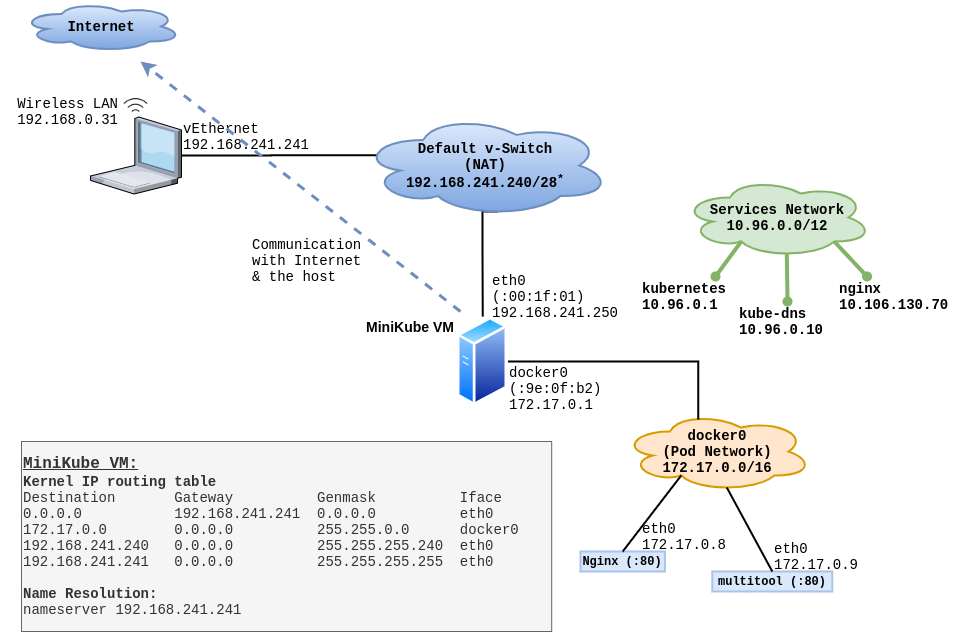

# Minikube Internals - Windows - Advanced Topic

If you are a developer (or even a system administrator), and you want to experiment with [Kubernetes](https://kubernetes.io), then [minikube](https://github.com/kubernetes/minikube) is something you should really look into. It is a simple single-node kubernetes cluster, which installs easy on your work computer - as a small virtual machine. It is open-source, and is free of cost. It is especially useful, when you want to learn / work with Kubernetes, but can't afford to run even a small Kubernetes cluster in a cloud environment, such as GCP, etc. 

The emphasis is on having minikube *running as a VM*, (not as a process on docker), because this takes away all the possible complexity away from your local computer. It (minikube VM) makes setting up and running the kubernetes cluster very easy. 

This article discusses advanced concepts about minikube VM, running in Hyper-V, on Windows 10.


## Minikube Networking on Hyper-V:

Here is the diagram for a quick recap.

|  |
| ------------------------------------------------------------------------- |


### Windows Host network configuration:
Lets go straight to HyperV vswitch. It is **"not configurable/manageable"** by the user. You are at Microsoft's mercy here. 


|  |
| ----------------------------------------------------------- |

|  |
| ----------------------------------------------------------- |

|  |
| ----------------------------------------------------------- |


This switch can select any networking scheme depending on it's *"mood"* - as per my observation. Sometimes it will configure an IP network of `192.168.241.240/28` , and some other time it could be completely different such as `172.17.6.192/28`. Keep in mind that the main (wireless) LAN network the Windows host is connected to never changed, nor the (wireless) LAN IP assigned to this Windows machine changed. (It stayed at `192.168.0.31/24`). 

**Note:** The `/28` part will be explained in a moment.

Here is how the network interfaces look like on the Windows host. It corresponds to the diagram shown above.

```
PS C:\Windows\system32> ipconfig

Windows IP Configuration

Wireless LAN adapter WiFi:

   Connection-specific DNS Suffix  . : getinternet.no
   Link-local IPv6 Address . . . . . : fe80::b185:5cf9:f6d7:8042%17
   IPv4 Address. . . . . . . . . . . : 192.168.0.31
   Subnet Mask . . . . . . . . . . . : 255.255.255.0
   Default Gateway . . . . . . . . . : 192.168.0.1

Ethernet adapter vEthernet (Default Switch):

   Connection-specific DNS Suffix  . :
   Link-local IPv6 Address . . . . . : fe80::600b:3d5f:3903:1a%39
   IPv4 Address. . . . . . . . . . . : 192.168.241.241
   Subnet Mask . . . . . . . . . . . : 255.255.255.240
   Default Gateway . . . . . . . . . :
```  

Here is the routing table from the Windows host:
```
PS C:\Windows\system32>  route print
. . . 
IPv4 Route Table
===========================================================================
Active Routes:
Network Destination        Netmask          Gateway       Interface  Metric
          0.0.0.0          0.0.0.0      192.168.0.1     192.168.0.31     45
        10.96.0.0      255.240.0.0  192.168.241.250  192.168.241.241   5001   <--- Created by `minikube tunnel`
        127.0.0.0        255.0.0.0         On-link         127.0.0.1    331
        127.0.0.1  255.255.255.255         On-link         127.0.0.1    331
  127.255.255.255  255.255.255.255         On-link         127.0.0.1    331
      192.168.0.0    255.255.255.0         On-link      192.168.0.31    301
     192.168.0.31  255.255.255.255         On-link      192.168.0.31    301
    192.168.0.255  255.255.255.255         On-link      192.168.0.31    301
  192.168.241.240  255.255.255.240         On-link   192.168.241.241   5256
  192.168.241.241  255.255.255.255         On-link   192.168.241.241   5256
  192.168.241.255  255.255.255.255         On-link   192.168.241.241   5256
        224.0.0.0        240.0.0.0         On-link         127.0.0.1    331
        224.0.0.0        240.0.0.0         On-link      192.168.0.31    301
        224.0.0.0        240.0.0.0         On-link   192.168.241.241   5256
  255.255.255.255  255.255.255.255         On-link         127.0.0.1    331
  255.255.255.255  255.255.255.255         On-link      192.168.0.31    301
  255.255.255.255  255.255.255.255         On-link   192.168.241.241   5256
===========================================================================
. . .  
```

### Minikube VM network configuration:

Below are the network interfaces inside the minikube VM. 
```
PS C:\Windows\system32> minikube.exe ssh
                         _             _
            _         _ ( )           ( )
  ___ ___  (_)  ___  (_)| |/')  _   _ | |_      __
/' _ ` _ `\| |/' _ `\| || , <  ( ) ( )| '_`\  /'__`\
| ( ) ( ) || || ( ) || || |\`\ | (_) || |_) )(  ___/
(_) (_) (_)(_)(_) (_)(_)(_) (_)`\___/'(_,__/'`\____)

# ifconfig
docker0   Link encap:Ethernet  HWaddr 02:42:28:9E:0F:B2
          inet addr:172.17.0.1  Bcast:172.17.255.255  Mask:255.255.0.0
          UP BROADCAST RUNNING MULTICAST  MTU:1500  Metric:1
          RX packets:91697 errors:0 dropped:0 overruns:0 frame:0
          TX packets:101027 errors:0 dropped:0 overruns:0 carrier:0
          collisions:0 txqueuelen:0
          RX bytes:10232846 (9.7 MiB)  TX bytes:39602379 (37.7 MiB)

eth0      Link encap:Ethernet  HWaddr 00:15:5D:00:1F:01
          inet addr:192.168.241.250  Bcast:192.168.241.255  Mask:255.255.255.240
          UP BROADCAST RUNNING MULTICAST  MTU:1500  Metric:1
          RX packets:11102 errors:0 dropped:0 overruns:0 frame:0
          TX packets:6565 errors:0 dropped:0 overruns:0 carrier:0
          collisions:0 txqueuelen:1000
          RX bytes:1157171 (1.1 MiB)  TX bytes:7172301 (6.8 MiB)

lo        Link encap:Local Loopback
          inet addr:127.0.0.1  Mask:255.0.0.0
          UP LOOPBACK RUNNING  MTU:65536  Metric:1
          RX packets:1256897 errors:0 dropped:0 overruns:0 frame:0
          TX packets:1256897 errors:0 dropped:0 overruns:0 carrier:0
          collisions:0 txqueuelen:1000
          RX bytes:283301155 (270.1 MiB)  TX bytes:283301155 (270.1 MiB)

veth03cbda4 Link encap:Ethernet  HWaddr DE:C0:A5:F3:CE:B4
          UP BROADCAST RUNNING MULTICAST  MTU:1500  Metric:1
          RX packets:0 errors:0 dropped:0 overruns:0 frame:0
          TX packets:13 errors:0 dropped:0 overruns:0 carrier:0
          collisions:0 txqueuelen:0
          RX bytes:0 (0.0 B)  TX bytes:546 (546.0 B)

veth279650d Link encap:Ethernet  HWaddr 42:B6:B6:F8:95:BC
          UP BROADCAST RUNNING MULTICAST  MTU:1500  Metric:1
          RX packets:13934 errors:0 dropped:0 overruns:0 frame:0
          TX packets:13252 errors:0 dropped:0 overruns:0 carrier:0
          collisions:0 txqueuelen:0
          RX bytes:3049146 (2.9 MiB)  TX bytes:8688952 (8.2 MiB)

veth8249ecb Link encap:Ethernet  HWaddr 9A:54:68:90:0D:1B
          UP BROADCAST RUNNING MULTICAST  MTU:1500  Metric:1
          RX packets:27420 errors:0 dropped:0 overruns:0 frame:0
          TX packets:30247 errors:0 dropped:0 overruns:0 carrier:0
          collisions:0 txqueuelen:0
          RX bytes:3330990 (3.1 MiB)  TX bytes:14834743 (14.1 MiB)

veth9958b03 Link encap:Ethernet  HWaddr 4E:F5:B6:37:E4:19
          UP BROADCAST RUNNING MULTICAST  MTU:1500  Metric:1
          RX packets:16448 errors:0 dropped:0 overruns:0 frame:0
          TX packets:18336 errors:0 dropped:0 overruns:0 carrier:0
          collisions:0 txqueuelen:0
          RX bytes:1384678 (1.3 MiB)  TX bytes:6596073 (6.2 MiB)

vethf810239 Link encap:Ethernet  HWaddr 76:DC:4B:15:20:A8
          UP BROADCAST RUNNING MULTICAST  MTU:1500  Metric:1
          RX packets:16186 errors:0 dropped:0 overruns:0 frame:0
          TX packets:18659 errors:0 dropped:0 overruns:0 carrier:0
          collisions:0 txqueuelen:0
          RX bytes:1367731 (1.3 MiB)  TX bytes:6617517 (6.3 MiB)
```
(The `veth*` interfaces are from the containers running on the VM.)

Notice that the  subnet mask of `eth0` shows up as `Mask:255.255.255.240`, meaning it is `/28` or `28` mask bits; which means only four bits are used for hosts on this subnet, resulting in `2^4` total IP addresses on this network. This means `2^4 - 2 = 14`, i.e. 14 usable IP addresses on this network created by the (moody) vSwitch in Windows 10 Hyper-V. 

Here it is again for reference:
```
eth0      Link encap:Ethernet  HWaddr 00:15:5D:00:1F:01
          inet addr:192.168.241.250  Bcast:192.168.241.255  Mask:255.255.255.240
```
The IP addresses from this subnet are:
* Network (or subnet) address: `192.168.241.240`
* First usable IP address: `192.168.241.241`  -- being used by Windows Host on it's virtual interface.
* Last usable IP address: `192.168.241.254`
* Broadcast address: `192.168.241.255` 

The IP address assigned to the minikube VM is `192.168.241.250`, which of-course is from within the usable IP range.

I don't know why Microsoft decided to assign a very limited network to the virtual switch. Remember, this vSwitch is *not* created by minikube. It is created when you install HyperV for the first time.

Here is the routing table from the minikube VM:
```
$ route -n
Kernel IP routing table
Destination     Gateway         Genmask         Flags Metric Ref    Use Iface
0.0.0.0         192.168.241.241 0.0.0.0         UG    1024   0        0 eth0
172.17.0.0      0.0.0.0         255.255.0.0     U     0      0        0 docker0
192.168.241.240 0.0.0.0         255.255.255.240 U     0      0        0 eth0
192.168.241.241 0.0.0.0         255.255.255.255 UH    1024   0        0 eth0
```

Name resolution on minikube VM:
```
$ cat /etc/resolv.conf
nameserver 192.168.241.241
```

```
# cat /etc/hosts
127.0.0.1       localhost
127.0.1.1       minikube
```

Various services listening on various network ports on the minikube VM:
```
ss is equivalent of netstat:

# ss -ntlp
State         Recv-Q         Send-Q                     Local Address:Port                    Peer Address:Port
LISTEN        0              0                                0.0.0.0:2049                         0.0.0.0:*
LISTEN        0              0                                0.0.0.0:36195                        0.0.0.0:*             users:(("rpc.mountd",pid=2098,fd=12))
LISTEN        0              0                                0.0.0.0:35717                        0.0.0.0:*
LISTEN        0              0                                0.0.0.0:39303                        0.0.0.0:*             users:(("rpc.statd",pid=2108,fd=9))
LISTEN        0              0                              127.0.0.1:10248                        0.0.0.0:*             users:(("kubelet",pid=2886,fd=31))
LISTEN        0              0                        192.168.241.250:10249                        0.0.0.0:*             users:(("kube-proxy",pid=4647,fd=11))
LISTEN        0              0                              127.0.0.1:35209                        0.0.0.0:*             users:(("kubelet",pid=2886,fd=9))
LISTEN        0              0                        192.168.241.250:2379                         0.0.0.0:*             users:(("etcd",pid=3899,fd=6))
LISTEN        0              0                              127.0.0.1:2379                         0.0.0.0:*             users:(("etcd",pid=3899,fd=5))
LISTEN        0              0                                0.0.0.0:5355                         0.0.0.0:*             users:(("systemd-resolve",pid=2007,fd=12))
LISTEN        0              0                        192.168.241.250:2380                         0.0.0.0:*             users:(("etcd",pid=3899,fd=3))
LISTEN        0              0                              127.0.0.1:2381                         0.0.0.0:*             users:(("etcd",pid=3899,fd=11))
LISTEN        0              0                                0.0.0.0:41679                        0.0.0.0:*             users:(("rpc.mountd",pid=2098,fd=16))
LISTEN        0              0                                0.0.0.0:111                          0.0.0.0:*             users:(("rpcbind",pid=2030,fd=8))
LISTEN        0              0                              127.0.0.1:10257                        0.0.0.0:*             users:(("kube-controller",pid=3944,fd=6))
LISTEN        0              0                              127.0.0.1:10259                        0.0.0.0:*             users:(("kube-scheduler",pid=3812,fd=6))
LISTEN        0              0                             127.0.0.53:53                           0.0.0.0:*             users:(("systemd-resolve",pid=2007,fd=18))
LISTEN        0              0                                0.0.0.0:22                           0.0.0.0:*             users:(("sshd",pid=2128,fd=3))
LISTEN        0              0                                0.0.0.0:37751                        0.0.0.0:*             users:(("rpc.mountd",pid=2098,fd=8))
LISTEN        0              0                                      *:18080                              *:*             users:(("docker-proxy",pid=4894,fd=4))
LISTEN        0              0                                      *:43073                              *:*
LISTEN        0              0                                      *:2049                               *:*
LISTEN        0              0                                      *:2376                               *:*             users:(("dockerd",pid=2372,fd=6))
LISTEN        0              0                                      *:10250                              *:*             users:(("kubelet",pid=2886,fd=33))
LISTEN        0              0                                      *:10251                              *:*             users:(("kube-scheduler",pid=3812,fd=5))
LISTEN        0              0                                      *:53131                              *:*             users:(("rpc.mountd",pid=2098,fd=18))
LISTEN        0              0                                      *:5355                               *:*             users:(("systemd-resolve",pid=2007,fd=14))
LISTEN        0              0                                      *:10252                              *:*             users:(("kube-controller",pid=3944,fd=5))
LISTEN        0              0                                      *:32783                              *:*             users:(("rpc.mountd",pid=2098,fd=10))
LISTEN        0              0                                      *:111                                *:*             users:(("rpcbind",pid=2030,fd=11))
LISTEN        0              0                                      *:10256                              *:*             users:(("kube-proxy",pid=4647,fd=10))
LISTEN        0              0                                      *:80                                 *:*             users:(("docker-proxy",pid=4989,fd=4))
LISTEN        0              0                                      *:40499                              *:*             users:(("rpc.statd",pid=2108,fd=11))
LISTEN        0              0                                      *:22                                 *:*             users:(("sshd",pid=2128,fd=4))
LISTEN        0              0                                      *:49527                              *:*             users:(("rpc.mountd",pid=2098,fd=14))
LISTEN        0              0                                      *:443                                *:*             users:(("docker-proxy",pid=4958,fd=4))
LISTEN        0              0                                      *:8443                               *:*             users:(("kube-apiserver",pid=3844,fd=5))
```


### The load balancer and the iptables magic:
You are aware that minikube comes with a built in loadbalancer, which is activated by running `minikube tunnel` in a separate terminal. So, as soon as you create a kubernetes service of `type: LoadBalancer` , it (the service) gets an IP address from the network IP range `10.96.0.0/12`. Actually this (`10.96.0.0/12`) is the service CIDR - used for assigning ClusterIP to all the services inside kubernetes cluster; and minikube plays a trick by re-using it as `EXTERNAL IP` for services of `type: LoadBalancer`. 
So, as soon as an IP is registered as EXTERNAL IP for a service, minikube sets up certain `iptables` rules on the minikube VM, so it can handle incoming traffic for that IP address.

Here are some pods, part of two different `deployments`.
```
demouser@windows-10-pro-demo MINGW64 ~
$ kubectl.exe get pods -o wide
NAME                         READY   STATUS    RESTARTS   AGE    IP           NODE       NOMINATED NODE   READINESS GATES
multitool-7f647bbbd7-czc8l   1/1     Running   1          6h5m   172.17.0.6   minikube   <none>           <none>
nginx-745b4df97d-qj4xt       1/1     Running   3          3d5h   172.17.0.5   minikube   <none>           <none>
```
Notice the pod-IP of the nginx pod is `172.17.0.5`.


Here a service is being created on top of the `nginx` deployment - as `type:LoadBalancer`:

```
demouser@windows-10-pro-demo MINGW64 ~
$ kubectl.exe expose deployment nginx --type LoadBalancer --port 80
service/nginx exposed
```


(at this point `minikube tunnel` is already running in a separate window)


```
demouser@windows-10-pro-demo MINGW64 ~
$ kubectl.exe get svc
NAME         TYPE           CLUSTER-IP       EXTERNAL-IP      PORT(S)        AGE
kubernetes   ClusterIP      10.96.0.1        <none>           443/TCP        32h
nginx        LoadBalancer   10.109.195.113   10.109.195.113   80:30589/TCP   107s
```
Notice the `CLUSTER-IP` and `EXTERNAL-IP` are same (`10.109.195.113`), as explained above. Also notice the *node port* of the `nginx` service is `30589`.

Here are the `iptables` rules created on the minikube VM for the `nginx` service created in the `default` namespace. These rules are added in various iptables chains. 

Note: The default output of `iptables-save` is very detailed and cryptic. The output shown below has been simplified for you.
 
```
# iptables-save

*nat

:PREROUTING ACCEPT [33:2445]
-A PREROUTING -m comment --comment "kubernetes service portals" -j KUBE-SERVICES


:KUBE-NODEPORTS - [0:0]
-A KUBE-NODEPORTS -p tcp -m comment --comment "default/nginx:" -m tcp --dport 30589 -j KUBE-SVC-4TDA


:KUBE-SERVICES - [0:0]
-A KUBE-SERVICES -d 10.109.195.113/32 -p tcp -m comment --comment "default/nginx: cluster IP" -m tcp --dport 80 -j KUBE-SVC-4TDA
-A KUBE-SERVICES -d 10.109.195.113/32 -p tcp -m comment --comment "default/nginx: loadbalancer IP" -m tcp --dport 80 -j KUBE-FW-4TDA


:KUBE-FW-4TDA - [0:0]
-A KUBE-FW-4TDA -m comment --comment "default/nginx: loadbalancer IP" -j KUBE-SVC-4TDA

:KUBE-SVC-4TDA - [0:0]
-A KUBE-SVC-4TDA -m comment --comment "default/nginx:" -j KUBE-SEP-4KCF

:KUBE-SEP-4KCF - [0:0]
-A KUBE-SEP-4KCF -p tcp -m comment --comment "default/nginx:" -m tcp -j DNAT --to-destination 172.17.0.5:80


*mangle
. . . 


*filter
. . . 
``` 


--------- 

# How Hyper-V on Windows implements "bad networking":

One of the major problem with HyperV's default vSwitch is that we cannot configure it, nor can we see how it is configured. It can dream/decide/generate any IP network scheme for the vSwitch at any given time, and the VMs have no choice but to use it. This is can cause a problem, especially when the vSwitch network has some sort of conflict with some other network on another network interface of the VM connected to it.

This *sometimes* is actually a *routine* when you are using minikube on Windows 10, using HyperV as hypervisor.
  

|  |
| --------------------------------------------------------------------- |


Here is the simplified version of the problem:

|  |
| ----------------------------------------------------------------------------- |


The biggest problem is, *"that the problem is not obvious"*. This sort of networking causes weird and unpredictable problems at unpredictable times. They are very hard to troubleshoot, especially if networking is not your domain.

Imagine a situation, when someone is running a local docker service on the Windows host for day-to-day local docker usage - which is normally the case with most developers. You are aware that the docker service creates a `docker0` software bridge and assigns a network `172.17.0.0/16` to this bridge. In that case there will be multiple `172.17.x.y` networks connected to different network interfaces on these two computers, creating all sort of networking havoc.

## Actual incident:

Here is what I experienced recently while working with Minikube on Windows+HyperV . For some reason I had to restart the minikube VM, and I noticed that it got a new IP address assigned to it.

```
demouser@windows-10-pro-demo MINGW64 ~
$ minikube stop
* Stopping "minikube" in hyperv ...
* Powering off "minikube" via SSH ...
* Node "m01" stopped.

demouser@windows-10-pro-demo MINGW64 ~
$ minikube start
* minikube v1.9.2 on Microsoft Windows 10 Pro 10.0.18363 Build 18363
* Using the hyperv driver based on existing profile
* Starting control plane node m01 in cluster minikube
* Restarting existing hyperv VM for "minikube" ...
* Preparing Kubernetes v1.18.0 on Docker 19.03.8 ...
E0429 05:45:44.621218    3352 kubeadm.go:331] Overriding stale ClientConfig host https://192.168.241.250:8443 with https://172.17.6.206:8443
* Enabling addons: default-storageclass, ingress, metrics-server, storage-provisioner
* Done! kubectl is now configured to use "minikube"
```
Notice: `Overriding stale ClientConfig host https://192.168.241.250:8443 with https://172.17.6.206:8443`

So, the new IP for my minikube VM is `172.17.6.206`.

### Details from Windows host:

Network interfaces on the host:
```
demouser@windows-10-pro-demo MINGW64 ~
$ ipconfig

Windows IP Configuration

Wireless LAN adapter WiFi:

   Connection-specific DNS Suffix  . : getinternet.no
   Link-local IPv6 Address . . . . . : fe80::b185:5cf9:f6d7:8042%19
   IPv4 Address. . . . . . . . . . . : 192.168.0.31
   Subnet Mask . . . . . . . . . . . : 255.255.255.0
   Default Gateway . . . . . . . . . : 192.168.0.1

Ethernet adapter vEthernet (Default Switch):

   Connection-specific DNS Suffix  . :
   Link-local IPv6 Address . . . . . : fe80::7d40:afdd:693c:702%21
   IPv4 Address. . . . . . . . . . . : 172.17.6.193
   Subnet Mask . . . . . . . . . . . : 255.255.255.240
   Default Gateway . . . . . . . . . :
``` 

Routing table of the host:
```
demouser@windows-10-pro-demo MINGW64 ~
$ route print
IPv4 Route Table
===========================================================================
Active Routes:
Network Destination        Netmask          Gateway       Interface  Metric
          0.0.0.0          0.0.0.0      192.168.0.1     192.168.0.31     45
        127.0.0.0        255.0.0.0         On-link         127.0.0.1    331
        127.0.0.1  255.255.255.255         On-link         127.0.0.1    331
  127.255.255.255  255.255.255.255         On-link         127.0.0.1    331
     172.17.6.192  255.255.255.240         On-link      172.17.6.193   5256
     172.17.6.193  255.255.255.255         On-link      172.17.6.193   5256
     172.17.6.207  255.255.255.255         On-link      172.17.6.193   5256
      192.168.0.0    255.255.255.0         On-link      192.168.0.31    301
     192.168.0.31  255.255.255.255         On-link      192.168.0.31    301
    192.168.0.255  255.255.255.255         On-link      192.168.0.31    301
        224.0.0.0        240.0.0.0         On-link         127.0.0.1    331
        224.0.0.0        240.0.0.0         On-link      192.168.0.31    301
        224.0.0.0        240.0.0.0         On-link      172.17.6.193   5256
  255.255.255.255  255.255.255.255         On-link         127.0.0.1    331
  255.255.255.255  255.255.255.255         On-link      192.168.0.31    301
  255.255.255.255  255.255.255.255         On-link      172.17.6.193   5256
===========================================================================
```


Based on the IP address and the subnet mask, I calculated the IP addresses from this subnet are:
* Network (or subnet) address: `172.17.6.192`
* First usable IP address: `172.17.6.193`  -- being used by Windows Host on it's virtual interface.
* Last usable IP address: `172.16.6.206`
* Broadcast address: `172.16.6.207` 


### Details from the minikube VM:

Network interfaces:
```
# ifconfig
docker0   Link encap:Ethernet  HWaddr 02:42:15:11:F8:80
          inet addr:172.17.0.1  Bcast:172.17.255.255  Mask:255.255.0.0
          UP BROADCAST RUNNING MULTICAST  MTU:1500  Metric:1
          RX packets:197833 errors:0 dropped:0 overruns:0 frame:0
          TX packets:191897 errors:0 dropped:0 overruns:0 carrier:0
          collisions:0 txqueuelen:0
          RX bytes:17497699 (16.6 MiB)  TX bytes:85174982 (81.2 MiB)

eth0      Link encap:Ethernet  HWaddr 00:15:5D:00:1F:01
          inet addr:172.17.6.206  Bcast:172.17.6.207  Mask:255.255.255.240
          UP BROADCAST RUNNING MULTICAST  MTU:1500  Metric:1
          RX packets:3948 errors:0 dropped:0 overruns:0 frame:0
          TX packets:3486 errors:0 dropped:0 overruns:0 carrier:0
          collisions:0 txqueuelen:1000
          RX bytes:410586 (400.9 KiB)  TX bytes:533714 (521.2 KiB)
. . . 
(output snipped)
. . .
```

Routing table of the VM:
```
# route -n
Kernel IP routing table
Destination     Gateway         Genmask         Flags Metric Ref    Use Iface
0.0.0.0         172.17.6.193    0.0.0.0         UG    1024   0        0 eth0
172.17.0.0      0.0.0.0         255.255.0.0     U     0      0        0 docker0
172.17.6.192    0.0.0.0         255.255.255.240 U     0      0        0 eth0
172.17.6.193    0.0.0.0         255.255.255.255 UH    1024   0        0 eth0
```

So far, I did not experience any *immediate* problems, but as I explained above, this sort of networking causes weird and unpredictable problems at unpredictable times. They are very hard to troubleshoot, especially if networking is not your domain. So watch out! And, somebody needs to inform minikube people.
