# Deploying applications locally on minikube - on Windows:
If you are a developer (or even a system administrator), and you want to experiment with [Kubernetes](https://kubernetes.io), then [minikube](https://github.com/kubernetes/minikube) is something you should really look into. It is a simple single-node kubernetes cluster, which installs easy on your work computer - as a small virtual machine. It is open-source, and is free of cost. It is especially useful, when you want to learn / work with Kubernetes, but can't afford to run even a small Kubernetes cluster in a cloud environment, such as GCP, etc. 

The emphasis is on having minikube *running as a VM*, (not as a process on docker), because this takes away all the possible complexity away from your local computer. It (minikube VM) makes setting up and running the kubernetes cluster very easy. 

Here is how the minikube VM setup looks like:

| 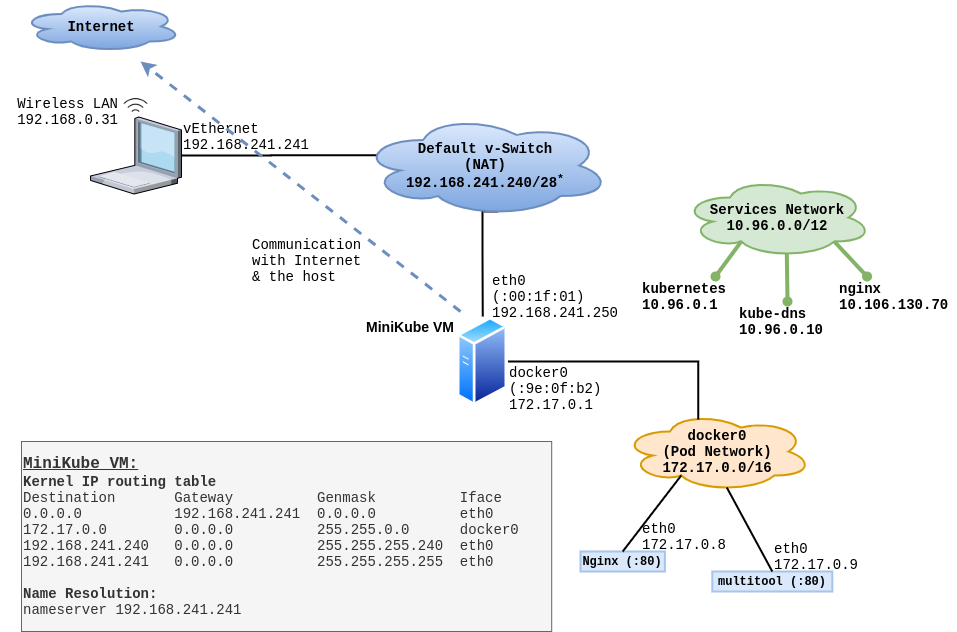 |
| ----------------------------------------------------------------------------------------- |

## What do you need to get it to work?
You need decently powered computer, with following specs:
* CPUs with hardware virtualization (Intel VT or AMD-V). Normally Intel's i3, i5, i7 (and now i9), and AMD's FX 63xx, 83xx, 9xxx, A10, A8, etc  are a good choices. 
* Minimum 4 GB RAM is good enough if you want to run Linux. Minikube takes 2 GB RAM from host computer, and assigns it to the minikube VM. If you are using Windows, then you need more, because windows is basically bloatware, and it just abuses system resources. 
* At least 20 GB free disk-space on your host OS, because minikube will create a 20 GB virtual disk. You can increase the size of the virtual disk at the time of minikube setup.
* A Hypervisor running on the computer, such as KVM. I don't recommend VirtualBox, or Hyper-V, or anything else. However, if you are on Windows or Mac, then you have no choice but to use one of these. In this guide it is going to be Hyper-V.
* Chromebooks will not work.

## Install and Setup Minikube on your local computer:
The computer I am using for this "test-setup" is an Intel i5, with 8 GB RAM, runs Windows 10 Professional, and runs HyperV as Hypervisor. Based on my experience, KVM is the best Hypervisor so far, and HyperV - or any other - is no-where close to it. But since this (Windows + Hyper-V) is something being used by some of the developers in my team - unfortunately - I thought I would cover this scenario, to at-least get them going, until they migrate themselves to Linux. I thought I would document it, so anybody interested in doing the same can benefit. I would also like to suggest that if you are using VirtualBox on Windows, that is even worse!. On Windows, HyperV is better than VirtualBox. 

**Note:** This document was written for a computer, which has **Windows 10 Professional** as Host OS and **Hyper-V** as Hypervisor. If you have a different OS or different Hypervisor on your computer, then you need to consult a different guide for installing minikube on your computer.
 
### Prerequisites:
Besides OS, you will need:
* Hyper-V - Hypervisor (**avoid VirtualBox**)
* kubectl
* minikube
* git bash

`git bash` is not absolutely necessary, but if you are a developer, you most probably are interacting with some git repositories. If so, you might already have `git bash` installed on your computer.

# Setup HyperV:

This is not that complicated. Go to `Windows -> Settings -> Turn Windows features on or off` and enable **Hyper-V** 

| 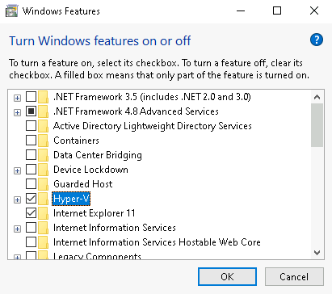 |
| ----------------------------------------------------- |

After HyperV is installed, open it *as Administrator* and explore a little bit.


| 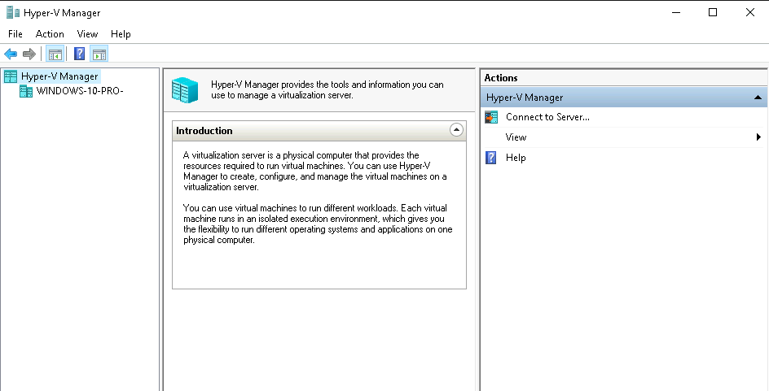 |
| --------------------------------------------------------- |

| 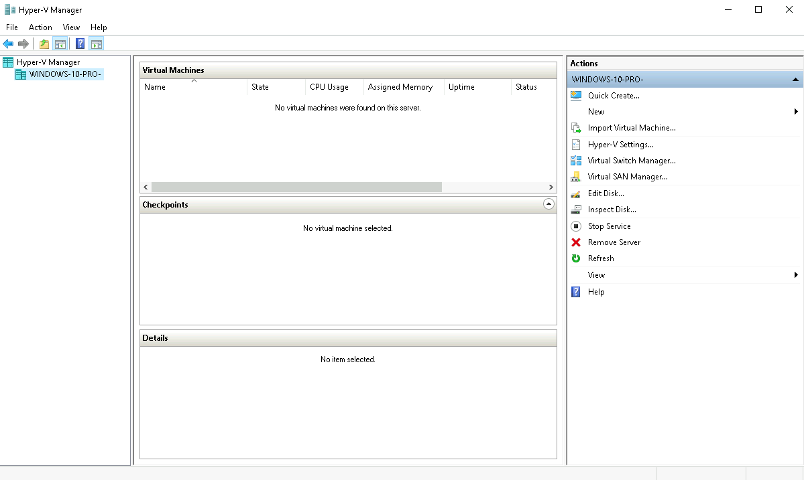 |
| --------------------------------------------------------- |


# Install MiniKube for Windows:

Browse/ navigate to the following URL, and follow instructions on that page: [https://kubernetes.io/docs/tasks/tools/install-minikube/](https://kubernetes.io/docs/tasks/tools/install-minikube/)

Download Minikube Windows Installer from: [https://github.com/kubernetes/minikube/releases/latest/download/minikube-installer.exe](https://github.com/kubernetes/minikube/releases/latest/download/minikube-installer.exe)

## Download `kubectl` binary:
Download the `kubectl` binary from [https://storage.googleapis.com/kubernetes-release/release/v1.18.0/bin/windows/amd64/kubectl.exe](https://storage.googleapis.com/kubernetes-release/release/v1.18.0/bin/windows/amd64/kubectl.exe) and place it inside `C:\Program Files\Kubernetes\Minikube\` directory . Minikube has already added this to your Windows' path , so it is a good place for all kubernetes related software.

## Run `git-bash` or `PowerShell` - as administrator, and setup `minikube`:
Run `git-bash` or `PowerShell` - as administrator, and run the following command to setup minikube.

**Note:** All commands in this guide are run in `git bash` - as administrator. Minikube commands **will not** work if you run them as regular user.

(This may take several minutes.)

```
demouser@windows-10-pro-demo MINGW64 ~

$ minikube.exe start --driver=hyperv

* minikube v1.9.2 on Microsoft Windows 10 Pro 10.0.18363 Build 18363
* Using the hyperv driver based on user configuration
* Downloading VM boot image ...
    > minikube-v1.9.0.iso.sha256: 65 B / 65 B [--------------] 100.00% ? p/s 0s
    > minikube-v1.9.0.iso: 174.93 MiB / 174.93 MiB [-] 100.00% 6.22 MiB p/s 29sr
* Starting control plane node m01 in cluster minikube
* Downloading Kubernetes v1.18.0 preload ...
    > preloaded-images-k8s-v2-v1.18.0-docker-overlay2-amd64.tar.lz4: 542.91 MiB
* Creating hyperv VM (CPUs=2, Memory=2200MB, Disk=20000MB) ...
* Preparing Kubernetes v1.18.0 on Docker 19.03.8 ...
* Enabling addons: default-storageclass, storage-provisioner
* Done! kubectl is now configured to use "minikube"
```

Verify that the minikube VM has an IP address:
```
demouser@windows-10-pro-demo MINGW64 ~
$ minikube ip
192.168.241.250
```

Verify that you can talk to kubernetes cluster inside minikube VM:
```
demouser@windows-10-pro-demo MINGW64 ~
$ kubectl.exe get nodes
NAME       STATUS   ROLES    AGE   VERSION
minikube   Ready    master   78s   v1.18.0
```

The minikube VM will look like this in your Hyper-V interface:

| 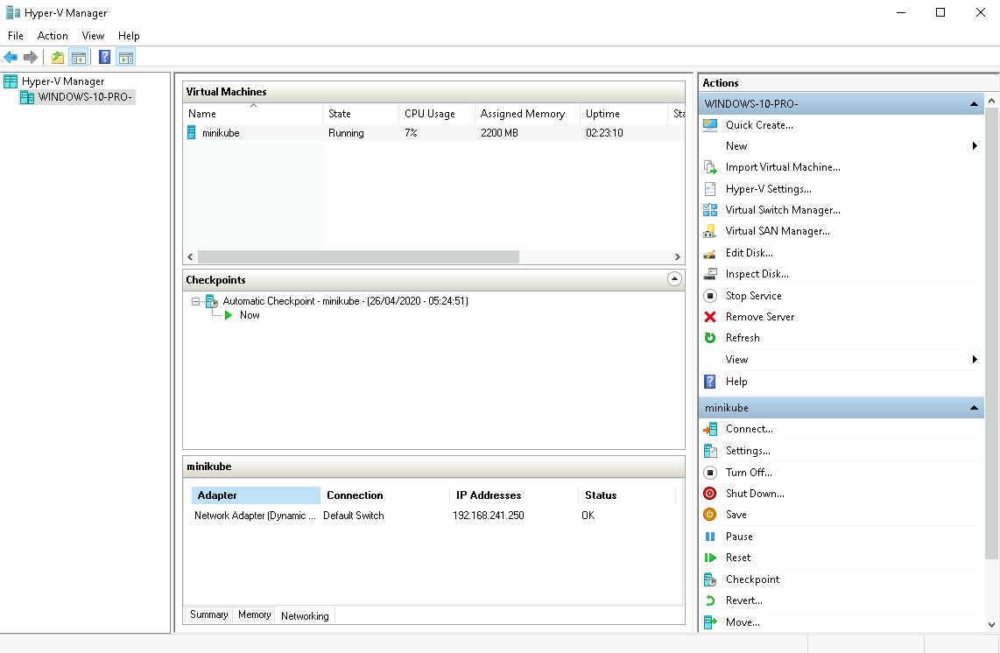 |
| --------------------------------------------------------------------- |

Very good. We are all set. 


### Minikube Addons:
By deafult, Minikube brings several addons with it in the deafult installation, but only few are enabled. Depending on your needs you can enable different addons.

```
demouser@windows-10-pro-demo MINGW64 ~
$ minikube addons list
|-----------------------------|----------|--------------|
|         ADDON NAME          | PROFILE  |    STATUS    |
|-----------------------------|----------|--------------|
| dashboard                   | minikube | disabled     |
| default-storageclass        | minikube | enabled ✅   |
| efk                         | minikube | disabled     |
| freshpod                    | minikube | disabled     |
| gvisor                      | minikube | disabled     |
| helm-tiller                 | minikube | disabled     |
| ingress                     | minikube | disabled     |
| ingress-dns                 | minikube | disabled     |
| istio                       | minikube | disabled     |
| istio-provisioner           | minikube | disabled     |
| logviewer                   | minikube | disabled     |
| metrics-server              | minikube | disabled     |
| nvidia-driver-installer     | minikube | disabled     |
| nvidia-gpu-device-plugin    | minikube | disabled     |
| registry                    | minikube | disabled     |
| registry-aliases            | minikube | disabled     |
| registry-creds              | minikube | disabled     |
| storage-provisioner         | minikube | enabled ✅   |
| storage-provisioner-gluster | minikube | disabled     |
|-----------------------------|----------|--------------|
```

```
demouser@windows-10-pro-demo MINGW64 ~
$ minikube addons enable dashboard
*  The 'dashboard' addon is enabled 
```

To use the dashboard addon, run the `minikube dashboard` command:

```
demouser@windows-10-pro-demo MINGW64 ~
$ minikube dashboard
*  Verifying dashboard health ...
*  Launching proxy ...
*  Verifying proxy health ...
*  Opening http://127.0.0.1:37419/api/v1/namespaces/kubernetes-dashboard/services/http:kubernetes-dashboard:/proxy/ in your default browser...
Opening in existing browser session.
```

(At this point a browser window will open in your computer and Kubernetes dashboard will be running visible inside it.)

|  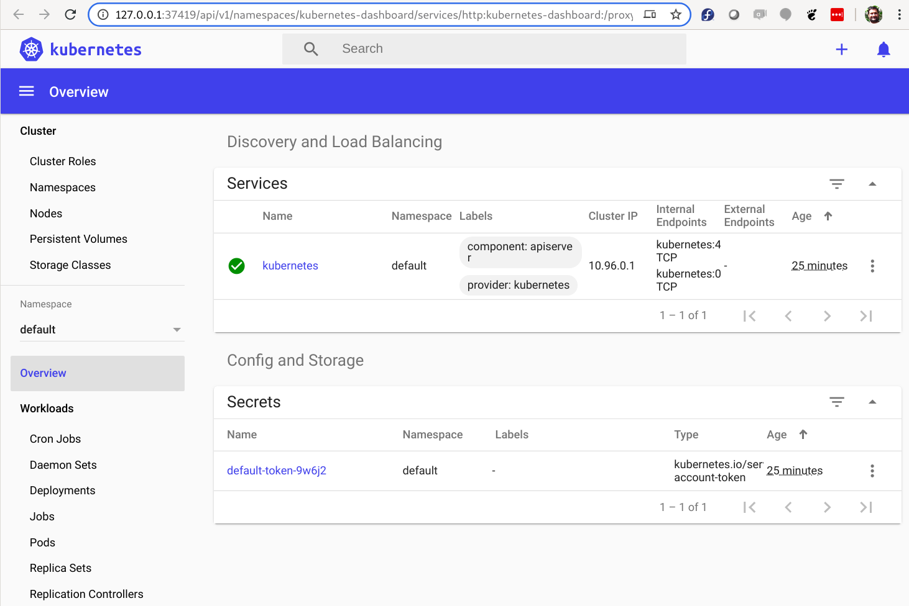 |
| --------------------------------------------------------------- |


One more addon that will surely prove useful is the `metrics-server`. It will help you figure out how much CPU and RAM your pods (and node) are consuming.

``` 
demouser@windows-10-pro-demo MINGW64 ~
$ minikube addons enable metrics-server
*  The 'metrics-server' addon is enabled 
``` 

After a few minutes, check Nodes - CPU and RAM usage:
```
demouser@windows-10-pro-demo MINGW64 ~
$ kubectl top nodes
NAME       CPU(cores)   CPU%   MEMORY(bytes)   MEMORY%   
minikube   153m         7%     1193Mi          33%       
```

Pods - CPU and RAM usage:
```
demouser@windows-10-pro-demo MINGW64 ~
$ kubectl top pods --all-namespaces
NAMESPACE              NAME                                         CPU(cores)   MEMORY(bytes)   
kube-system            coredns-66bff467f8-dww5p                     2m           6Mi             
kube-system            coredns-66bff467f8-hnbxp                     2m           6Mi             
kube-system            etcd-minikube                                24m          47Mi            
kube-system            kube-apiserver-minikube                      48m          281Mi           
kube-system            kube-controller-manager-minikube             20m          34Mi            
kube-system            kube-proxy-hdc9r                             0m           13Mi            
kube-system            kube-scheduler-minikube                      4m           10Mi            
kube-system            metrics-server-7bc6d75975-kp4kp              0m           10Mi            
kube-system            storage-provisioner                          0m           17Mi            
kube-system            tiller-deploy-58bf6f4995-nvwc6               0m           6Mi             
kubernetes-dashboard   dashboard-metrics-scraper-84bfdf55ff-jtp2z   0m           4Mi             
kubernetes-dashboard   kubernetes-dashboard-bc446cc64-wccx9         0m           7Mi             
```

The plugins you enable will show up as pods in the `kube-system` name-space.

```
demouser@windows-10-pro-demo MINGW64 ~
$ kubectl --namespace=kube-system get pods
NAME                               READY   STATUS    RESTARTS   AGE
coredns-66bff467f8-dww5p           1/1     Running   0          47m
coredns-66bff467f8-hnbxp           1/1     Running   0          47m
etcd-minikube                      1/1     Running   0          47m
kube-apiserver-minikube            1/1     Running   0          47m
kube-controller-manager-minikube   1/1     Running   0          47m
kube-proxy-hdc9r                   1/1     Running   0          47m
kube-scheduler-minikube            1/1     Running   0          47m
metrics-server-7bc6d75975-kp4kp    1/1     Running   0          11m     <--- Addon added later
storage-provisioner                1/1     Running   1          47m
```

## Stopping and starting minikube:

You can stop the VM using:
```
demouser@windows-10-pro-demo MINGW64 ~
$ minikube.exe stop
* Stopping "minikube" in hyperv ...
* Powering off "minikube" via SSH ...
* Node "m01" stopped.
```

You can start an existing minikube VM by simply running the `minikube start` command. It will pick up all the configuration from files inside `~/.minikube/*` , and bring up the minikube VM in the same state as it was before (including addons). i.e. In such case, it will not create a new minikube VM.

(This may take several minutes)
```
demouser@windows-10-pro-demo MINGW64 ~
$ minikube start
* minikube v1.9.2 on Microsoft Windows 10 Pro 10.0.18363 Build 18363
* Using the hyperv driver based on existing profile
* Starting control plane node m01 in cluster minikube
* Restarting existing hyperv VM for "minikube" ...
* Preparing Kubernetes v1.18.0 on Docker 19.03.8 ...
* Enabling addons: dashboard, default-storageclass, helm-tiller, ingress, metrics-server, storage-provisioner
* Done! kubectl is now configured to use "minikube"
```

```
demouser@windows-10-pro-demo MINGW64 ~
$ minikube.exe status
m01
host: Running
kubelet: Running
apiserver: Running
kubeconfig: Configured
```

## Verify host-to-minikube connectivity:

Find the IP of your minikube machine. This is important for understanding, but we will talk about this in a moment.
```
demouser@windows-10-pro-demo MINGW64 ~
$ minikube.exe ip
192.168.241.250
```

```
demouser@windows-10-pro-demo MINGW64 ~
$ ping 192.168.241.250

Pinging 192.168.241.250 with 32 bytes of data:
Reply from 192.168.241.250: bytes=32 time<1ms TTL=64
Reply from 192.168.241.250: bytes=32 time<1ms TTL=64
Reply from 192.168.241.250: bytes=32 time<1ms TTL=64
Reply from 192.168.241.250: bytes=32 time=1ms TTL=64

Ping statistics for 192.168.241.250:
    Packets: Sent = 4, Received = 4, Lost = 0 (0% loss),
Approximate round trip times in milli-seconds:
    Minimum = 0ms, Maximum = 1ms, Average = 0ms
```


For any OS related maintenance (or exploration), log onto the minikube vm directly, using `minikube ssh` command:

```
demouser@windows-10-pro-demo MINGW64 ~
$ minikube.exe ssh
                         _             _
            _         _ ( )           ( )
  ___ ___  (_)  ___  (_)| |/')  _   _ | |_      __
/' _ ` _ `\| |/' _ `\| || , <  ( ) ( )| '_`\  /'__`\
| ( ) ( ) || || ( ) || || |\`\ | (_) || |_) )(  ___/
(_) (_) (_)(_)(_) (_)(_)(_) (_)`\___/'(_,__/'`\____)


$ sudo -i
sudo: /etc/environment: No such file or directory
# 
```
(Ignore the error message about `/etc/environment`) 


## About setting up `C:\Windows\System32\drivers\etc\hosts` with minikube's IP on host computer:
Some people might be tempted to update minikube's IP address in `hosts` file, which is actually useless exercise. The reason is that IP address of the minikube VM will keep changing, and you will keep updating the `hosts` file. Essentially, you really not gain any advantage of putting this IP in `C:\Windows\System32\drivers\etc\hosts`. 

In short, don't bother.

## Use kubectl to interact with kuberntes cluster running in minikube:
Now we have minikube installed. It is time to start using it. We already have kubectl installed on the host computer, and minikube has already created a `kube/config` for us. Minikube also sets the context for kubectl to use minikube cluster. So if we run `kubectl` commands against this cluster, the commands will work. 

```
demouser@windows-10-pro-demo MINGW64 ~
$ kubectl.exe config get-contexts
CURRENT   NAME       CLUSTER    AUTHINFO   NAMESPACE
*         minikube   minikube   minikube
```

```
demouser@windows-10-pro-demo MINGW64 ~
$ kubectl.exe get nodes -o wide
NAME       STATUS   ROLES    AGE    VERSION   INTERNAL-IP       EXTERNAL-IP   OS-IMAGE               KERNEL-VERSION   CONTAINER-RUNTIME
minikube   Ready    master   3h2m   v1.18.0   192.168.241.250   <none>        Buildroot 2019.02.10   4.19.107         docker://19.3.8 
```

## Create our first deployment on this cluster:
Lets create our first deployment on this cluster, and then access it from our host computer.

```
demouser@windows-10-pro-demo MINGW64 ~
$ kubectl create deployment nginx --image=nginx:alpine
deployment.apps/nginx created

demouser@windows-10-pro-demo MINGW64 ~
$ kubectl get pods
NAME                     READY   STATUS    RESTARTS   AGE
nginx-745b4df97d-wjrtr   1/1     Running   0          14s
```

## Access your application through NodePort:
Lets expose this `deployment` as a service of `type: NodePort`, so we can access it from our host computer. 

```
demouser@windows-10-pro-demo MINGW64 ~
$ kubectl expose deployment nginx --type=NodePort --port 80
service/nginx exposed


demouser@windows-10-pro-demo MINGW64 ~
$ kubectl get svc
NAME         TYPE        CLUSTER-IP      EXTERNAL-IP   PORT(S)        AGE
kubernetes   ClusterIP   10.96.0.1       <none>        443/TCP        4d1h
nginx        NodePort    10.100.136.156  <none>        80:31255/TCP   6s
```

Now, we can access this service using our minikube VM's IP address and the NodePort assigned to the service.

```
demouser@windows-10-pro-demo MINGW64 ~
$ curl -s 192.168.241.250:31255
<!DOCTYPE html>
<html>
<head>
<title>Welcome to nginx!</title>
. . . 
</head>
<h1>Welcome to nginx!</h1>
</html>
```

Great! So we can access the service using VM's IP and the NodePort of the service.

## Using MiniKube's built in LoadBalancer:
First, lets delete the existing nginx service , and create a new one as `type:LoadBalancer`.

```
demouser@windows-10-pro-demo MINGW64 ~
$ kubectl delete service nginx
service/nginx deleted
```

```
demouser@windows-10-pro-demo MINGW64 ~
$ kubectl expose deployment nginx --type=LoadBalancer --port 80
service/nginx exposed


demouser@windows-10-pro-demo MINGW64 ~
$ kubectl get svc
NAME         TYPE           CLUSTER-IP      EXTERNAL-IP   PORT(S)        AGE
kubernetes   ClusterIP      10.96.0.1       <none>        443/TCP        4d21h
nginx        LoadBalancer   10.106.130.70   <pending>     80:32185/TCP   4s
```

Notice that the `EXTERNAL-IP` is in `<pending>` state. 

MiniKube's LoadBalancer is activated when we run `minikube tunnel` command. As soon as the internal loadbalancer comes up, the service gets an EXTERNAL-IP address.

Remember that `minikube tunnel` command needs to run in a separate terminal, and it will ask you `sudo` password. This is because `minikube tunnel` runs as a process, and creates an additional network route on your work computer, so that all traffic destined to `10.96.0.0/12` network is sent to `192.168.241.250` - which is the IP address of the minikube VM.

Here is the output of the `minikube tunnel` command:
```
demouser@windows-10-pro-demo MINGW64 ~
$ minikube tunnel
Status:	
	machine: minikube
	pid: 75840
	route: 10.96.0.0/12 -> 192.168.241.250
	minikube: Running
	services: [nginx]
    errors: 
		minikube: no errors
		router: no errors
		loadbalancer emulator: no errors
. . . 
```
(above goes on forever)


Here is the routing table from my work-computer (the physical/KVM host) - *after* the `minikube tunnel` command is executed:

```
demouser@windows-10-pro-demo MINGW64 ~
$ route print
. . . 

IPv4 Route Table
===========================================================================
Active Routes:
Network Destination        Netmask          Gateway       Interface  Metric
          0.0.0.0          0.0.0.0      192.168.0.1     192.168.0.31     45
        10.96.0.0      255.240.0.0  192.168.241.250  192.168.241.241   5001    <---- This one!
        127.0.0.0        255.0.0.0         On-link         127.0.0.1    331
        127.0.0.1  255.255.255.255         On-link         127.0.0.1    331
  127.255.255.255  255.255.255.255         On-link         127.0.0.1    331
      192.168.0.0    255.255.255.0         On-link      192.168.0.31    301
     192.168.0.31  255.255.255.255         On-link      192.168.0.31    301
    192.168.0.255  255.255.255.255         On-link      192.168.0.31    301
  192.168.241.240  255.255.255.240         On-link   192.168.241.241   5256
  192.168.241.241  255.255.255.255         On-link   192.168.241.241   5256
  192.168.241.255  255.255.255.255         On-link   192.168.241.241   5256
        224.0.0.0        240.0.0.0         On-link         127.0.0.1    331
        224.0.0.0        240.0.0.0         On-link      192.168.0.31    301
        224.0.0.0        240.0.0.0         On-link   192.168.241.241   5256
  255.255.255.255  255.255.255.255         On-link         127.0.0.1    331
  255.255.255.255  255.255.255.255         On-link      192.168.0.31    301
  255.255.255.255  255.255.255.255         On-link   192.168.241.241   5256
===========================================================================
Persistent Routes:
  None

. . . 

```

Back on the first terminal, if you check the list of services, you will see that your service has an EXTERNAL-IP address - `10.106.130.170`. 


```
demouser@windows-10-pro-demo MINGW64 ~
$ kubectl  get svc
NAME         TYPE           CLUSTER-IP      EXTERNAL-IP     PORT(S)        AGE
kubernetes   ClusterIP      10.96.0.1       <none>          443/TCP        5d
nginx        LoadBalancer   10.106.130.70   10.106.130.70   80:32185/TCP   171m
```

You can now access your service as you would normally do through a LoadBalancer IP, without using any fancy ports.

```
demouser@windows-10-pro-demo MINGW64 ~
$ curl 10.106.130.70
<!DOCTYPE html>
<html>
<head>
<title>Welcome to nginx!</title>

</head>
<body>
<h1>Welcome to nginx!</h1>
. . . 
<p><em>Thank you for using nginx.</em></p>
</body>
</html>
```

Hurray! It works!


**Note:**
When you stop the `minikube tunnel` command (using ctrl+c), (after you have let it run for a while), it removes the routing entry from the routing table from the host computer.

```
. . . 
. . . 

Status:	
	machine: minikube
	pid: 349178
	route: 10.96.0.0/12 -> 192.168.241.250
	minikube: Running
	services: [nginx]
    errors: 
		minikube: no errors
		router: no errors
		loadbalancer emulator: no errors

^C
demouser@windows-10-pro-demo MINGW64 ~
$
```

If you check the routing table on the host, you won't find the entry for `10.96.0.0/12` anymore:

```
demouser@windows-10-pro-demo MINGW64 ~
$ route print
. . . 

IPv4 Route Table
===========================================================================
Active Routes:
Network Destination        Netmask          Gateway       Interface  Metric
          0.0.0.0          0.0.0.0      192.168.0.1     192.168.0.31     45
        127.0.0.0        255.0.0.0         On-link         127.0.0.1    331
        127.0.0.1  255.255.255.255         On-link         127.0.0.1    331
  127.255.255.255  255.255.255.255         On-link         127.0.0.1    331
      192.168.0.0    255.255.255.0         On-link      192.168.0.31    301
     192.168.0.31  255.255.255.255         On-link      192.168.0.31    301
    192.168.0.255  255.255.255.255         On-link      192.168.0.31    301
  192.168.241.240  255.255.255.240         On-link   192.168.241.241   5256
  192.168.241.241  255.255.255.255         On-link   192.168.241.241   5256
  192.168.241.255  255.255.255.255         On-link   192.168.241.241   5256
        224.0.0.0        240.0.0.0         On-link         127.0.0.1    331
        224.0.0.0        240.0.0.0         On-link      192.168.0.31    301
        224.0.0.0        240.0.0.0         On-link   192.168.241.241   5256
  255.255.255.255  255.255.255.255         On-link         127.0.0.1    331
  255.255.255.255  255.255.255.255         On-link      192.168.0.31    301
  255.255.255.255  255.255.255.255         On-link   192.168.241.241   5256
===========================================================================
Persistent Routes:
  None

. . . 

```


# Use minikube's built-in ingress controller:

You can use minikube's built-in ingress controller, which is based on nginx. It is a minikube add-on, so first, you will need to enable it.

```
demouser@windows-10-pro-demo MINGW64 ~
$ minikube addons enable ingress
🌟  The 'ingress' addon is enabled
```


Verify that the NGINX Ingress controller is running in the `kube-system` namespace:

```
demouser@windows-10-pro-demo MINGW64 ~
$ kubectl get pods -n kube-system
NAME                                        READY   STATUS    RESTARTS   AGE
coredns-66bff467f8-dww5p                    1/1     Running   3          5d13h
coredns-66bff467f8-hnbxp                    1/1     Running   3          5d13h
etcd-minikube                               1/1     Running   2          5d13h
kube-apiserver-minikube                     1/1     Running   2          5d13h
kube-controller-manager-minikube            1/1     Running   2          5d13h
kube-proxy-hdc9r                            1/1     Running   2          5d13h
kube-scheduler-minikube                     1/1     Running   2          5d13h
metrics-server-7bc6d75975-kp4kp             1/1     Running   3          5d12h
nginx-ingress-controller-6d57c87cb9-tbnqt   0/1     Running   0          58s      <----- This one!
storage-provisioner                         1/1     Running   4          5d13h
```


Create a deployment. Lets use `praqma/network-multitool` to run a new deployment.

```
demouser@windows-10-pro-demo MINGW64 ~
$ cat 01-multitool-deployment.yaml 
apiVersion: apps/v1
kind: Deployment
metadata:
  name: multitool
  labels:
    app: multitool
spec:
  selector:
    matchLabels:
      app: multitool
  template:
    metadata:
      labels:
        app: multitool
    spec:
      containers:
      - image: praqma/network-multitool
        name: multitool
        ports:
        - containerPort: 80
          name: http
        resources:
          limits:
            cpu: 10m
            memory: 50Mi
          requests:
            cpu: 5m
            memory: 10Mi
```

```
demouser@windows-10-pro-demo MINGW64 ~
$ kubectl apply -f 01-multitool-deployment.yaml 
deployment.apps/multitool created
```

```
demouser@windows-10-pro-demo MINGW64 ~
$ kubectl get pods
NAME                         READY   STATUS    RESTARTS   AGE
multitool-5dd8699c59-z5kdn   1/1     Running   0          110s
nginx-745b4df97d-wjrtr       1/1     Running   0          38h
```

Expose this deployment as a service:

```
demouser@windows-10-pro-demo MINGW64 ~
$ kubectl expose deployment multitool --type ClusterIP --port 80
service/multitool exposed

demouser@windows-10-pro-demo MINGW64 ~
$ kubectl get svc 
NAME         TYPE           CLUSTER-IP       EXTERNAL-IP     PORT(S)        AGE
kubernetes   ClusterIP      10.96.0.1        <none>          443/TCP        5d13h
multitool    ClusterIP      10.102.171.156   <none>          80/TCP         20s
nginx        LoadBalancer   10.106.130.70    10.106.130.70   80:32185/TCP   15h
```

Or, you can use the following file to create the same service (for multitool):

```
demouser@windows-10-pro-demo MINGW64 ~
$ cat 02-multitool-service.yaml 
apiVersion: v1
kind: Service
metadata:
  labels:
    app: multitool
  name: multitool
spec:
  ports:
  - port: 80
    protocol: TCP
    targetPort: 80
  selector:
    app: multitool
  type: ClusterIP
```


Create an ingress for this service:

```
demouser@windows-10-pro-demo MINGW64 ~
$ cat 03-multitool-ingress.yaml 
apiVersion: networking.k8s.io/v1beta1 # for versions before 1.14 use extensions/v1beta1
kind: Ingress
metadata:
  name: multitool-ingress
spec:
  rules:
  - host: multitool.example.com
    http:
      paths:
      - path: /
        backend:
          serviceName: multitool
          servicePort: 80 
```

```
demouser@windows-10-pro-demo MINGW64 ~
$ kubectl apply -f  03-multitool-ingress.yaml 
ingress.networking.k8s.io/multitool-ingress created
```

Verify that it is created:
```
demouser@windows-10-pro-demo MINGW64 ~
$ kubectl get ingress
NAME                CLASS    HOSTS                   ADDRESS          PORTS   AGE
multitool-ingress   <none>   multitool.example.com   192.168.241.250   80      17s
```

Now, update your `hosts` file and point `multitool.example.com` to the ip address being shown under the ADDRESS column. This address is actually the IP address of your minikube VM.

```
demouser@windows-10-pro-demo MINGW64 ~
$ cat /c/Windows/System32/drivers/etc/hosts

# minikube ingress for multitool.example.com
192.168.241.250         multitool.example.com   nginx.example.com
192.168.241.250         tomcat.example.com 
```

The moment of truth. Access your multitool service from the host / your work computer:
```
demouser@windows-10-pro-demo MINGW64 ~
$ curl -s multitool.example.com
Praqma Network MultiTool (with NGINX) - multitool-5dd8699c59-z5kdn - 172.17.0.10/16
```

It works!


## Run a `tomcat` container:
Tomcat runs on port 8080, so it will be a good example to see how a service running on a different port can be accessed through the ingress `tomcat.example.com` , using minikube's built-in ingress controller. 

For this example, I have created just one file, which contains all the three objects. i.e. `deployment`, `service`, `ingress`. Also, I am pulling a sample `.war` file into the tomcat container, so I have something to show.

Here is the file:

```
demouser@windows-10-pro-demo MINGW64 ~
$ cat tomcat-deploymet-service-ingress.yaml 
apiVersion: apps/v1
kind: Deployment
metadata:
  name: tomcat
  labels:
    app: tomcat
spec:
  selector:
    matchLabels:
      app: tomcat
  template:
    metadata:
      labels:
        app: tomcat
    spec:
      containers:
      - name: tomcat
        image: tomcat:9
        ports:
        - containerPort: 8080
        resources:
          limits:
            cpu: "50m"
          requests:
            cpu: 50m
        volumeMounts:
        - name: web-content-dir
          mountPath: /usr/local/tomcat/webapps/
      initContainers:
      - name: multitool
        image: praqma/network-multitool
        workingDir: /web-content
        command:
        - wget
        - "-O"
        - "/web-content/sample.war"
        - https://tomcat.apache.org/tomcat-9.0-doc/appdev/sample/sample.war
        resources:
          limits:
            cpu: "20m"
          requests:
            cpu: 20m
        volumeMounts:
        - name: web-content-dir
          mountPath: /web-content
      volumes:
      - name: web-content-dir
        emptyDir: {}
    
---

apiVersion: v1
kind: Service
metadata:
  namespace: default
  name: tomcat
  labels:
    app: tomcat
spec:
  ports:
    - port: 8080
  selector:
    app: tomcat
  type: ClusterIP

---
apiVersion: networking.k8s.io/v1beta1 # for versions before 1.14 use extensions/v1beta1
kind: Ingress
metadata:
  name: tomcat-ingress
  labels:
    app: tomcat
spec:
  rules:
  - host: tomcat.example.com
    http:
      paths:
      - path: /
        backend:
          serviceName: tomcat
          servicePort: 8080
```

Lets create the deployment, service and ingress for tomcat:

```
demouser@windows-10-pro-demo MINGW64 ~
$ kubectl apply -f tomcat-deploymet-service-ingress.yaml 
deployment.apps/tomcat created
service/tomcat created
ingress.networking.k8s.io/tomcat-ingress created
```

Verify that the objects are created:

```
demouser@windows-10-pro-demo MINGW64 ~
$ kubectl get deployments,services,ingress
NAME                        READY   UP-TO-DATE   AVAILABLE   AGE
deployment.apps/multitool   1/1     1            1           43m
deployment.apps/nginx       1/1     1            1           39h
deployment.apps/tomcat      1/1     1            1           94s

NAME                 TYPE           CLUSTER-IP       EXTERNAL-IP     PORT(S)        AGE
service/kubernetes   ClusterIP      10.96.0.1        <none>          443/TCP        5d14h
service/multitool    ClusterIP      10.102.171.156   <none>          80/TCP         38m
service/nginx        LoadBalancer   10.106.130.70    10.106.130.70   80:32185/TCP   16h
service/tomcat       ClusterIP      10.101.172.146   <none>          8080/TCP       94s

NAME                                   CLASS    HOSTS                   ADDRESS          PORTS   AGE
ingress.extensions/multitool-ingress   <none>   multitool.example.com   192.168.241.250   80      33m
ingress.extensions/tomcat-ingress      <none>   tomcat.example.com      192.168.241.250   80      94s
```
**Note:** The `nginx` service of `type:LoadBalancer` showing up in the output above, has nothing to do with minikube's built-in ingress controller (which is also nginx based). The above nginx deployment and service is something we created earlier in this document.

Alright, so we have the three objects related to tomcat. Notice that the ingress `tomcat.example.com` is also using the same IP address as the ingress for multitool, and that IP address is the IP address of the minikube VM. This is OK. That is exactly how it is supposed to look like.

Lets see if we can access it from our host computer or not. To be able to do that, first we have to update `hosts` file and setup a host entry - as administrator.

```
demouser@windows-10-pro-demo MINGW64 ~
$ cat /c/Windows/System32/drivers/etc/hosts

# minikube ingress for multitool.example.com
192.168.241.250         multitool.example.com   nginx.example.com
192.168.241.250         tomcat.example.com 
```
**Note:** If the IP address is same for multiple hosts/URLs, you can use write them together in a single line.

Lets access tomcat from the host:

```
demouser@windows-10-pro-demo MINGW64 ~
$ curl tomcat.example.com
<!doctype html><html lang="en"><head><title>HTTP Status 404 – Not Found</title><style type="text/css">body {font-family:Tahoma,Arial,sans-serif;} h1, h2, h3, b {color:white;background-color:#525D76;} h1 {font-size:22px;} h2 {font-size:16px;} h3 {font-size:14px;} p {font-size:12px;} a {color:black;} .line {height:1px;background-color:#525D76;border:none;}</style></head><body><h1>HTTP Status 404 – Not Found</h1><hr class="line" /><p><b>Type</b> Status Report</p><p><b>Message</b> Not found</p><p><b>Description</b> The origin server did not find a current representation for the target resource or is not willing to disclose that one exists.</p><hr class="line" /><h3>Apache Tomcat/9.0.34</h3></body></html>
```

Hurray! We can reach `tomcat.example.com` ! 

If you are wondering, why are we celebrating by seeing a `404`, and some garbage output displayed on the screen? Well, the output is actually *coming from Tomcat*, which simply states that it could not find any applications configured in it, or it will not reveal that any application exists. It expects you to write an index file, which users can use to reach respective applications, or simply use the application's URL directly. So if we see the output above, it means our ingress for `tomcat.example.com` is working and we *are* reaching the backend tomcat service. 

Remember, I copied a `sample.war` file in tomcat. That was to test tomcat using `http://tomcat.example.com/sample` . So lets do that.

```
demouser@windows-10-pro-demo MINGW64 ~
$ curl tomcat.example.com/sample
```

```
demouser@windows-10-pro-demo MINGW64 ~
$ curl -L tomcat.example.com/sample
<html>
<head>
<title>Sample "Hello, World" Application</title>
</head>
<body bgcolor=white>

<table border="0">
<tr>
<td>

</td>
<td>
<h1>Sample "Hello, World" Application</h1>
<p>This is the home page for a sample application used to illustrate the
source directory organization of a web application utilizing the principles
outlined in the Application Developer's Guide.
</td>
</tr>
</table>

<p>To prove that they work, you can execute either of the following links:
<ul>
<li>To a <a href="hello.jsp">JSP page</a>.
<li>To a <a href="hello">servlet</a>.
</ul>

</body>
</html>
```

Here is a screenshot of the same from a browser:

| 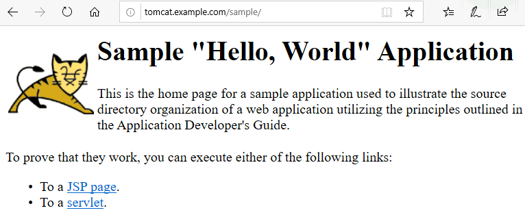 |
| --------------------------------------------------------------------- |


## Warning about an annotation in minikube ingress example:

If you try to access `tomcat.example.com/sample` , and you see the output below, then you probably have used some annotations incorrectly.

```
demouser@windows-10-pro-demo MINGW64 ~
$ curl tomcat.example.com/sample

<!doctype html><html lang="en"><head><title>HTTP Status 404 – Not Found</title><style type="text/css">body {font-family:Tahoma,Arial,sans-serif;} h1, h2, h3, b {color:white;background-color:#525D76;} h1 {font-size:22px;} h2 {font-size:16px;} h3 {font-size:14px;} p {font-size:12px;} a {color:black;} .line {height:1px;background-color:#525D76;border:none;}</style></head><body><h1>HTTP Status 404 – Not Found</h1><hr class="line" /><p><b>Type</b> Status Report</p><p><b>Message</b> Not found</p><p><b>Description</b> The origin server did not find a current representation for the target resource or is not willing to disclose that one exists.</p><hr class="line" /><h3>Apache Tomcat/9.0.34</h3></body></html>
```


The above shows that `tomcat.example.com/sample` in unreachable from my host computer. I am actually being redirected to the root path `/`. If you used the annotation suggested in the example described at [https://kubernetes.io/docs/tasks/access-application-cluster/ingress-minikube/](https://kubernetes.io/docs/tasks/access-application-cluster/ingress-minikube/), then this is the cause of the problem. 

The problematic annotation in the definition of the ingress object is this one:

```
. . . 
  annotations:
    nginx.ingress.kubernetes.io/rewrite-target: /$1
. . . 
``` 

The above annotation forces the target to be re-written, which messes up with the URL we are trying to reach, and instead of reaching `/sample` on the tomcat service, we are redirected to `/` . To fix this, simply remove this annotation section from your yaml file, and re-deploy the ingress-object. 


The nginx ingress controller's rewrite rules are explained here: [https://kubernetes.github.io/ingress-nginx/examples/rewrite/](https://kubernetes.github.io/ingress-nginx/examples/rewrite/)


## Warning about the `ingress-dns` addon:
There is an `ingress-dns` addon available with minikube. You will see it in **disabled** state in the list when you type in `minikube addons list`

```
demouser@windows-10-pro-demo MINGW64 ~
$ minikube addons list
|-----------------------------|----------|--------------|
|         ADDON NAME          | PROFILE  |    STATUS    |
|-----------------------------|----------|--------------|
| dashboard                   | minikube | enabled ✅   |
| default-storageclass        | minikube | enabled ✅   |
| efk                         | minikube | disabled     |
| freshpod                    | minikube | disabled     |
| gvisor                      | minikube | disabled     |
| helm-tiller                 | minikube | enabled ✅   |
| ingress                     | minikube | enabled ✅   |
| ingress-dns                 | minikube | disabled     |
| istio                       | minikube | disabled     |
| istio-provisioner           | minikube | disabled     |
| logviewer                   | minikube | disabled     |
| metrics-server              | minikube | enabled ✅   |
| nvidia-driver-installer     | minikube | disabled     |
| nvidia-gpu-device-plugin    | minikube | disabled     |
| registry                    | minikube | disabled     |
| registry-aliases            | minikube | disabled     |
| registry-creds              | minikube | disabled     |
| storage-provisioner         | minikube | enabled ✅   |
| storage-provisioner-gluster | minikube | disabled     |
|-----------------------------|----------|--------------|
```

You may be tempted to enable it, but it is actually not that useful. It is an attempt/hack by someone to solve the problem of updating `/etc/hosts` described in the previous section. The details of this add-on are here: [https://github.com/kubernetes/minikube/tree/master/deploy/addons/ingress-dns](https://github.com/kubernetes/minikube/tree/master/deploy/addons/ingress-dns)

The approach/idea is good, but it is more hack-ey and more demanding/difficult from the developer's perspective. It actually sets up a small DNS service/resolver within the minikube kubernetes cluster, and any service you create with an ingress, gets a DNS entry in that small DNS server/resolver. Then you configure your host computer to use this DNS resolver in addition to whatever DNS resolver you may be using.  

A special part of host configuration requires the IP address of the minikube VM to be configured in a certain file (`/etc/resolvconf/resolv.conf.d/base`) - on the host, and that is where the problem lies. The minikube VM may change it's IP address at any moment. This means you will need to update this special file every time minikube changes it's IP address, and the minikube boot-up process does not update this file automatically. So you are stuck with modifying even more files, at even more locations, which results in more moving parts, and lengthier trouble-shooting if something is not working. 

So, until miniube's `ingress-dns` add-on brings auto-update of the host configuration files, it is best to not use it.
 

# Using Helm on your minikube kubernetes cluster:
If you want to develop helm charts, or just want to use existing ones, you will need **`helm`** on your local work computer (the host). 

## Helm version 3:
Helm 3.2 is the latest at the time this document was written. To be able to use Helm , you simply install it for your operating system using the instructions from this URL: [https://helm.sh/docs/intro/install/](https://helm.sh/docs/intro/install/) . 

Basically it is the following simple steps:
* Download the binary for windows from: [https://get.helm.sh/helm-v3.2.0-windows-amd64.zip](https://get.helm.sh/helm-v3.2.0-windows-amd64.zip)
* Unpack/unzip it, and put it inside `C:\Windows\Program Files\Kubernetes\Minikube\`

Check helm version at any given time:
```
demouser@windows-10-pro-demo MINGW64 ~
$ helm version
version.BuildInfo{Version:"v3.1.3", GitCommit:"0a9a9a88e8afd6e77337a3e2ad744756e191429a", GitTreeState:"clean", GoVersion:"go1.13.10"}
```

That's it, you are good to start using helm. But, "What about tiller?". Well, Tiller has been removed in Helm version 3.x! You don't need tiller in your cluster anymore, if you are using helm v-3.x . See details here: [https://helm.sh/blog/helm-3-released/](https://helm.sh/blog/helm-3-released/) . 

You don't need minikube's "helm-tiller" add-on in your minikube cluster, if you want to use helm 3.

## Helm version 2:
In case you want to use helm 2.x, for whatever reason, you need **helm 2.x** binary on your local computer, and it's server component **tiller** installed inside the kubernetes cluster. 

Installing `helm` v2 on your local computer is done in the same way as described above, except that the zip file will be of `v2` instead of `v3`.

Basically it is the following simple steps:
* Download the binary for windows from: [https://get.helm.sh/helm-v2.16.6-windows-amd64.zip](https://get.helm.sh/helm-v2.16.6-windows-amd64.zip)
* Unpack/unzip it, and put it inside `C:\Windows\Program Files\Kubernetes\Minikube\`

Then, to install `tiller` on the minikube cluster, simply install the `helm-tiller` add-on, and you are good to go.

```
demouser@windows-10-pro-demo MINGW64 ~
$ minikube addons enable helm-tiller
*  The 'helm-tiller' addon is enabled
```


## Install an example helm chart:
**Note:** Helm v3 is used in the commands below.

Before you are able to actually use helm to deploy an existing helm chart, you will need to add it's repository URL.

```
demouser@windows-10-pro-demo MINGW64 ~
$ helm repo add stable https://kubernetes-charts.storage.googleapis.com
"stable" has been added to your repositories
```

Then you can list all available charts/packages in a particular repository, or search for a particular one.

``` 
demouser@windows-10-pro-demo MINGW64 ~
$ helm search repo stable
NAME                                 	CHART VERSION	APP VERSION            	DESCRIPTION                                       
stable/acs-engine-autoscaler         	2.2.2        	2.1.1                  	DEPRECATED Scales worker nodes within agent pools 
stable/aerospike                     	0.3.2        	v4.5.0.5               	A Helm chart for Aerospike in Kubernetes          
stable/airflow                       	6.7.2        	1.10.4                 	Airflow is a platform to programmatically autho...
stable/ambassador                    	5.3.1        	0.86.1                 	A Helm chart for Datawire Ambassador              
stable/anchore-engine                	1.5.2        	0.7.0                  	Anchore container analysis and policy evaluatio...
stable/apm-server                    	2.1.5        	7.0.0                  	The server receives data from the Elastic APM a...
stable/ark                           	4.2.2        	0.10.2                 	DEPRECATED A Helm chart for ark                   
stable/artifactory                   	7.3.1        	6.1.0                  	DEPRECATED Universal Repository Manager support...
. . . 
. . . 
stable/zeppelin                      	1.1.0        	0.7.2                  	Web-based notebook that enables data-driven, in...
stable/zetcd                         	0.1.9        	0.0.3                  	CoreOS zetcd Helm chart for Kubernetes            
```

Or:

```
demouser@windows-10-pro-demo MINGW64 ~
$ helm search repo postgres
NAME                               	CHART VERSION	APP VERSION	DESCRIPTION                                       
stable/postgresql                  	8.6.4        	11.7.0     	DEPRECATED Chart for PostgreSQL, an object-rela...
stable/prometheus-postgres-exporter	1.3.0        	0.8.0      	A Helm chart for prometheus postgres-exporter     
stable/pgadmin                     	1.2.2        	4.18.0     	pgAdmin is a web based administration tool for ...
stable/stolon                      	1.5.9        	0.13.0     	Stolon - PostgreSQL cloud native High Availabil...
stable/gcloud-sqlproxy             	0.6.1        	1.11       	DEPRECATED Google Cloud SQL Proxy                 
```


Lets install wordpress helm chart. First, we need to check if it exists:

```
demouser@windows-10-pro-demo MINGW64 ~
$ helm search repo wordpress
NAME            	CHART VERSION	APP VERSION	DESCRIPTION                                       
stable/wordpress	9.0.3        	5.3.2      	DEPRECATED Web publishing platform for building...
```

We see that there is a chart, but it is deprecated. Bitnami is maintaining the latest wordpress helm chart. So we add Bitnami's helm repo.

```
demouser@windows-10-pro-demo MINGW64 ~
$ helm repo add bitnami https://charts.bitnami.com/bitnami
"bitnami" has been added to your repositories
```

Then, we search for, and install the wordpress chart from bitnami:

```
demouser@windows-10-pro-demo MINGW64 ~
$ helm search repo bitnami/wordpress
NAME             	CHART VERSION	APP VERSION	DESCRIPTION                                       
bitnami/wordpress	9.1.9        	5.4.0      	Web publishing platform for building blogs and ...
```

Download/Install the wordpress chart:
```
demouser@windows-10-pro-demo MINGW64 ~
$ helm install myblog bitnami/wordpress
NAME: myblog
LAST DEPLOYED: Fri Apr 24 00:00:23 2020
NAMESPACE: default
STATUS: deployed
REVISION: 1
NOTES:
**Please be patient while the chart is being deployed**

To access your WordPress site from outside the cluster follow the steps below:

1. Get the WordPress URL by running these commands:

  NOTE: It may take a few minutes for the LoadBalancer IP to be available.
        Watch the status with: 'kubectl get svc --namespace default -w myblog-wordpress'

   export SERVICE_IP=$(kubectl get svc --namespace default myblog-wordpress --template "{{ range (index .status.loadBalancer.ingress 0) }}{{.}}{{ end }}")
   echo "WordPress URL: http://$SERVICE_IP/"
   echo "WordPress Admin URL: http://$SERVICE_IP/admin"

2. Open a browser and access WordPress using the obtained URL.

3. Login with the following credentials below to see your blog:

  echo Username: user
  echo Password: $(kubectl get secret --namespace default myblog-wordpress -o jsonpath="{.data.wordpress-password}" | base64 --decode)
```

Above deploys the chart, which you can see in `helm list`:

```
demouser@windows-10-pro-demo MINGW64 ~
$ helm list
NAME  	NAMESPACE	REVISION	UPDATED                                 	STATUS  	CHART          	APP VERSION
myblog	default  	1       	2020-04-24 00:00:23.499057849 +0200 CEST	deployed	wordpress-9.1.9	5.4.0      
```

The chart deploys a wordpress `deployment` and a mariadb `statefulset`. 

```
demouser@windows-10-pro-demo MINGW64 ~
$ kubectl get pods
NAME                                READY   STATUS    RESTARTS   AGE
multitool-5dd8699c59-z5kdn          1/1     Running   0          35h
myblog-mariadb-0                    1/1     Running   0          102s
myblog-wordpress-74c676dccd-45trh   0/1     Running   0          102s
nginx-745b4df97d-wjrtr              1/1     Running   0          3d2h
tomcat-78d49d44d-vlcqb              1/1     Running   0          34h
```

It also sets up the wordpress service as type load-balancer:

```
demouser@windows-10-pro-demo MINGW64 ~
$ kubectl get svc
NAME               TYPE           CLUSTER-IP       EXTERNAL-IP     PORT(S)                      AGE
kubernetes         ClusterIP      10.96.0.1        <none>          443/TCP                      7d1h
multitool          ClusterIP      10.102.171.156   <none>          80/TCP                       35h
myblog-mariadb     ClusterIP      10.106.159.63    <none>          3306/TCP                     2m16s
myblog-wordpress   LoadBalancer   10.96.159.46     <pending>       80:30356/TCP,443:30938/TCP   2m16s
nginx              LoadBalancer   10.106.130.70    10.106.130.70   80:32185/TCP                 2d3h
tomcat             ClusterIP      10.105.43.47     <none>          8080/TCP                     34h
```

You can access this wordpress service, if you run `minikube tunnel` in a separate terminal, as a regular user. As soon as you run it, come back to the previous terminal, check the services again, and you will see that the wordpress service's loadBalancer has an IP address!

```
demouser@windows-10-pro-demo MINGW64 ~
$ kubectl get svc
NAME               TYPE           CLUSTER-IP       EXTERNAL-IP     PORT(S)                      AGE
kubernetes         ClusterIP      10.96.0.1        <none>          443/TCP                      7d1h
multitool          ClusterIP      10.102.171.156   <none>          80/TCP                       35h
myblog-mariadb     ClusterIP      10.106.159.63    <none>          3306/TCP                     5m20s
myblog-wordpress   LoadBalancer   10.96.159.46     10.96.159.46    80:30356/TCP,443:30938/TCP   5m20s
nginx              LoadBalancer   10.106.130.70    10.106.130.70   80:32185/TCP                 2d3h
tomcat             ClusterIP      10.105.43.47     <none>          8080/TCP                     34h
```

Access this IP from a browser in your host computer, and you will see your wordpress blog site. To access admin panel, you will need the password of the admin user, which the wordpress helm chart shows how to obtain - in the `Notes`. 

```
demouser@windows-10-pro-demo MINGW64 ~
$ echo Password: $(kubectl get secret --namespace default myblog-wordpress -o jsonpath="{.data.wordpress-password}" | base64 --decode)
Password: TGERAY7mzZ
```

| 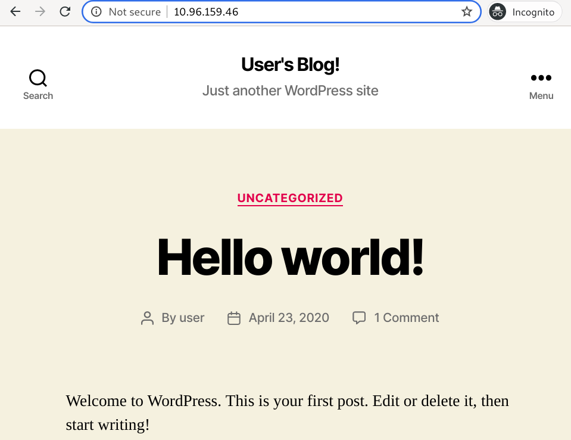 |
| ----------------------------------------------------------- |

| 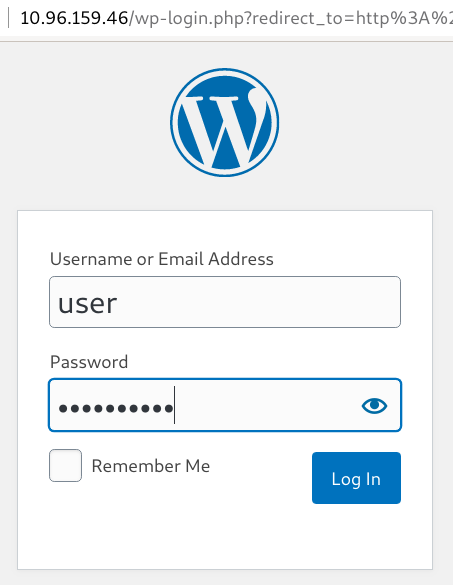 |
| ----------------------------------------------------------- |

| 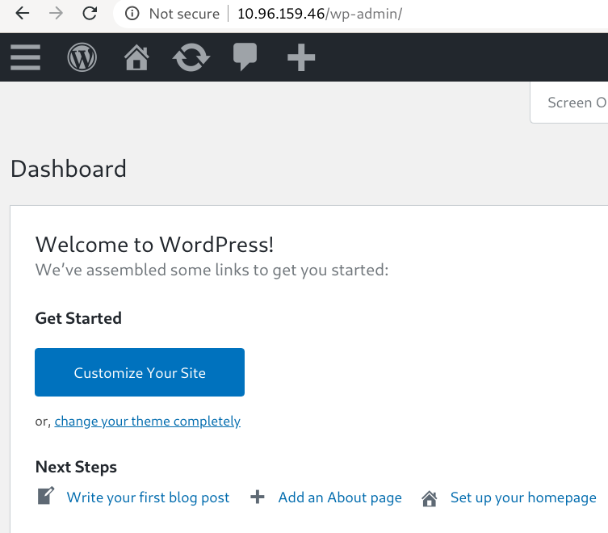 |
| ----------------------------------------------------------- |


Congratulations! Your minikube installation is complete, with necessary features :) You may want to add more add-ons, and/or modify it to your heart's content. But for now, you are all set! 


# Some limitations of minikube:

* The IP address of the minikube VM may change during subsequent `stop` , `start` operations. But if all you want to do is use `kubectl` to access the cluster inside that VM, then you should not be bothered, as the `minikube start` command updates your local `kube/config` file with the latest IP address of the minikube VM/API-server.
* Minikube comes with a built-in ingress/reverse proxy (using nginx). However, you will most probably not be able to use LetsEncrypt's SSL certificates while using the LetsEncrypt's HTTP challenge. The reason is that you will most probably be behind a home router/firewall, and HTTP challenge will not work unless you go through additional steps, which involve modifying forwarding rules of your home router and forward port 80 traffic from your router to your work computer. (Your work computer will most probably be on a wireless network, and it will also keep changing it's IP address!). One trick you can do is to install `Traefik` with HTTPS support enabled but without configuring it to use LetsEncrypt. This way you can still access your apps over HTTPS using TRAEFIK_DEFAULT_CERT. This certificate will be self signed, but at least you will get HTTPS URLs working. Though you can use LetsEncrypt DNS challenge to get valid certificates for your apps running in your minikube cluster, and have your apps served through HTTPS.

Remember, this (minikube) cluster is supposed to be a **local test cluster**, for learning, development, and experimentation. Don't expect all the bells and whistles of a regular kubernetes cluster to be present in this small one-node cluster. :)


# Additional fun stuff:
* If you don't want to use minikube's built-in LoadBalancer, you can setup your own, such as **MetalLB**. 
* If you don't want to use minikube's built-in Ingress Controller, you can use your own, such as **Traefik**. 

# Other Windows level configurations/optimizations:
## Disabled VM checkpoint:
It is best to disable the VM checkpoint feature for minikube VM. It does not serve any purpose for minikube, and is an overhead. To disable it, go to: `Hyper-V -> minikube VM -> Settings -> Checkpoints`, and disable the main check-box. 

| 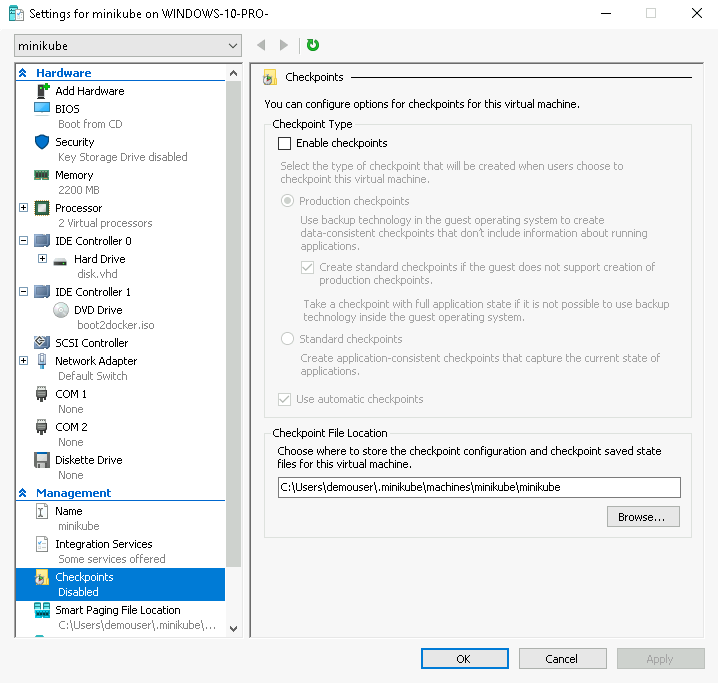 |
| ------------------------------------------------------------------------------------- |


# Further reading:
* [https://wiki.libvirt.org/page/VirtualNetworking](https://wiki.libvirt.org/page/VirtualNetworking)
* [https://kubernetes.io/docs/setup/learning-environment/minikube/](https://kubernetes.io/docs/setup/learning-environment/minikube/)
* [https://docs.gitlab.com/charts/development/minikube/](https://docs.gitlab.com/charts/development/minikube/)
* [https://minikube.sigs.k8s.io/docs/handbook/](https://minikube.sigs.k8s.io/docs/handbook/)
* [https://kubernetes.io/docs/tasks/access-application-cluster/ingress-minikube/](https://kubernetes.io/docs/tasks/access-application-cluster/ingress-minikube/)


