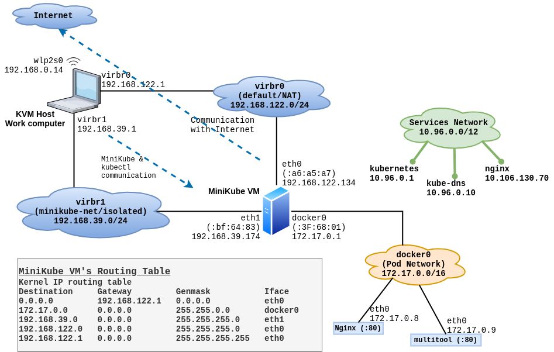

# Deploying applications locally on minikube:

## Install and Setup Minikube on your local computer:

If you installed Google-Cloud-SDK on your computer, then you should know that it provides lots of packages, such as `kubectl`, as well as `minikube` ; which you can install using gcloud commands:
```
gcloud components list

gcloud components install COMPONENT_ID
```

In case you installed google-cloud-sdk YUM repository, then installing these packages is as simple as `yum install <package-name>` 

```
[root@kworkhorse ~]# yum --disablerepo="*" --enablerepo="google-cloud-sdk" list available
Last metadata expiration check: 1:16:01 ago on Thu 16 Apr 2020 09:29:37 PM CEST.
Available Packages
google-cloud-sdk.noarch                                                        289.0.0-1            google-cloud-sdk
google-cloud-sdk-anthos-auth.x86_64                                            289.0.0-1            google-cloud-sdk
google-cloud-sdk-app-engine-go.x86_64                                          289.0.0-1            google-cloud-sdk
google-cloud-sdk-app-engine-grpc.x86_64                                        289.0.0-1            google-cloud-sdk
google-cloud-sdk-app-engine-java.noarch                                        289.0.0-1            google-cloud-sdk
google-cloud-sdk-app-engine-python.noarch                                      289.0.0-1            google-cloud-sdk
google-cloud-sdk-app-engine-python-extras.noarch                               289.0.0-1            google-cloud-sdk
google-cloud-sdk-bigtable-emulator.x86_64                                      289.0.0-1            google-cloud-sdk
google-cloud-sdk-cbt.x86_64                                                    289.0.0-1            google-cloud-sdk
google-cloud-sdk-cloud-build-local.x86_64                                      289.0.0-1            google-cloud-sdk
google-cloud-sdk-datalab.noarch                                                289.0.0-1            google-cloud-sdk
google-cloud-sdk-datastore-emulator.noarch                                     289.0.0-1            google-cloud-sdk
google-cloud-sdk-firestore-emulator.noarch                                     289.0.0-1            google-cloud-sdk
google-cloud-sdk-kind.x86_64                                                   289.0.0-1            google-cloud-sdk
google-cloud-sdk-kpt.x86_64                                                    289.0.0-1            google-cloud-sdk
google-cloud-sdk-minikube.x86_64                                               289.0.0-1            google-cloud-sdk                           
google-cloud-sdk-pubsub-emulator.noarch                                        289.0.0-1            google-cloud-sdk
google-cloud-sdk-skaffold.x86_64                                               289.0.0-1            google-cloud-sdk
google-cloud-sdk-spanner-emulator.x86_64                                       289.0.0-1            google-cloud-sdk
google-cloud-sdk-tests.noarch                                                  289.0.0-1            google-cloud-sdk
kubectl.x86_64                                                                 1.18.1-0             google-cloud-sdk
[root@kworkhorse ~]# 
```

```
[root@kworkhorse ~]# yum search minikube
Last metadata expiration check: 0:39:56 ago on Thu 16 Apr 2020 09:29:40 PM CEST.
===================== Name Matched: minikube ======================
google-cloud-sdk-minikube.x86_64 : Google Cloud SDK
[root@kworkhorse ~]# 
``` 

### Install the minikube package:
``` 
[root@kworkhorse ~]# yum -y install google-cloud-sdk-minikube.x86_64
Last metadata expiration check: 0:41:25 ago on Thu 16 Apr 2020 09:29:40 PM CEST.
Dependencies resolved.
===================================================================
 Package                   Arch   Version   Repository        Size
===================================================================
Installing:
 google-cloud-sdk-minikube x86_64 289.0.0-1 google-cloud-sdk  13 M

Transaction Summary
===================================================================
Install  1 Package

Total download size: 13 M
Installed size: 43 M
Downloading Packages:
02311b8ff662232b90e0df30503bba809f 3.2 MB/s |  13 MB     00:04    
-------------------------------------------------------------------
Total                              3.2 MB/s |  13 MB     00:04     
Running transaction check
Transaction check succeeded.
Running transaction test
Transaction test succeeded.
Running transaction
  Preparing        :                                           1/1 
  Installing       : google-cloud-sdk-minikube-289.0.0-1.x86   1/1 
  Running scriptlet: google-cloud-sdk-minikube-289.0.0-1.x86   1/1 
  Verifying        : google-cloud-sdk-minikube-289.0.0-1.x86   1/1 

Installed:
  google-cloud-sdk-minikube-289.0.0-1.x86_64                       

Complete!
[root@kworkhorse ~]#
``` 


### Setup minikube VM:
```
[kamran@kworkhorse ~]$ minikube start --driver=kvm2
😄  minikube v1.9.2 on Fedora 31
    ▪ KUBECONFIG=/home/kamran/.kube/config:/home/kamran/.kube/kubeadm-cluster.conf
✨  Using the kvm2 driver based on user configuration
💾  Downloading driver docker-machine-driver-kvm2:
    > docker-machine-driver-kvm2.sha256: 65 B / 65 B [-------] 100.00% ? p/s 0s
    > docker-machine-driver-kvm2: 13.88 MiB / 13.88 MiB  100.00% 2.46 MiB p/s 5
💿  Downloading VM boot image ...
    > minikube-v1.9.0.iso.sha256: 65 B / 65 B [--------------] 100.00% ? p/s 0s
    > minikube-v1.9.0.iso: 174.93 MiB / 174.93 MiB [-] 100.00% 6.20 MiB p/s 29s
👍  Starting control plane node m01 in cluster minikube
💾  Downloading Kubernetes v1.18.0 preload ...
    > preloaded-images-k8s-v2-v1.18.0-docker-overlay2-amd64.tar.lz4: 542.91 MiB
🔥  Creating kvm2 VM (CPUs=2, Memory=3900MB, Disk=20000MB) ...
🐳  Preparing Kubernetes v1.18.0 on Docker 19.03.8 ...
🌟  Enabling addons: default-storageclass, storage-provisioner
🏄  Done! kubectl is now configured to use "minikube"

❗  /usr/local/bin/kubectl is v1.13.4, which may be incompatible with Kubernetes v1.18.0.
💡  You can also use 'minikube kubectl -- get pods' to invoke a matching version
[kamran@kworkhorse ~]$ 
```

At this point, you should see minikube VM running in KVM:
|   |
| --------------------------------------------------------------- |


```
[kamran@kworkhorse ~]$ kubectl get nodes
NAME       STATUS   ROLES    AGE   VERSION
minikube   Ready    master   2m    v1.18.0
[kamran@kworkhorse ~]$ 
```

### Minikube Addons:
By deafult, Minikube brings several addons with it in the deafult installation, but only few are enabled. Depending on your needs you can enable different addons.

```
[kamran@kworkhorse ~]$ minikube addons list
|-----------------------------|----------|--------------|
|         ADDON NAME          | PROFILE  |    STATUS    |
|-----------------------------|----------|--------------|
| dashboard                   | minikube | disabled     |
| default-storageclass        | minikube | enabled ✅   |
| efk                         | minikube | disabled     |
| freshpod                    | minikube | disabled     |
| gvisor                      | minikube | disabled     |
| helm-tiller                 | minikube | disabled     |
| ingress                     | minikube | disabled     |
| ingress-dns                 | minikube | disabled     |
| istio                       | minikube | disabled     |
| istio-provisioner           | minikube | disabled     |
| logviewer                   | minikube | disabled     |
| metrics-server              | minikube | disabled     |
| nvidia-driver-installer     | minikube | disabled     |
| nvidia-gpu-device-plugin    | minikube | disabled     |
| registry                    | minikube | disabled     |
| registry-aliases            | minikube | disabled     |
| registry-creds              | minikube | disabled     |
| storage-provisioner         | minikube | enabled ✅   |
| storage-provisioner-gluster | minikube | disabled     |
|-----------------------------|----------|--------------|
[kamran@kworkhorse ~]$ 
```

```
[kamran@kworkhorse ~]$ minikube addons enable dashboard
🌟  The 'dashboard' addon is enabled
[kamran@kworkhorse ~]$ 
```

To use the dashboard addon, run the `minikube dashboard` command:

```
[kamran@kworkhorse ~]$ minikube dashboard
🤔  Verifying dashboard health ...
🚀  Launching proxy ...
🤔  Verifying proxy health ...
🎉  Opening http://127.0.0.1:37419/api/v1/namespaces/kubernetes-dashboard/services/http:kubernetes-dashboard:/proxy/ in your default browser...
Opening in existing browser session.
```

(At this point a browser window will open in your computer and Kubernetes dashboard will be running visible inside it.)

|   |
| --------------------------------------------------------------- |


One more addon that will surely prove useful is the `metrics-server`. It will help you figure out how much CPU and RAM your pods (and node) are consuming.

``` 
[kamran@kworkhorse ~]$ minikube addons enable metrics-server
🌟  The 'metrics-server' addon is enabled
[kamran@kworkhorse ~]$ 
``` 

Nodes - CPU and RAM usage:
```
[kamran@kworkhorse ~]$ kubectl top nodes
NAME       CPU(cores)   CPU%   MEMORY(bytes)   MEMORY%   
minikube   153m         7%     1193Mi          33%       
[kamran@kworkhorse ~]$ 
```

Pods - CPU and RAM usage:
```
[kamran@kworkhorse ~]$ kubectl top pods --all-namespaces
NAMESPACE              NAME                                         CPU(cores)   MEMORY(bytes)   
kube-system            coredns-66bff467f8-dww5p                     2m           6Mi             
kube-system            coredns-66bff467f8-hnbxp                     2m           6Mi             
kube-system            etcd-minikube                                24m          47Mi            
kube-system            kube-apiserver-minikube                      48m          281Mi           
kube-system            kube-controller-manager-minikube             20m          34Mi            
kube-system            kube-proxy-hdc9r                             0m           13Mi            
kube-system            kube-scheduler-minikube                      4m           10Mi            
kube-system            metrics-server-7bc6d75975-kp4kp              0m           10Mi            
kube-system            storage-provisioner                          0m           17Mi            
kube-system            tiller-deploy-58bf6f4995-nvwc6               0m           6Mi             
kubernetes-dashboard   dashboard-metrics-scraper-84bfdf55ff-jtp2z   0m           4Mi             
kubernetes-dashboard   kubernetes-dashboard-bc446cc64-wccx9         0m           7Mi             
[kamran@kworkhorse ~]$ 
```


Install Helm-Tiller addon, which is good to install helm charts on your minikube cluster:
```
[kamran@kworkhorse ~]$ minikube addons enable helm-tiller
🌟  The 'helm-tiller' addon is enabled
[kamran@kworkhorse ~]$ 
```


The plugins you enable will show up as pods in the `kube-system` name-space.

```
[kamran@kworkhorse ~]$ kubectl --namespace=kube-system get pods
NAME                               READY   STATUS    RESTARTS   AGE
coredns-66bff467f8-dww5p           1/1     Running   0          47m
coredns-66bff467f8-hnbxp           1/1     Running   0          47m
etcd-minikube                      1/1     Running   0          47m
kube-apiserver-minikube            1/1     Running   0          47m
kube-controller-manager-minikube   1/1     Running   0          47m
kube-proxy-hdc9r                   1/1     Running   0          47m
kube-scheduler-minikube            1/1     Running   0          47m
metrics-server-7bc6d75975-kp4kp    1/1     Running   0          11m     <--- Addon added later
storage-provisioner                1/1     Running   1          47m
tiller-deploy-58bf6f4995-nvwc6     1/1     Running   0          89s     <--- Addon added later
[kamran@kworkhorse ~]$ 
```

## Stopping and starting minikube:

You can stop the VM using:
```
[kamran@kworkhorse ~]$ minikube stop
✋  Stopping "minikube" in kvm2 ...
🛑  Node "m01" stopped.
[kamran@kworkhorse ~]$ 
```

You can start an existing minikube VM by simply running the `minikube start` command. It will pick up all the configuration from files inside `~/.minikube/*` , and bring up the minikube VM in the same state as it was before (including addons). i.e. In such case, it will not create a new minikube VM.

```
[kamran@kworkhorse ~]$ minikube start
😄  minikube v1.9.2 on Fedora 31
    ▪ KUBECONFIG=/home/kamran/.kube/config:/home/kamran/.kube/kubeadm-cluster.conf
✨  Using the kvm2 driver based on existing profile
👍  Starting control plane node m01 in cluster minikube
🔄  Restarting existing kvm2 VM for "minikube" ...
🐳  Preparing Kubernetes v1.18.0 on Docker 19.03.8 ...
🌟  Enabling addons: dashboard, default-storageclass, helm-tiller, metrics-server, storage-provisioner
🏄  Done! kubectl is now configured to use "minikube"

❗  /usr/local/bin/kubectl is v1.13.4, which may be incompatible with Kubernetes v1.18.0.
💡  You can also use 'minikube kubectl -- get pods' to invoke a matching version
[kamran@kworkhorse ~]$ 
```

```
[kamran@kworkhorse ~]$ minikube status
m01
host: Running
kubelet: Running
apiserver: Running
kubeconfig: Configured

[kamran@kworkhorse ~]$ 
```

Find the IP of your minikube machine: (more on this later)
```
[kamran@kworkhorse ~]$ minikube ip
192.168.39.174
```

For any OS related maintenance (or exploration), log onto the minikube vm directly, using `minikube ssh` command:
```
[kamran@kworkhorse ~]$ minikube ssh
                         _             _            
            _         _ ( )           ( )           
  ___ ___  (_)  ___  (_)| |/')  _   _ | |_      __  
/' _ ` _ `\| |/' _ `\| || , <  ( ) ( )| '_`\  /'__`\
| ( ) ( ) || || ( ) || || |\`\ | (_) || |_) )(  ___/
(_) (_) (_)(_)(_) (_)(_)(_) (_)`\___/'(_,__/'`\____)

$ 

$ sudo -i
sudo: /etc/environment: No such file or directory
# 
```
(Ignore the error message about `/etc/environment`) 


## Some limitations:

* Acessing your applications over NodePort is horrible, and super painful. So, you will need to (you should) setup a LoadBalancer in minikube yourself, such as MetalLB. It is surprisingly easy to setup and easy to use! 
* Can't setup any HTTPS reverse proxy with LetsEncrypt's HTTP challenge because you will most probably be behind a home router/firewall. If you install Traefik with HTTPS support enabled, (without enabling LetsEncrypt), you can still access your apps over HTTPS using TRAEFIK_DEFAULT_CERT. This certificate is self signed, but at least you will get HTTPS URLs working. 
* You can, though, use LetsEncrypt DNS challenge to get valid certificates for your apps running in your minikube cluster, and have your apps served through HTTPS. 
------

# How minikube works - the networking part

First, if you installed minikube **on Linux** *and* **used KVM for Virtualization**, then congratulations, you made the best choice! :) The reason is, Linux and KVM setup is very simple and straight-forward. There is nothing hidden, complicated, fearful or frustrating - as it is the case with Windows and VirtualBox/HyperV. (I will discuss this at a later time.)

This article discusses a minikube VM, running in KVM, on Fedora Linux.

## KVM virtual networks:
By default, KVM sets up a virtual network on your Linux host, and calls it `virbr0` (or, Virtual Bridge - Zero). This is a **NAT** type network,(Network Address Translation), which NATs any traffic coming in from inside this virtual network , trying to reach the internet, via any of the physical devices on your host. i.e either your wireless adapter, or network/ethernet port, or modem. So, this way, not only you can access the VMs you create (on this network), the VMs (on this network) can easily reach the internet also. 

When you install `minikube` , it creates an additional **isolated** virtual network inside KVM, and connects the minikube VM to both of these networks. i.e. it attaches itself to the NAT network as well as the isolated network. Like so:

|  |
| ----------------------------------------------------------- |


Now, comes the million dollar question. If a VM is accessible from the host computer over the regular NAT network, and if the VM can also reach the internet, why minikube uses two networks? Wouldn't one be enough for the required functionality? 

### The problem:
Good job, if you asked this question! The answer is very interesting. You see, minikube is a piece of software, which primarily wants to achieve few things:
* It needs to setup a VM on the Hypervisor you have on your host computer, and then run the complete setup procedure to install Kubernetes on this VM.
* It needs to setup some access mechanism for you to be able to use this (single-node) kubernetes cluster running on this VM , as a regular user.
* It needs to be able to perform day to day management operations on this VM.

To be able to do these, it needs to be able to talk the the Hypervisor, and also be able to reach the VM on the OS level, such as performing a simple operation as `minikube ssh` . When you pass the `--driver=kvm2` - or whatever Hypervisor you have on your computer - on the `minikube start` command, minikube configures itself to talk to that particular Hypervisor and get things done. That handles the "talking to the Hypervisor" part. Now, after the VM is created, minikube needs to SSH into the VM and run the setup process. Then, after the setup finishes, it needs to write certain `.kube/config` file for you, on the host computer, to be able to use this cluster. 

Now, consider a this scenario. If this VM had a dynamic IP address, then `minikube` can still setup the VM, and can run the setup process as well. It will also generate the `.kube/config` file for you and other OS/ssh related files. **But,** what if the VM restarts and gets a new IP address from the Hypervisor? It is on a virtual network served by a local DHCP service. So, there are high chances that some day, the IP will change, and suddenly you won't be able to do simple `kubectl get pods` because the VM is running on a new IP, which essentially means that the kubernetes API server is now listening on a new IP address. What is that IP address? well, nobody knows, until you do some troubleshooting, and look inside certain log files, insect VM, etc, etc.

Now you may be thinking, well, why doesn't it simply assigns a static IP to the minikube VM, and gets on with it's life? That is not a simple thing to do. I mean, sure you can stick a assumed-to-be-free fixed IP address of your choice to the VM at the time of VM creation, and all will be good! Right? No. Wrong. The reason is, how would the minikube setup process know which IP on the virtual network is unused, and then simply use that as fixed IP? Probably scan the virtual network and exclude the "alive" IPs from your options, and then use an IP which is did not show up in the scan! Simple, right? Wrong again. What if the IP minikube decides on, is actually in-use by another VM on the same network, which happens to be in the stopped state during the minikube's investigation, and later when that VM comes back online, there will be a problem! Two VMs using the same IP addresses! 

If we just assume for a second that minikube's IP being changed on a DHCP network is not a big deal, and minikube can fix this problem by: talking to the Hypervisor, obtain the new IP address, update the `kube/config` file it created for you with the new IP addresses. Sure! So this would mean that you will need to run some imaginary `minikube update-kube-config` command before you are able to run simple `kubectl get pods` command. That would be very frustrating. Remember, I am completely ignoring other potential problems like SSH fingerprints being changed, etc, for simplicity's sake.


So, we want a predictable way to reach the VM, but that does not seem to be an option on the existing virtual network! There are many ifs and buts if you use this scenario. 

The predictable way to reach and use this VM would be that it had a fixed IP address. Since that is not possible on existing virtual network, we need to create an independent virtual network, solely for minikube's use.

This means, minikube would query the Hypervisor for all networks currently in use, and then create a new virtual network making sure to pick a network range not in conflict with existing networks. This is fairly easy thing to do. Once it creates such a network, it can assign whatever IP address it wishes (from the new virtual network) to the minikube VM. In this way, it is straight forward to keep a note of this VM's IP address and setup necessary configuration files both for minikube's use, and for your `kubectl`, so you can use it as a normal user.

The only additional configuration minikube setup process while creating the virtual network is to create it as an **isolated network**. The reason behind this decision is to make sure that this virtual network is used solely for minikube, and you as a user do not create additional VMs in this virtual network. Now, there are chances that some user may still (accidentally) create some other VM (at a later time) in this network, by selecting minikube' network as a network for the new VM. Even if someone does that, the VM will be not able to reach the internet, **because it is on an isolated network!**. Alright, so isolated network ensures that anyone can access the VM connected to it, and the VM can also access the host , but that is about it. Being not a NAT network, if the (minikube) VM on this isolated network needs to get something from the internet, it can't, solely because of the type of network it is on! So, how to get all the stuff from the internet on the minikube VM?

## The solution:

The solution is to connect this VM on this isolated network, to yet another network, which can perform NAT. That way, we can communicate with this VM over the isolated network, and the VM can still reach the internet, through the other NAT network.

|  |
| ----------------------------------------------------------- |


# Further reading:
* [https://wiki.libvirt.org/page/VirtualNetworking](https://wiki.libvirt.org/page/VirtualNetworking)
* [https://kubernetes.io/docs/setup/learning-environment/minikube/](https://kubernetes.io/docs/setup/learning-environment/minikube/)
* [https://docs.gitlab.com/charts/development/minikube/](https://docs.gitlab.com/charts/development/minikube/)
* [https://minikube.sigs.k8s.io/docs/handbook/](https://minikube.sigs.k8s.io/docs/handbook/)

